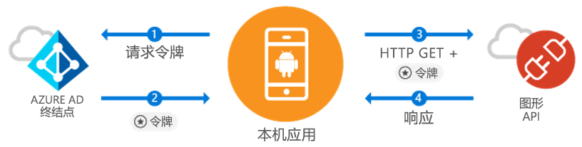

# <a name="quickstart-sign-in-users-and-call-the-microsoft-graph-api-from-an-android-app"></a>快速入门：从 Android 应用登录用户并调用 Microsoft Graph API

[!INCLUDE [active-directory-develop-applies-v1-adal](../../../includes/active-directory-develop-applies-v1-adal.md)]

如果你要开发 Android 应用程序，Microsoft 可让 Azure Active Directory (Azure AD) 用户拥有简单直接的登录体验。 Azure AD 允许应用程序通过 Microsoft Graph 或你自己的受保护 Web API 访问用户数据。

Azure AD 身份验证库 (ADAL) Android 库使用行业标准的 OAuth 2.0 和 OpenID Connect 支持 [Microsoft Azure Active Directory 帐户](https://azure.microsoft.com/services/active-directory/)，因此你的应用能够开始使用 [Microsoft Azure 云](https://cloud.microsoft.com) 和 [Microsoft Graph API](https://developer.microsoft.com/graph)。

在本快速入门中，你将学习如何：

* 获取 Microsoft Graph 的令牌
* 刷新令牌
* 调用 Microsoft Graph
* 注销用户

## <a name="prerequisites"></a>先决条件

若要开始操作，你需要一个可在其中创建用户和注册应用程序的 Azure AD 租户。 如果还没有租户，请[了解如何获取租户](quickstart-create-new-tenant.md)。

## <a name="scenario-sign-in-users-and-call-the-microsoft-graph"></a>方案：让用户登录并调用 Microsoft Graph



可以将此应用用于所有 Azure AD 帐户。 它同时支持单租户方案和多租户方案（分步讨论）。 它演示了如何生成应用来连接企业用户并通过 Microsoft Graph 访问其 Azure 和 O365 数据。 在身份验证流中，最终用户需要登录该应用程序并同意其权限，某些情况下可能需要管理员同意该应用。 本示例中的大部分逻辑展示了如何对最终用户进行身份验证并对 Microsoft Graph 进行基本调用。

## <a name="sample-code"></a>代码示例

可以[在 GitHub 上](https://github.com/Azure-Samples/active-directory-android)找到完整的示例代码。

```Java
// Initialize your app with MSAL
AuthenticationContext mAuthContext = new AuthenticationContext(
        MainActivity.this,
        AUTHORITY,
        false);


// Perform authentication requests
mAuthContext.acquireToken(
    getActivity(),
    RESOURCE_ID,
    CLIENT_ID,
    REDIRECT_URI,
    PromptBehavior.Auto,
    getAuthInteractiveCallback());

// ...

// Get tokens to call APIs like the Microsoft Graph
mAuthResult.getAccessToken()
```

## <a name="step-1-register-and-configure-your-app"></a>步骤 1：注册并配置应用

需要使用 [Azure 门户](https://portal.azure.com)向 Microsoft 注册一个本机客户端应用程序。

1. 开始注册应用
    - 导航到 [Azure 门户](https://aad.portal.azure.com)。
    - 选择“Azure Active Directory” > “应用注册”。

2. 创建应用程序
    - 选择“新注册”。 
    - 在“名称”字段中输入应用名称  。
    - 在“支持的帐户类型”下，选择“任何组织目录中的帐户和个人 Microsoft 帐户”。  
    - 另外，请从下拉列表中选择“公共客户端(移动和桌面)”并输入 `http://localhost`。  
    - 单击“注册”  。

3. 配置 Microsoft Graph
    - 选择“API 权限”  。
    - 选择“添加权限”，在“选择 API”中选择“Microsoft Graph”   。
    - 在“委托的权限”  下，选择 **User.Read** 权限，然后点击“添加”  以保存。        
    
4. 恭喜！ 应用已配置成功。 在下一部分中，你需要：
    - `Application ID`
    - `Redirect URI`

## <a name="step-2-get-the-sample-code"></a>步骤 2：获取示例代码

1. 克隆代码。
    ```
    git clone https://github.com/Azure-Samples/active-directory-android
    ```
2. 在 Android Studio 中打开示例。
    - 选择“打开现有 Android Studio 项目”  。

## <a name="step-3-configure-your-code"></a>步骤 3：配置代码

可以在 ***src/main/java/com/azuresamples/azuresampleapp/MainActivity.java*** 文件中找到此代码示例的所有配置。

1. 将常量 `CLIENT_ID` 替换为 `ApplicationID`。
2. 将常量 `REDIRECT URI` 替换为之前配置的 `Redirect URI` (`http://localhost`)。

## <a name="step-4-run-the-sample"></a>步骤 4：运行示例

1. 选择“生成”>“清理项目”  。
2. 选择“运行”>“运行应用”  。
3. 该应用应生成并显示一些基本的 UX。 单击 `Call Graph API` 按钮时，它将提示登录，然后自动使用新令牌调用 Microsoft Graph API。

## <a name="next-steps"></a>后续步骤

1. 有关库机制以及如何配置新方案和功能的详细信息，请查看 [ADAL Android Wiki](https://github.com/AzureAD/azure-activedirectory-library-for-android/wiki)。
2. 在本机方案中，应用将使用嵌入式 Web 视图，并且不会退出应用。 `Redirect URI` 可以是任意值。
3. 发现任何问题或有任何要求？ 可以在 Stack Overflow 上使用标记 `azure-active-directory` 创建问题或发贴。

### <a name="cross-app-sso"></a>跨应用 SSO

了解[如何使用 ADAL 在 Android 上启用跨应用 SSO](howto-v1-enable-sso-android.md)。

### <a name="auth-telemetry"></a>身份验证遥测

ADAL 库公开身份验证遥测来帮助应用开发人员了解其应用的行为并创造更好的体验。 这使你可以捕获成功的登录、活跃用户以及其他一些有趣的见解。 使用身份验证遥测时，需要应用开发人员建立遥测服务来聚合和存储事件。

若要了解有关身份验证遥测的详细信息，请查看 [ADAL Android auth telemetry](https://github.com/AzureAD/azure-activedirectory-library-for-android/wiki/Telemetry)（ADAL Android 身份验证遥测）。
