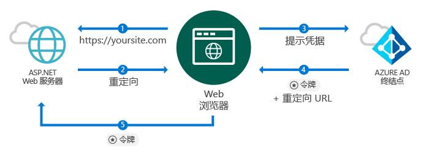
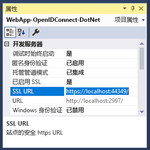
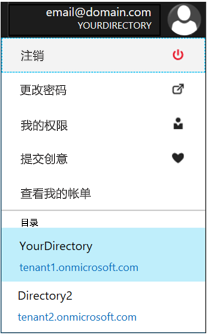
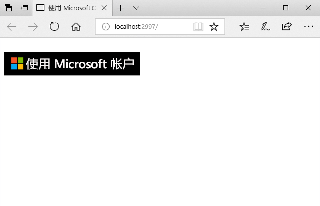
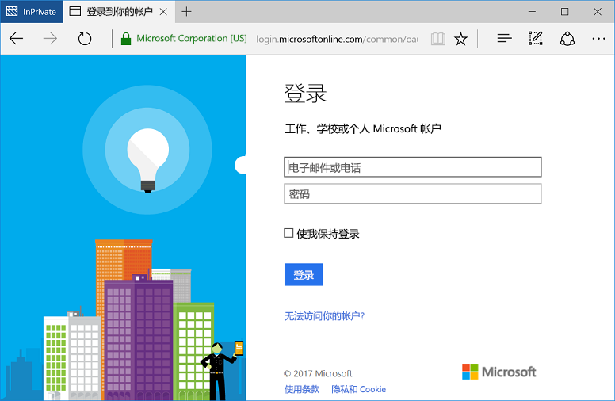

# <a name="quickstart-add-sign-in-with-microsoft-to-an-aspnet-web-app"></a>快速入门：向 ASP.NET Web 应用添加 Microsoft 登录功能

[!INCLUDE [active-directory-develop-applies-v1](../../../includes/active-directory-develop-applies-v1.md)]

在本快速入门中，你将了解如何使用 OpenID Connect 通过基于传统 Web 浏览器的应用程序，根据 ASP.NET 模型视图控制器 (MVC) 解决方案实现 Microsoft 登录。 你将了解如何在 ASP.NET 应用程序中使用工作和学校帐户登录。

在本快速入门结束时，应用程序可接受与 Azure Active Directory (Azure AD) 集成的组织的工作和学校帐户登录。

> [!NOTE]
> 如果除工作和学校帐户登录外，还需要启用个人帐户登录，可以使用 [Microsoft 标识平台终结点](azure-ad-endpoint-comparison.md)。 有关详细信息，请参阅[此 ASP.NET 教程](tutorial-v2-asp-webapp.md)以及[本文](active-directory-v2-limitations.md)对 Microsoft 标识平台终结点的解释。

## <a name="prerequisites"></a>先决条件

要开始，请确保满足下列先决条件：

* 已安装 Visual Studio 2015 Update 3 或 Visual Studio 2019。 尚未安装？ [免费下载 Visual Studio 2019](https://www.visualstudio.com/downloads/)

## <a name="scenario-sign-in-users-from-work-and-school-accounts-in-your-aspnet-app"></a>场景：在 ASP.NET 应用中让用户使用工作和学校帐户登录



浏览器访问 ASP.NET 网站，并请求用户使用此场景中的“登录”按钮进行身份验证。 在此方案中，呈现网页的大部分工作在服务器端完成。

此快速入门演示了如何从空模板起步在 ASP.NET Web 应用程序上让用户登录。 它还包括了添加登录按钮和每个控制器与方法等步骤，并讨论了这些任务背后的概念。 还可以通过使用 [Visual Studio Web 模板](https://docs.microsoft.com/aspnet/visual-studio/overview/2013/creating-web-projects-in-visual-studio#organizational-account-authentication-options)并选择“组织帐户”和云选项之一（该选项使用包含其他控制器、方法和视图的更丰富的模板），创建使 Azure AD 用户（工作和学校帐户）登录的项目。

## <a name="libraries"></a>库

本快速入门使用以下包：

| 库 | 说明 |
|---|---|
| [Microsoft.Owin.Security.OpenIdConnect](https://www.nuget.org/packages/Microsoft.Owin.Security.OpenIdConnect/) | 让应用程序可使用 OpenIdConnect 进行身份验证的中间件 |
| [Microsoft.Owin.Security.Cookies](https://www.nuget.org/packages/Microsoft.Owin.Security.Cookies) |允许应用程序使用 Cookie 维持用户会话的中间件 |
| [Microsoft.Owin.Host.SystemWeb](https://www.nuget.org/packages/Microsoft.Owin.Host.SystemWeb) | 允许基于 OWIN 的应用程序使用 ASP.NET 请求管道在 IIS 上运行 |
|  |  |

## <a name="step-1-set-up-your-project"></a>步骤 1：设置项目

这些步骤介绍如何使用 OpenID Connect 通过 OWIN 中间件在 ASP.NET 项目上安装和配置身份验证管道。

要下载此示例的 Visual Studio 项目，请按照下列步骤操作：
1. [下载 GitHub 上的示例项目](https://github.com/AzureADQuickStarts/WebApp-OpenIdConnect-DotNet/archive/GuidedSetup.zip)。
1. 跳至“配置”步骤以在执行操作前配置代码示例。

## <a name="step-2-create-your-aspnet-project"></a>步骤 2：创建 ASP.NET 项目

1. 在 Visual Studio 中，转到“文件”>“新建”>“项目”。
2. 在 Visual C#\Web 下，选择“ASP.NET Web 应用程序(.NET Framework)”。
3. 为应用程序命名，并单击“确定”。
4. 选择“空”并选中复选框，添加 MVC 引用。

## <a name="step-3-add-authentication-components"></a>步骤 3：添加身份验证组件

1. 在 Visual Studio 中，转到“工具”>“NuGet 包管理器”>“包管理器控制台”。
2. 在包管理器控制台窗口中键入以下命令，添加 **OWIN 中间件 NuGet 包**：

    ```powershell
    Install-Package Microsoft.Owin.Security.OpenIdConnect
    Install-Package Microsoft.Owin.Security.Cookies
    Install-Package Microsoft.Owin.Host.SystemWeb
    ```

<!--start-collapse-->
> ### <a name="about-these-packages"></a>关于这些包
>上述库通过基于 Cookie 的身份验证使用 OpenID Connect 启用单一登录 (SSO)。 完成身份验证后，代表用户的令牌会发送到应用程序，OWIN 中间件会创建会话 Cookie。 浏览器随后对后续请求使用此 cookie，这样一来，用户就无需重新验证，也不需要任何其他验证。
<!--end-collapse-->

## <a name="step-4-configure-the-authentication-pipeline"></a>步骤 4：配置身份验证管道

按照以下步骤创建 OWIN 中间件 Startup 类，以配置 OpenID Connect 身份验证。 此类自动执行。

> [!TIP]
> 如果项目的根文件夹中没有 `Startup.cs` 文件，请执行以下操作：<br/>
> 1. 右键单击项目的根文件夹：>   “添加”>“新建项”...>“OWIN Startup 类”<br/>
> 2. 将其命名为 `Startup.cs`<br/>
>
>> 确保选择的类是 OWIN Startup 类，而不是标准 C# 类。 通过检查是否在命名空间上看到 `[assembly: OwinStartup(typeof({NameSpace}.Startup))]` 来进行确认。

创建 OWIN 中间件 Startup 类：

1. 将 OWIN 和 Microsoft.IdentityModel 命名空间添加到 `Startup.cs`：

    [!code-csharp[main](../../../WebApp-OpenIDConnect-DotNet/WebApp-OpenIDConnect-DotNet/Startup.cs?name=AddedNameSpaces "Startup.cs")]

2. 使用以下代码替换 Startup 类：

    [!code-csharp[main](../../../WebApp-OpenIDConnect-DotNet/WebApp-OpenIDConnect-DotNet/Startup.cs?name=Startup "Startup.cs")]

<!--start-collapse-->
> [!NOTE]
> 在 *OpenIDConnectAuthenticationOptions* 中提供的参数将充当应用程序与 Azure AD 通信时使用的坐标。 OpenID Connect 中间件会使用 Cookie，因此，还需要设置 Cookie 身份验证，如以上代码所示。 *ValidateIssuer* 值告知 OpenIdConnect 不要限制某个特定组织的访问权限。
<!--end-collapse-->

<!--end-setup-->

<!--start-use-->

## <a name="step-5-add-a-controller-to-handle-sign-in-and-sign-out-requests"></a>步骤 5：添加控制器来处理登录和注销请求

创建新控制器来公开登录和注销方法。

1.  右键单击“控制器”文件夹，并选择“添加”>“控制器”
2.  选择“MVC (.NET 版本)控制器 - 空”。
3.  选择 **添加** 。
4.  将其命名为 `HomeController`，然后选择“添加”。
5.  向该类添加 OWIN 命名空间：

    [!code-csharp[main](../../../WebApp-OpenIDConnect-DotNet/WebApp-OpenIDConnect-DotNet/Controllers/HomeController.cs?name=AddedNameSpaces "HomeController.cs")]

6. 通过代码启动身份验证质询，添加下面的方法来处理控制器登录和注销：

    [!code-csharp[main](../../../WebApp-OpenIDConnect-DotNet/WebApp-OpenIDConnect-DotNet/Controllers/HomeController.cs?name=SigInAndSignOut "HomeController.cs")]

## <a name="step-6-create-the-apps-home-page-to-sign-in-users-via-a-sign-in-button"></a>步骤 6：创建应用的主页，通过登录按钮来登录用户

在 Visual Studio 中，创建新视图来添加登录按钮并在身份验证后显示用户信息：

1. 右键单击“视图/主页”文件夹，然后选择“添加视图”。
1. 将其命名为“Index”。
1. 向文件添加以下 HTML，其中包括登录按钮：

    [!code-html[main](../../../WebApp-OpenIDConnect-DotNet/WebApp-OpenIDConnect-DotNet/Views/Home/Index.cshtml "Index.cshtml")]

<!--start-collapse-->
此页以 SVG 形式添加登录按钮，背景为黑色：<br/><br/> 有关更多登录按钮，请转到[应用程序的品牌指南](howto-add-branding-in-azure-ad-apps.md)。
<!--end-collapse-->

## <a name="step-7-display-users-claims-by-adding-a-controller"></a>步骤 7：添加控制器来显示用户声明

此控制器演示如何使用 `[Authorize]` 属性来保护控制器。 此属性只允许通过身份验证的用户，从而限制对控制器的访问。 下面的代码使用该属性来显示作为登录的一部分被检索的用户声明。

1. 右键单击“控制器”文件夹，然后选择“添加”>“控制器”。
1. 选择“MVC {version} 控制器 - 空”。
1. 选择 **添加** 。
1. 将其命名为“ClaimsController”。
1. 将控制器类的代码替换为下面的代码 - 此示例将 `[Authorize]` 属性添加到类：

    [!code-csharp[main](../../../WebApp-OpenIDConnect-DotNet/WebApp-OpenIDConnect-DotNet/Controllers/ClaimsController.cs?name=ClaimsController "ClaimsController.cs")]

<!--start-collapse-->
> [!NOTE]
> 因为使用 `[Authorize]` 属性，仅当用户通过身份验证后，才执行此控制器的所有方法。 如果用户未通过身份验证，并尝试访问控制器，OWIN 会启动身份验证质询，并强制用户进行身份验证。 上面的代码查看用户令牌中特定属性的用户的声明集合。 这些属性包括用户的完整姓名和用户名，以及全局用户标识符使用者。 它还包含租户 ID，表示用户的组织的 ID。
<!--end-collapse-->

## <a name="step-8-create-a-view-to-display-the-users-claims"></a>步骤 8：创建视图来显示用户的声明

在 Visual Studio 中创建新视图，以在网页上显示用户的声明：

1. 右键单击“视图/声明”文件夹，然后选择“添加视图”。
1. 将其命名为“Index”。
1. 将以下 HTML 添加到文件：

    [!code-html[main](../../../WebApp-OpenIDConnect-DotNet/WebApp-OpenIDConnect-DotNet/Views/Claims/Index.cshtml "Index.cshtml")]

<!--end-use-->

<!--start-configure-->

## <a name="step-9-configure-your-webconfig-and-register-an-application"></a>步骤 9：配置 web.config 并注册应用程序

1. 在 Visual Studio 中，将以下内容添加到 `configuration\appSettings` 部分下的 `web.config`（位于根文件夹中）：

    ```xml
    <add key="ClientId" value="Enter_the_Application_Id_here" />
    <add key="RedirectUrl" value="Enter_the_Redirect_Url_here" />
    <add key="Tenant" value="common" />
    <add key="Authority" value="https://login.microsoftonline.com/{0}" />
    ```
2. 在解决方案资源管理器中，选择项目并查看“属性”<i></i> 窗口（如果看不到“属性”窗口，请按 F4）
3. 将“已启用 SSL”更改为 <code>True</code>
4. 将项目的 SSL URL 复制到剪贴板：<br/><br/><br />
5. 在 <code>web.config</code> 中，用项目的 SSL URL替换 <code>Enter_the_Redirect_URL_here</code>。

### <a name="register-your-application-in-the-azure-portal-then-add-its-information-to-webconfig"></a>在 Azure 门户中注册你的应用程序，然后将其信息添加到 *web.config*

1. 转到 [Microsoft Azure 门户 - 应用注册](https://portal.azure.com/#blade/Microsoft_AAD_IAM/ActiveDirectoryMenuBlade/RegisteredApps)，注册应用程序。
2. 选择“新建应用程序注册”。
3. 输入应用程序的名称。
4. 将 Visual Studio 项目的 SSL URL 粘贴到登录 URL 中。 此 URL 还会自动添加到正在注册的应用程序的回复 URL 列表。
5. 选择“创建”以注册应用程序。 执行此操作后会返回到应用程序列表。
6. 现在，搜索并/或选择刚刚创建的应用程序，打开其属性。
7. 将“应用程序 ID”下的 GUID 复制到剪贴板。
8. 返回到 Visual Studio，在 `web.config` 中，用你注册的应用程序 ID 替换 `Enter_the_Application_Id_here`。

> [!TIP]
> 如果帐户配置为可访问多个目录，请确保为要向其注册应用程序的组织选择了正确的目录，方法是单击 Azure 门户右上角的帐户名称，然后按照指示验证所选目录：<br/>

## <a name="step-10-configure-sign-in-options"></a>步骤 10：配置登录选项

可以将应用程序配置为只允许某个组织的 Azure AD 实例中的用户登录，或者接受任何组织中的用户登录。 按照以下选项之一的说明进行操作：

### <a name="configure-your-application-to-allow-sign-ins-of-work-and-school-accounts-from-any-company-or-organization-multi-tenant"></a>将应用程序配置为允许任何公司或组织（多租户）的工作和学校帐户登录

如果想接受任何已经与 Azure AD 集成的公司或组织的工作和学校帐户登录，请执行以下步骤。 此场景是 *SaaS 应用程序*的常见场景：

1. 返回到 [Microsoft Azure 门户 - 应用注册](https://portal.azure.com/#blade/Microsoft_AAD_IAM/ActiveDirectoryMenuBlade/RegisteredApps)，并查找你注册的应用程序。
2. 在“所有设置”下，选择“属性”。
3. 将“多租户”属性更改为“是”，然后选择“保存”。

有关此设置和多租户应用程序概念的详细信息，请参阅[多租户概述](howto-convert-app-to-be-multi-tenant.md)。

### <a name="restrict-users-from-only-one-organizations-active-directory-instance-to-sign-in-to-your-application-single-tenant"></a>限制某个组织的 Active Directory 实例的用户登录应用程序（单租户）

此选项是业务线应用程序的常见方案。

如果希望应用程序仅接受属于特定 Azure AD 实例的帐户（包括该示例的来宾帐户）进行登录，请按照下列步骤操作：

1. 使用 `Common` 将 web.config 中的 `Tenant` 参数替换为组织的租户名称 - 例如 contoso.onmicrosoft.com 。
1. 将 [OWIN Startup 类](#step-4-configure-the-authentication-pipeline)中的 `ValidateIssuer` 参数更改为 `true`。

要仅允许用户来自特定组织的列表，请按照下列步骤操作：

1. 将 `ValidateIssuer` 设置为 true。
1. 使用 `ValidIssuers` 参数来指定组织列表。

还可通过 IssuerValidator 参数实现自定义方法来验证颁发者。 有关 `TokenValidationParameters` 的详细信息，请参阅[此 MSDN 文章](https://msdn.microsoft.com/library/system.identitymodel.tokens.tokenvalidationparameters.aspx "TokenValidationParameters MSDN 文章")。

<!--end-configure-->

<!--start-configure-arp-->
<!--
## Configure your ASP.NET Web App with the application's registration information

In this step, you will configure your project to use SSL, and then use the SSL URL to configure your application’s registration information. After this, add the application’ registration information to your solution via *web.config*.

1.  In Solution Explorer, select the project and look at the `Properties` window (if you don’t see a Properties window, press F4)
2.  Change `SSL Enabled` to `True`
3.  Copy the value from `SSL URL` above and paste it in the `Redirect URL` field on the top of this page, then click *Update*:<br/><br/><br />
4.  Add the following in `web.config` file located in root’s folder, under section `configuration\appSettings`:

```xml
<add key="ClientId" value="[Enter the application Id here]" />
<add key="RedirectUri" value="[Enter the Redirect URL here]" />
<add key="Tenant" value="common" />
<add key="Authority" value="https://login.microsoftonline.com/{0}" /> 
```
-->
<!--end-configure-arp-->
<!--start-test-->

## <a name="step-11-test-your-code"></a>步骤 11：测试代码

1. 按 F5 在 Visual Studio 中运行项目。 浏览器随即打开，并定向到 `http://localhost:{port}`，可在其中看到“Microsoft 登录”按钮。
1. 选择登录按钮。

### <a name="sign-in"></a>登录

准备好测试后，请使用工作帐户 (Azure AD) 登录。





#### <a name="expected-results"></a>预期结果

在用户登录后，用户会被重定向到网站主页，该网站是 Microsoft 应用程序注册门户上应用程序注册信息中指定的 HTTPS URL。 此页现在显示 Hello {用户}、注销链接，以及查看用户声明的链接（即指向之前创建的 Authorize 控制器的链接）。

### <a name="see-users-claims"></a>查看用户的声明

选择超链接，查看用户的声明。 此操作将用户引至控制器和视图，仅供通过身份验证的用户访问。

#### <a name="expected-results"></a>预期结果

 应看到一个表，其中包含已登录用户的基本属性：

| 属性 | 值 | 说明 |
|---|---|---|
| 名称 | {用户全名} | 用户的名字和姓氏 |
| 用户名 | <span>user@domain.com</span> | 用于标识已登录用户的用户名 |
| 主题| {使用者} |一个在 Web 上唯一地标识用户登录名的字符串 |
| 租户 ID | {Guid} | 唯一表示用户的 Azure AD 组织的 guid |

此外还可看到一个表格，其中包含身份验证请求中的所有用户声明。 有关 ID 令牌和说明中所有声明的列表，请参阅 [ID 令牌中的声明列表](https://docs.microsoft.com/azure/active-directory/develop/active-directory-token-and-claims)。

### <a name="optional-access-a-method-that-has-an-authorize-attribute"></a>（可选）访问具有 [Authorize] 属性的方法

此步骤测试作为匿名用户对 Claims 控制器的访问：<br/>
选择注销用户的链接并完成注销过程。<br/>
现在浏览器中键入 `http://localhost:{port}/claims`，访问受 `[Authorize]` 属性保护的控制器

#### <a name="expected-results"></a>预期结果

应收到提示，要求进行身份验证以查看视图。

## <a name="additional-information"></a>其他信息

<!--start-collapse-->
### <a name="protect-your-entire-web-site"></a>保护整个网站

若要保护整个网站，请在 `Global.asax` `Application_Start` 方法中将 `AuthorizeAttribute` 添加到 `GlobalFilters`：

```csharp
GlobalFilters.Filters.Add(new AuthorizeAttribute());
```
<!--end-collapse-->

<div></div>
<br/>

<!--end-test-->

## <a name="next-steps"></a>后续步骤

现在，可以转到其他方案。

> [!div class="nextstepaction"]
> [ASP.NET 教程](https://docs.microsoft.com/azure/active-directory/develop/tutorial-v2-asp-webapp)
