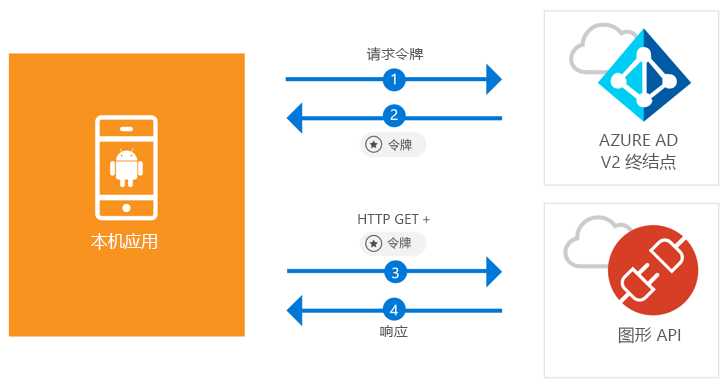

# <a name="quickstart-sign-in-users-and-call-the-microsoft-graph-api-from-an-android-app"></a>快速入门：从 Android 应用将用户登录并调用 Microsoft Graph API

[!INCLUDE [active-directory-develop-applies-v2-msal](../../../includes/active-directory-develop-applies-v2-msal.md)]

本快速入门包含了一个代码示例，该示例演示了 Android 应用程序如何将个人、工作和学校帐户进行登录，获取访问令牌以及调用 Microsoft Graph API。



> [!NOTE]
> **先决条件**
> * Android Studio 3 或更高版本
> * 需要 Android SDK 21 或更高版本（建议使用 SDK 27）

> [!div renderon="docs"]
> ## <a name="register-and-download"></a>注册和下载
> ### <a name="register-and-configure-your-application-and-code-sample"></a>注册并配置应用程序和代码示例
> #### <a name="step-1-register-your-application"></a>步骤 1：注册应用程序
> 若要注册应用程序并将应用程序注册信息添加到解决方案，请执行以下操作：
> 1. 转到 [Microsoft 应用程序注册门户](https://apps.dev.microsoft.com/portal/register-app)注册应用程序。
> 1. 在“应用程序名称”框中输入应用程序的名称。
> 1. 确保未选中“指导式设置”复选框，然后选择“创建”。
> 1. 依次选择“添加平台”、“本机应用程序”和“保存”。

> [!div renderon="portal" class="sxs-lookup"]
> #### <a name="step-1-configure-your-application"></a>步骤 1：配置应用程序
> 为使此快速入门中的代码示例正常运行，需要将答复 URL 添加为 **msal{AppId}://auth**（其中，{AppId} 是你的应用的应用程序 ID）。
> > [!div renderon="portal" id="makechanges" class="nextstepaction"]
> > [为我执行此更改]()
>
> > [!div id="appconfigured" class="alert alert-info"]
> >  应用程序已使用这些属性进行了配置

#### <a name="step-2-download-the-project"></a>步骤 2：下载项目

* [下载 Android Studio 项目](https://github.com/Azure-Samples/active-directory-android-native-v2/archive/master.zip)

#### <a name="step-3-configure-your-project"></a>步骤 3：配置项目

1. 解压缩该项目并将其在 Android Studio 中打开。
1. 在“应用” > “java” > “{host}.{namespace}”下，打开“MainActivity”。**<i></i>**
1. 将以 `final static String CLIENT_ID` 开头的行替换为：

    > [!div renderon="portal" class="sxs-lookup"]
    > ```java
    > final static String CLIENT_ID = "ENTER_THE_APPLICATION_ID_HERE";
    > ```

    > [!div renderon="docs"]
    > ```java
    > final static String CLIENT_ID = "<ENTER_THE_APPLICATION_ID_HERE>";
    > ```

1. 打开：“应用” > “清单” > “AndroidManifest.xml”。
1. 将下面的活动添加到 **manifest\application** 节点。 此代码片段将注册一个 **BrowserTabActivity**，以允许 OS 在完成身份验证后继续运行应用程序：

    > [!div renderon="docs"]
    > ```xml
    > <!--Intent filter to capture System Browser calling back to our app after Sign In-->
    > <activity
    >     android:name="com.microsoft.identity.client.BrowserTabActivity">
    >     <intent-filter>
    >         <action android:name="android.intent.action.VIEW" />
    >         <category android:name="android.intent.category.DEFAULT" />
    >         <category android:name="android.intent.category.BROWSABLE" />
    > 
    >         <!--Add in your scheme/host from registered redirect URI-->
    >         <!--By default, the scheme should be similar to 'msal[appId]' -->
    >         <data android:scheme="msal<ENTER_THE_APPLICATION_ID_HERE>"
    >             android:host="auth" />
    >     </intent-filter>
    > </activity>
    > ```

    > [!div renderon="portal" class="sxs-lookup"]
    > ```xml
    > <!--Intent filter to capture System Browser calling back to our app after Sign In-->
    > <activity
    >     android:name="com.microsoft.identity.client.BrowserTabActivity">
    >     <intent-filter>
    >         <action android:name="android.intent.action.VIEW" />
    >         <category android:name="android.intent.category.DEFAULT" />
    >         <category android:name="android.intent.category.BROWSABLE" />
    > 
    >         <!--Add in your scheme/host from registered redirect URI-->
    >         <!--By default, the scheme should be similar to 'msal[appId]' -->
    >         <data android:scheme="msalENTER_THE_APPLICATION_ID_HERE"
    >             android:host="auth" />
    >     </intent-filter>
    > </activity>
    > ```

> [!div renderon="docs"]
> <span>6.</span>将 `<ENTER_THE_APPLICATION_ID_HERE>` 替换为你的应用程序的“应用程序 ID”。 如果需要查找“应用程序 ID”，请转到“概述”页面。

## <a name="more-information"></a>更多信息

请阅读以下各部分来详细了解本快速入门。

### <a name="msal"></a>MSAL

MSAL ([com.microsoft.identity.client](https://javadoc.io/doc/com.microsoft.identity.client/msal)) 库用于用户登录和请求用于访问由 Microsoft Azure Active Directory (Azure AD) 保护的 API 的令牌库。 可以如下所述使用 Gradle 来安装它：在“依赖项”下的“Gradle 脚本” > “build.gradle (Module: app)”中添加以下内容：

```gradle  
implementation 'com.android.volley:volley:1.1.1'
implementation 'com.microsoft.identity.client:msal:0.1.+'
```

### <a name="msal-initialization"></a>MSAL 初始化

可以通过添加以下代码，为 MSAL 添加引用：

```java
import com.microsoft.identity.client.*;
```

然后，使用以下代码对 MSAL 进行初始化：

```java
sampleApp = new PublicClientApplication(
        this.getApplicationContext(),
        CLIENT_ID);
```

> |其中： ||
> |---------|---------|
> |`CLIENT_ID` | 在 *portal.azure.com* 中注册的应用程序的应用程序 ID |

### <a name="requesting-tokens"></a>请求令牌

MSAL 有两种用于获取令牌的方法：`acquireToken` 和 `acquireTokenSilentAsync`

#### <a name="getting-a-user-token-interactively"></a>以交互方式获取用户令牌

在某些情况下，需要强制用户与 Azure AD v2.0 终结点进行交互，这将导致进行上下文切换以转到系统浏览器，以验证用户的凭据或表示同意。 示例包括：

* 用户首次登录应用程序
* 由于密码已过期，用户可能需要重新输入凭据的情况
* 应用程序正在请求访问用户需要同意的资源的情况
* 需要双重身份验证的情况

```java
sampleApp.acquireToken(this, SCOPES, getAuthInteractiveCallback());
```

> |其中：||
> |---------|---------|
> | `SCOPES` | 包含所请求的作用域（即针对 Microsoft Graph 的 `{ "user.read" }` 或针对自定义 Web API 的 `{ "<Application ID URL>/scope" }`（即 `api://<Application ID>/access_as_user`）） |
> | `getAuthInteractiveCallback` | 在进行身份验证后将控制权返还给应用程序时执行的回调 |

#### <a name="getting-a-user-token-silently"></a>以静默方式获取用户令牌

你不希望在用户每次需要访问资源时都要求其验证其凭据。 大多数情况下，你希望在无需任何用户交互的情况下进行令牌获取和续订。 可以使用 `AcquireTokenSilentAsync` 方法获取令牌，以在初始 `acquireToken` 方法后访问受保护资源：

```java
sampleApp.acquireToken(getActivity(), SCOPES, getAuthInteractiveCallback());
```

> |其中：||
> |---------|---------|
> | `SCOPES` | 包含所请求的作用域（即针对 Microsoft Graph 的 `{ "user.read" }` 或针对自定义 Web API 的 `{ "<Application ID URL>/scope" }`（即 `api://<Application ID>/access_as_user`）） |
> | `getAuthInteractiveCallback` | 在进行身份验证后将控制权返还给应用程序时执行的回调 |

## <a name="next-steps"></a>后续步骤

### <a name="learn-the-steps-to-create-the-application-used-in-this-quickstart"></a>了解创建本快速入门中使用的应用程序的步骤

试用 Android 教程，了解有关构建应用程序和新功能的完整分步指南，包括本快速入门的完整说明。

> [!div class="nextstepaction"]
> [调用图形 API Android 教程](https://docs.microsoft.com/azure/active-directory/develop/guidedsetups/active-directory-android)

### <a name="msal-for-android-library-wiki"></a>适用于 Android 库 wiki 的 MSAL

阅读有关适用于 Android 的 MSAL 库的详细信息：

> [!div class="nextstepaction"]
> [适用于 Android 库 wiki 的 MSAL](https://github.com/AzureAD/microsoft-authentication-library-for-android/wiki)

[!INCLUDE [Help and support](../../../includes/active-directory-develop-help-support-include.md)]