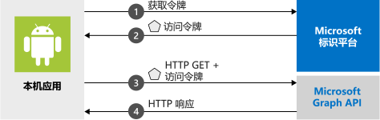

# <a name="quickstart-sign-in-users-and-call-the-microsoft-graph-api-from-an-android-app"></a>快速入门：从 Android 应用登录用户并调用 Microsoft Graph API

本快速入门包含了一个代码示例，该示例演示了 Android 应用程序如何将个人、工作和学校帐户进行登录，获取访问令牌以及调用 Microsoft Graph API。



> [!NOTE]
> **先决条件**
> * Android Studio 
> * Android 16+ 为必需 


> [!div renderon="docs"]
> ## <a name="register-and-download-your-quickstart-app"></a>注册并下载快速入门应用
> 可以使用两个选项来启动快速入门应用程序：
> * [快速][选项 1：注册并自动配置应用，然后下载代码示例](#option-1-register-and-auto-configure-your-app-and-then-download-your-code-sample)
> * [手动][选项 2：注册并手动配置应用程序和代码示例](#option-2-register-and-manually-configure-your-application-and-code-sample)
>
> ### <a name="option-1-register-and-auto-configure-your-app-and-then-download-your-code-sample"></a>选项 1：注册并自动配置应用，然后下载代码示例
> #### <a name="step-1-register-your-application"></a>步骤 1：注册应用程序
> 若要注册应用，请执行以下操作：
> 1. 转到新的 [Azure 门户 - 应用注册](https://portal.azure.com/#blade/Microsoft_AAD_RegisteredApps/applicationsListBlade/quickStartType/AndroidQuickstartPage/sourceType/docs)窗格。
> 1. 输入应用程序的名称并选择“注册”  。
> 1. 遵照说明下载内容，并只需单击一下自动配置新应用程序。
>
> ### <a name="option-2-register-and-manually-configure-your-application-and-code-sample"></a>选项 2：注册并手动配置应用程序和代码示例
>
> #### <a name="step-1-register-your-application"></a>步骤 1：注册应用程序
> 若要手动注册应用程序并将应用的注册信息添加到解决方案，请执行以下步骤：
>
> 1. 导航到面向开发人员的 Microsoft 标识平台的[应用注册](https://aka.ms/MobileAppReg)页。
> 1. 选择“新注册”。 
> 1. 出现“注册应用程序”页后，请输入应用程序的注册信息： 
>      - 在“名称”  部分输入一个会显示给应用用户的有意义的应用程序名称，例如 `AndroidQuickstart`。
>      - 可以跳过此页上的其他配置。 
>      - 点击“`Register`”按钮。
> 1. 单击新应用，然后转到`Authentication` > `Add Platform` > `Android`。    
>      - 输入 Android studio 项目提供的包名。 
>      - 生成签名哈希。 有关说明，请查看门户。
> 1. 选择 `Configure` 并保存“MSAL 配置”JSON 以供稍后使用。 

> [!div renderon="portal" class="sxs-lookup"]
> #### <a name="step-1-configure-your-application"></a>步骤 1：配置应用程序
> 为使此快速入门中的代码示例正常运行，需要添加与身份验证代理兼容的重定向 URI。 
> > [!div renderon="portal" id="makechanges" class="nextstepaction"]
> > [执行此更改]()
>
> > [!div id="appconfigured" class="alert alert-info"]
> >  应用程序已使用这些属性进行了配置

#### <a name="step-2-download-the-project"></a>步骤 2：下载项目

* [下载代码示例](https://github.com/Azure-Samples/active-directory-android-native-v2/archive/master.zip)

#### <a name="step-3-configure-your-project"></a>步骤 3：配置项目

> [!div renderon="docs"]
> 如果选择了上面的“选项 1”，则可跳过这些步骤。 

> [!div renderon="portal" class="sxs-lookup"]
> 1. 解压缩该项目并将其在 Android Studio 中打开。
> 1. 在 **app** > **src** > **main** > **res** > **raw** 中，打开 **auth_config.json**。
> 1. 编辑 **auth_config.json**，将其替换为 Azure 门户中的 JSON。 若要手动进行操作，请进行以下更改：
>    ```javascript
>    {
>       "client_id" : "Enter_the_Application_Id_Here",
>       "authorization_user_agent" : "DEFAULT",
>       "redirect_uri" : "Enter_the_Redirect_Uri_Here",
>       "authorities" : [
>          {
>             "type": "AAD",
>             "audience": {
>                "type": "Enter_the_Audience_Info_Here",
>                "tenant_id": "Enter_the_Tenant_Info_Here"
>             }
>          }
>       ]
>    }
>    ```
> 
> 1. 在“应用”   >   “清单”中，打开 **AndroidManifest.xml**。
> 1. 将以下活动粘贴到 **manifest\application** 节点： 
>    ```xml
>    <!--Intent filter to catch Microsoft's callback after Sign In-->
>    <activity
>        android:name="com.microsoft.identity.client.BrowserTabActivity">
>        <intent-filter>
>            <action android:name="android.intent.action.VIEW" />
>            <category android:name="android.intent.category.DEFAULT" />
>            <category android:name="android.intent.category.BROWSABLE" />
>            <data android:scheme="msauth"
>                android:host="Enter_the_Package_Name"
>                android:path="/Enter_the_Signature_Hash" />
>        </intent-filter>
>    </activity>
>    ```
> 1. 运行应用！ 

> [!div class="sxs-lookup" renderon="portal"]
> > [!NOTE]
> > 本快速入门支持 Enter_the_Supported_Account_Info_Here。

> [!div renderon="docs"]
> 1. 解压缩该项目并将其在 Android Studio 中打开。
> 1. 在“应用”   > “资源”   >   “原始”中，打开 **auth_config.json**。
> 1. 编辑 **auth_config.json**，将其替换为 Azure 门户中的 JSON。 若要手动进行操作，请进行以下更改：
>    ```javascript
>    "client_id" : "ENTER_YOUR_APPLICATION_ID",
>    "redirect_uri": "ENTER_YOUR_REDIRECT_URI", 
>     ```
> 1. 在“应用”   >   “清单”中，打开 **AndroidManifest.xml**。
> 1. 将下面的活动添加到 **manifest\application** 节点。 此代码片段将注册一个 **BrowserTabActivity**，以允许 OS 在完成身份验证后继续运行应用程序：
>    ```xml
>    <!--Intent filter to catch Microsoft's callback after Sign In-->
>    <activity
>        android:name="com.microsoft.identity.client.BrowserTabActivity">
>        <intent-filter>
>            <action android:name="android.intent.action.VIEW" />
>            <category android:name="android.intent.category.DEFAULT" />
>            <category android:name="android.intent.category.BROWSABLE" />
>            <data android:scheme="msauth"
>                android:host="Enter_the_Package_Name"
>                android:path="/Enter_the_Decoded_Signature_Hash" />
>        </intent-filter>
>    </activity>
>    ```
> 1. 将 `Enter_the_Package_Name` 和 `Enter_the_Signature_Hash` 替换为在 Azure 门户中注册的值。 
> 1. 运行应用！ 

## <a name="more-information"></a>更多信息

请阅读以下各部分来详细了解本快速入门。

### <a name="getting-msal"></a>获取 MSAL

MSAL ([com.microsoft.identity.client](https://javadoc.io/doc/com.microsoft.identity.client/msal)) 是一个库，用于用户登录和请求令牌，此类令牌用于访问受 Microsoft 标识平台保护的 API。 可以如下所述使用 Gradle 3.0+ 来安装它：在“依赖项”  下的“Gradle 脚本”   > “build.gradle (Module: app)”  中添加以下内容：

```gradle  
implementation 'com.android.volley:volley:1.1.1'
implementation 'com.microsoft.identity.client:msal:0.3.+'
```

### <a name="msal-initialization"></a>MSAL 初始化

可以通过添加以下代码，为 MSAL 添加引用：

```java
import com.microsoft.identity.client.*;
```

然后，使用以下代码对 MSAL 进行初始化：

```java
    sampleApp = new PublicClientApplication(
        this.getApplicationContext(),
        R.raw.auth_config);
```

> |其中： ||
> |---------|---------|
> |`R.raw.auth_config` | 此文件包含应用程序的配置，包括应用/客户端 ID、登录受众、重定向 URI 以及多个其他的自定义选项。 |

### <a name="requesting-tokens"></a>请求令牌

MSAL 有两种用于获取令牌的方法：`acquireToken` 和 `acquireTokenSilentAsync`

#### <a name="acquiretoken-getting-a-token-interactively"></a>acquireToken：以交互方式获取令牌

有些情况下，需要用户与 Microsoft 标识平台交互。 在这些情况下，最终用户可能需要选择其帐户、输入其凭据，或者同意应用请求的权限。 例如， 

* 用户首次登录应用程序
* 用户在重置其密码时需输入其凭据。 
* 如果撤销许可 
* 如果应用显式要求许可。 
* 应用程序首次请求访问资源时
* 需要 MFA 或其他条件访问策略时

```java
sampleApp.acquireToken(this, SCOPES, getAuthInteractiveCallback());
```

> |其中：||
> |---------|---------|
> | `SCOPES` | 包含所请求的作用域（即针对 Microsoft Graph 的 `{ "user.read" }` 或针对自定义 Web API 的 `{ "<Application ID URL>/scope" }`（即 `api://<Application ID>/access_as_user`）） |
> | `getAuthInteractiveCallback` | 在进行身份验证后将控制权返还给应用程序时执行的回调 |

#### <a name="acquiretokensilent-getting-a-user-token-silently"></a>acquireTokenSilent：以静默方式获取用户令牌

应用不应该在用户每次请求令牌时都要求他们登录。 如果用户已登录，则此方法允许应用以静默方式请求令牌。

```java
    sampleApp.getAccounts(new PublicClientApplication.AccountsLoadedCallback() {
        @Override
        public void onAccountsLoaded(final List<IAccount> accounts) {

            if (!accounts.isEmpty()) {
                sampleApp.acquireTokenSilentAsync(SCOPES, accounts.get(0), getAuthSilentCallback());
            } else {
                /* No accounts */
            }
        }
    });
```

> |其中：||
> |---------|---------|
> | `SCOPES` | 包含所请求的作用域（即针对 Microsoft Graph 的 `{ "user.read" }` 或针对自定义 Web API 的 `{ "<Application ID URL>/scope" }`（即 `api://<Application ID>/access_as_user`）） |
> | `getAccounts(...)` | 包含你尝试以静默方式获取其令牌的帐户 |
> | `getAuthSilentCallback()` | 在进行身份验证后将控制权返还给应用程序时执行的回调 |

## <a name="next-steps"></a>后续步骤

### <a name="learn-the-steps-to-create-the-application-used-in-this-quickstart"></a>了解创建本快速入门中使用的应用程序的步骤

试用 Android 教程，了解有关构建应用程序和新功能的完整分步指南，包括本快速入门的完整说明。

> [!div class="nextstepaction"]
> [调用图形 API Android 教程](https://docs.microsoft.com/azure/active-directory/develop/guidedsetups/active-directory-android)

### <a name="msal-for-android-library-wiki"></a>适用于 Android 库 wiki 的 MSAL

阅读有关适用于 Android 的 MSAL 库的详细信息：

> [!div class="nextstepaction"]
> [适用于 Android 库 wiki 的 MSAL](https://github.com/AzureAD/microsoft-authentication-library-for-android/wiki)

[!INCLUDE [Help and support](../../../includes/active-directory-develop-help-support-include.md)]

帮助我们改进 Microsoft 标识平台。 通过完成简短的两问题调查，告诉我们你的想法。

> [!div class="nextstepaction"]
> [Microsoft 标识平台调查](https://forms.office.com/Pages/ResponsePage.aspx?id=v4j5cvGGr0GRqy180BHbRyKrNDMV_xBIiPGgSvnbQZdUQjFIUUFGUE1SMEVFTkdaVU5YT0EyOEtJVi4u)