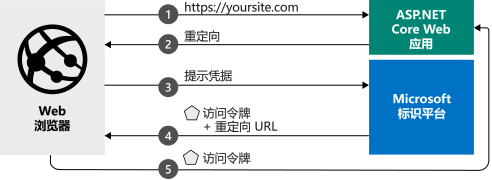

# <a name="quickstart-add-sign-in-with-microsoft-to-an-aspnet-core-web-app"></a>快速入门：向 ASP.NET Core Web 应用添加 Microsoft 登录功能

在本快速入门中，你将通过代码示例了解 ASP.NET Core Web 应用如何从任何 Azure Active Directory (Azure AD) 实例登录个人帐户（hotmail.com、outlook.com 和其他）以及工作和学校帐户。 （有关说明，请参阅[示例工作原理](#how-the-sample-works)。）

> [!div renderon="docs"]
> ## <a name="prerequisites"></a>先决条件
>
> * [Visual Studio 2019](https://visualstudio.microsoft.com/vs/) 或 [Visual Studio Code](https://code.visualstudio.com/)
> * [.NET Core SDK 3.1+](https://dotnet.microsoft.com/download)
>
> ## <a name="register-and-download-your-quickstart-app"></a>注册并下载快速入门应用
> 可以使用两个选项来启动快速入门应用程序：
> * [快速][选项 1：注册并自动配置应用，然后下载代码示例](#option-1-register-and-auto-configure-your-app-and-then-download-your-code-sample)
> * [手动][选项 2：注册并手动配置应用程序和代码示例](#option-2-register-and-manually-configure-your-application-and-code-sample)
>
> ### <a name="option-1-register-and-auto-configure-your-app-and-then-download-your-code-sample"></a>选项 1：注册并自动配置应用，然后下载代码示例
>
> 1. 访问 [Azure 门户 - 应用注册](https://aka.ms/aspnetcore2-1-aad-quickstart-v2)。
> 1. 输入应用程序的名称并选择“注册”。
> 1. 遵照说明下载内容，并一键式自动配置新应用程序。
>
> ### <a name="option-2-register-and-manually-configure-your-application-and-code-sample"></a>选项 2：注册并手动配置应用程序和代码示例
>
> #### <a name="step-1-register-your-application"></a>步骤 1：注册应用程序
> 若要注册应用程序并将应用的注册信息手动添加到解决方案，请执行以下步骤：
>
> 1. 登录 [Azure 门户](https://portal.azure.com)。
> 1. 如果有权访问多个租户，请使用顶部菜单中的“目录 + 订阅”筛选器:::image type="icon" source="./media/common/portal-directory-subscription-filter.png" border="false":::，选择要在其中注册应用程序的租户。
> 1. 搜索并选择“Azure Active Directory”  。
> 1. 在“管理”下，选择“应用注册”，然后选择“新建注册”  。
> 1. 输入应用程序的名称（例如 `AspNetCore-Quickstart`）。 应用的用户可能会看到此名称，你稍后可对其进行更改。
> 1. 输入 `https://localhost:44321/` 的“重定向 URI”
> 1. 选择“注册”  。
> 1. 在“管理”下，选择“身份验证”。 
> 1. 在“重定向 URI”下，选择“添加 URI”，然后输入 `https://localhost:44321/signin-oidc` 
> 1. 输入 `https://localhost:44321/signout-oidc` 的“注销 URL”
> 1. 选择“隐式授权”下的“ID 令牌”。
> 1. 选择“保存”。

> [!div class="sxs-lookup" renderon="portal"]
> #### <a name="step-1-configure-your-application-in-the-azure-portal"></a>步骤 1：在 Azure 门户中配置应用程序
> 为使此快速入门中的代码示例正常运行，需将回复 URL 添加为 `https://localhost:44321/` 和 `https://localhost:44321/signin-oidc`，将注销 URL 添加为 `https://localhost:44321/signout-oidc`，并请求将由授权终结点颁发的 ID 令牌。
> > [!div renderon="portal" id="makechanges" class="nextstepaction"]
> > [执行此更改]()
>
> > [!div id="appconfigured" class="alert alert-info"]
> >  应用程序已使用这些属性进行配置。

#### <a name="step-2-download-your-aspnet-core-project"></a>步骤 2：下载 ASP.NET Core 项目

> [!div renderon="docs"]
> [下载 ASP.NET Core 解决方案](https://github.com/Azure-Samples/active-directory-aspnetcore-webapp-openidconnect-v2/archive/aspnetcore3-1.zip)

> [!div renderon="portal" class="sxs-lookup"]
> 运行该项目。

> [!div renderon="portal" class="sxs-lookup" id="autoupdate" class="nextstepaction"]
> [下载代码示例](https://github.com/Azure-Samples/active-directory-aspnetcore-webapp-openidconnect-v2/archive/aspnetcore3-1.zip)

> [!div class="sxs-lookup" renderon="portal"]
> #### <a name="step-3-your-app-is-configured-and-ready-to-run"></a>步骤 3：应用已配置并可以运行
> 我们已经为项目配置了应用属性的值，并且该项目已准备好运行。
> [!div class="sxs-lookup" renderon="portal"]
> > [!NOTE]
> > `Enter_the_Supported_Account_Info_Here`
> [!div renderon="docs"]
> #### <a name="step-3-configure-your-aspnet-core-project"></a>步骤 3：配置 ASP.NET Core 项目
> 1. 将 .zip 存档解压缩到驱动器根附近的本地文件夹中。 例如，解压缩到 C:\Azure-Samples。
> 1. 在 Visual Studio 2019 中打开该解决方案。
> 1. 打开 appsettings.json 文件，并修改以下内容：
>
>    ```json
>    "ClientId": "Enter_the_Application_Id_here",
>    "TenantId": "common",
>    ```
>
>    - 将 `Enter_the_Application_Id_here` 替换为在 Azure 门户中注册的应用程序的应用程序(客户端) ID。 可以在应用的“概览”页中找到“应用程序(客户端) ID”。
>    - 将 `common` 替换为以下内容之一：
>       - 如果应用程序仅支持此组织目录中的帐户，请将此值替换为目录（租户）ID (GUID) 或租户名称（例如，`contoso.onmicrosoft.com`）  。 你可以在应用的概述页面上找到目录（租户）ID 。
>       - 如果应用程序支持“任何组织目录中的帐户”，请将该值替换为`organizations`
>       - 如果应用程序支持“所有 Microsoft 帐户用户”，请将该值保留为 `common`
>
> 在此快速入门中，请不要更改 appsettings.json 文件中的任何其他值。
>
> #### <a name="step-4-build-and-run-the-application"></a>步骤 4：生成并运行应用程序
>
> 通过选择“调试”菜单 >“开始调试”，或按 `F5` 键在 Visual Studio 中构建和运行应用 。
>
> 系统会提示你输入凭据，然后要求你同意应用所需的权限。 在同意提示上选择“接受”。
>
> :::image type="content" source="media/quickstart-v2-aspnet-core-webapp/webapp-01-consent.png" alt-text="“同意”对话框，显示应用从 > 用户请求的权限":::
>
> 同意请求的权限后，应用将显示你已使用 Azure Active Directory 凭据成功登录。
>
> :::image type="content" source="media/quickstart-v2-aspnet-core-webapp/webapp-02-signed-in.png" alt-text="“同意”对话框，显示应用从 > 用户请求的权限":::

## <a name="more-information"></a>详细信息

本部分概述了使用户登录所需的代码。 阅读本概述对于了解代码的工作原理、主要参数非常有用，如果你想要将登录功能添加到现有 ASP.NET Core 应用程序，阅读本概述也非常有用。

### <a name="how-the-sample-works"></a>示例工作原理


### <a name="startup-class"></a>Startup 类

Microsoft.AspNetCore.Authentication 中间件使用主机进程初始化时执行的 `Startup` 类：

```csharp
  public void ConfigureServices(IServiceCollection services)
  {
      services.AddAuthentication(OpenIdConnectDefaults.AuthenticationScheme)
          .AddMicrosoftIdentityWebApp(Configuration.GetSection("AzureAd"));

      services.AddControllersWithViews(options =>
      {
          var policy = new AuthorizationPolicyBuilder()
              .RequireAuthenticatedUser()
              .Build();
          options.Filters.Add(new AuthorizeFilter(policy));
      });
      services.AddRazorPages()
          .AddMicrosoftIdentityUI();
  }
```

方法 `AddAuthentication()` 配置该服务以添加基于 Cookie 的身份验证，此身份验证在浏览器方案中使用，并用于设置 OpenID Connect 质询。

包含 `.AddMicrosoftIdentityWebApp` 的行可向应用程序添加 Microsoft 标识平台身份验证。 然后将其配置为，基于 appsettings.json 配置文件 `AzureAD` 部分中的信息，使用 Microsoft 标识平台终结点进行登录：

| *appsettings.json* 密钥 | 说明                                                                                                                                                          |
|------------------------|----------------------------------------------------------------------------------------------------------------------------------------------------------------------|
| `ClientId`             | Azure 门户中注册的应用程序的“应用程序(客户端) ID”。                                                                                       |
| `Instance`             | 用户进行身份验证时使用的安全令牌服务 (STS) 终结点。 此值通常为 `https://login.microsoftonline.com/`，指示 Azure 公有云。 |
| `TenantId`             | 租户的名称或其租户 ID (GUID)，或使用工作帐户或学校帐户或 Microsoft 个人帐户进行用户登录时常用的名称。                             |

`Configure()` 方法包含两个重要的方法 `app.UseCookiePolicy()` 和 `app.UseAuthentication()`，这些方法实现了命名功能。

```csharp
// This method gets called by the runtime. Use this method to configure the HTTP request pipeline.
public void Configure(IApplicationBuilder app, IHostingEnvironment env)
{
    // more code
    app.UseAuthentication();
    app.UseAuthorization();
    // more code
}
```

### <a name="protect-a-controller-or-a-controllers-method"></a>保护控制器或控制器的方法

可以使用 `[Authorize]` 属性保护控制器或控制器方法。 此属性通过仅允许经过身份验证的用户，来限制对控制器或方法的访问，这意味着如果用户未经身份验证，则可以启动身份验证质询来访问控制器。

[!INCLUDE [Help and support](../../../includes/active-directory-develop-help-support-include.md)]

## <a name="next-steps"></a>后续步骤

包含此 ASP.NET Core 教程的 GitHub 存储库包含说明和更多代码示例，这些示例向你展示如何：

- 向新的 ASP.NET Core Web 应用程序添加身份验证
- 调用 Microsoft Graph、其他 Microsoft API 或你自己的 Web API
- 添加授权
- 在国家云中或使用社会标识实现用户登录

> [!div class="nextstepaction"]
> [GitHub 上的 ASP.NET Core Web 应用教程](https://github.com/Azure-Samples/active-directory-aspnetcore-webapp-openidconnect-v2/)
