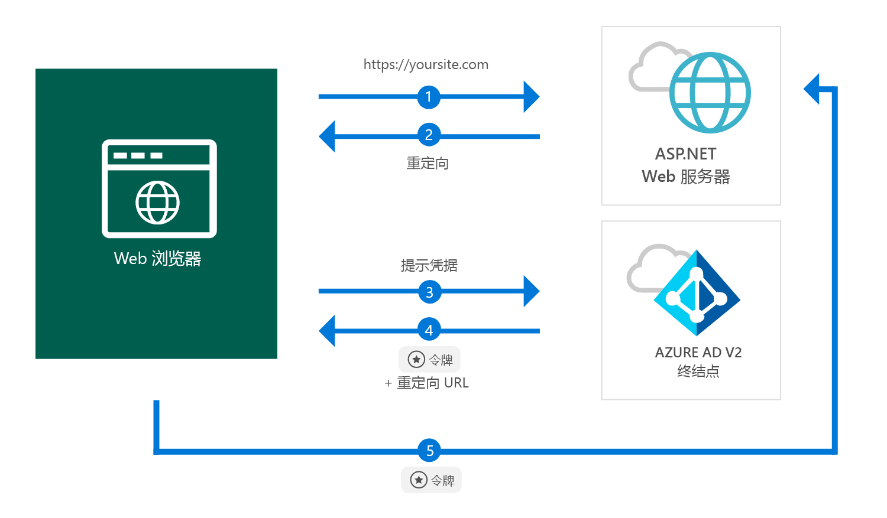

# <a name="quickstart-add-sign-in-with-microsoft-to-an-aspnet-web-app"></a>快速入门：向 ASP.NET Web 应用添加 Microsoft 登录功能

[!INCLUDE [active-directory-develop-applies-v2](../../../includes/active-directory-develop-applies-v2.md)]

本快速入门介绍如何使用 ASP.NET Web 应用从任何 Azure Active Directory (Azure AD) 实例中登录个人帐户（hotmail.com、outlook.com 等）以及学校和工作帐户。



> [!div renderon="docs"]
> ## <a name="register-your-application-and-download-your-quickstart-app"></a>注册应用程序并下载快速入门应用
>
> ### <a name="register-and-configure-your-application-and-code-sample"></a>注册并配置应用程序和代码示例
> #### <a name="step-1-register-your-application"></a>步骤 1：注册应用程序
> 
> 1. 转到 [Microsoft 应用程序注册门户](https://apps.dev.microsoft.com/portal/register-app)。
> 1. 输入应用程序的名称，确保未选中“引导式设置”选项，然后单击“创建”。
> 1. 单击 `Add Platform`，然后选择 `Web`。
> 1. 确保“允许隐式流”保持选中状态。
> 1. 在“重定向 URL”中输入 `https://localhost:44368/`。
> 1. 滚动到页面底部，单击“保存”。

> [!div class="sxs-lookup" renderon="portal"]
> #### <a name="step-1-configure-your-application-in-azure-portal"></a>步骤 1：在 Azure 门户中配置应用程序
> 为使此快速入门中的代码示例正常运行，需要添加答复 URL `https://localhost:44368/`。
> > [!div renderon="portal" id="makechanges" class="nextstepaction"]
> > [为我执行此更改]()
>
> > [!div id="appconfigured" class="alert alert-info"]
> >  应用程序已使用此属性进行配置

#### <a name="step-2-download-your-project"></a>步骤 2：下载项目

[下载 Visual Studio 2017 解决方案](https://github.com/AzureADQuickStarts/AppModelv2-WebApp-OpenIDConnect-DotNet/archive/master.zip)

#### <a name="step-3-configure-your-visual-studio-project"></a>步骤 3：配置 Visual Studio 项目

1. 将 zip 文件提取到本地文件夹（例如，C:\Azure-Samples）
1. 在 Visual Studio 中打开解决方案 (AppModelv2-WebApp-OpenIDConnect-DotNet.sln)
1. 编辑 **Web.config**，用刚刚注册的应用程序中的应用程序 ID 替换 `Enter_the_Application_Id_here`：

    ```xml
    <add key="ClientId" value="Enter_the_Application_Id_here" />
    ```
    
> [!div class="sxs-lookup" renderon="portal"]
> [!IMPORTANT]
> 如果应用程序为单租户应用程序（仅针对此目录中的帐户），则请在 Web.config 文件中查找 `Tenant` 的值，并将 `common` 替换为租户 ID 或租户名称（例如，contoso.microsoft.com）。 可在“概览”页中获取租户名称。

## <a name="more-information"></a>详细信息

本部分概述了登录用户所需的代码。 这有助于了解代码的工作原理、主要参数，并且可用于向现有 ASP.NET 应用程序添加登录。

### <a name="owin-middleware-nuget-packages"></a>OWIN 中间件 NuGet 包

可以将 ASP.NET 中的 OpenID Connect 与 OWIN 中间件包配合使用，通过基于 Cookie 的身份验证设置身份验证管道。 可在 Visual Studio 的**包管理器控制台**中运行以下命令，以便安装这些包：

```powershell
Install-Package Microsoft.Owin.Security.OpenIdConnect
Install-Package Microsoft.Owin.Security.Cookies
Install-Package Microsoft.Owin.Host.SystemWeb
```

### <a name="owin-startup-class"></a>OWIN 启动类

OWIN 中间件使用一个启动类，该类在托管进程初始化时执行（在本快速入门中，该类是指根文件夹中的 *startup.cs* 文件）。 以下代码显示本快速入门使用的参数：

```csharp
public void Configuration(IAppBuilder app)
{
    app.SetDefaultSignInAsAuthenticationType(CookieAuthenticationDefaults.AuthenticationType);

    app.UseCookieAuthentication(new CookieAuthenticationOptions());
    app.UseOpenIdConnectAuthentication(
        new OpenIdConnectAuthenticationOptions
        {
            // Sets the ClientId, authority, RedirectUri as obtained from web.config
            ClientId = clientId,
            Authority = authority,
            RedirectUri = redirectUri,
            // PostLogoutRedirectUri is the page that users will be redirected to after sign-out. In this case, it is using the home page
            PostLogoutRedirectUri = redirectUri,
            Scope = OpenIdConnectScope.OpenIdProfile,
            // ResponseType is set to request the id_token - which contains basic information about the signed-in user
            ResponseType = OpenIdConnectResponseType.IdToken,
            // ValidateIssuer set to false to allow personal and work accounts from any organization to sign in to your application
            // To only allow users from a single organizations, set ValidateIssuer to true and 'tenant' setting in web.config to the tenant name
            // To allow users from only a list of specific organizations, set ValidateIssuer to true and use ValidIssuers parameter 
            TokenValidationParameters = new TokenValidationParameters()
            {
                ValidateIssuer = false
            },
            // OpenIdConnectAuthenticationNotifications configures OWIN to send notification of failed authentications to OnAuthenticationFailed method
            Notifications = new OpenIdConnectAuthenticationNotifications
            {
                AuthenticationFailed = OnAuthenticationFailed
            }
        }
    );
}
```

> |其中  |  |
> |---------|---------|
> | `ClientId`     | Azure 门户中注册的应用程序的应用程序 ID |
> | `Authority`    | 用户要进行身份验证的 STS 终结点。 对于公有云，通常为 https://login.microsoftonline.com/{tenant}/v2.0，其中 {tenant} 是租户名称、租户 ID 或者对于常用终结点（用于多租户应用程序）的引用，即 common |
> | `RedirectUri`  | 一个 URL，在通过 Azure AD v2.0 终结点进行身份验证之后，会将用户发送到此 URL |
> | `PostLogoutRedirectUri`     | 一个 URL，在注销以后，会将用户发送到此 URL |
> | `Scope`     | 请求的作用域的列表，使用空格进行分隔 |
> | `ResponseType`     | 请求身份验证的响应包含 ID 令牌 |
> | `TokenValidationParameters`     | 用于令牌验证的参数列表。 在本示例中，`ValidateIssuer` 设置为 `false`，指示它可以接受来自任何个人、工作或学校帐户类型的登录 |
> | `Notifications`     | 委托的列表，这些委托可以在不同的 *OpenIdConnect* 消息上执行 |

### <a name="initiate-an-authentication-challenge"></a>启动身份验证质询

可以通过在控制器中请求身份验证质询，强制用户登录：

```csharp
public void SignIn()
{
    if (!Request.IsAuthenticated)
    {
        HttpContext.GetOwinContext().Authentication.Challenge(
            new AuthenticationProperties{ RedirectUri = "/" },
            OpenIdConnectAuthenticationDefaults.AuthenticationType);
    }
}
```

> [!TIP]
> 如果希望视图可供经身份验证用户和未经身份验证用户访问，使用上述方法请求身份验证质询是可选的，也是常用的。 或者，可以使用下一节中所述的方法来保护控制器。

### <a name="protect-a-controller-or-a-controllers-method"></a>保护控制器或控制器的方法

可以使用 `[Authorize]` 属性保护控制器或控制器操作。 此属性限制对控制器或操作的访问，其方法是仅允许经身份验证的用户访问控制器中的操作。这意味着，当未经身份验证的用户尝试访问 `[Authorize]` 属性修饰的某个操作或控制器时，会自动进行身份验证质询。

## <a name="next-steps"></a>后续步骤

试用 ASP.NET 教程，了解有关构建应用程序和新功能的完整分步指南，包括本快速入门的完整说明。

### <a name="learn-the-steps-to-create-the-application-used-in-this-quickstart"></a>了解创建本快速入门中使用的应用程序的步骤

> [!div class="nextstepaction"]
> [登录教程](.\tutorial-v2-asp-webapp.md)

[!INCLUDE [Help and support](../../../includes/active-directory-develop-help-support-include.md)]