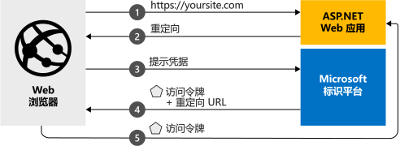

# <a name="quickstart-add-microsoft-identity-platform-sign-in-to-an-aspnet-web-app"></a>快速入门：向 ASP.NET Web 应用添加 Microsoft 标识平台登录功能
在本快速入门中，你将通过代码示例了解 ASP.NET Web 应用如何从任何 Azure Active Directory (Azure AD) 实例登录个人帐户（hotmail.com、outlook.com 和其他）以及工作和学校帐户。  （有关说明，请参阅[示例工作原理](#how-the-sample-works)。）
> [!div renderon="docs"]
> ## <a name="register-and-download-your-quickstart-app"></a>注册并下载快速入门应用
> 可以使用两个选项来启动快速入门应用程序：
> * [快速][选项 1：注册并自动配置应用，然后下载代码示例](#option-1-register-and-auto-configure-your-app-and-then-download-your-code-sample)
> * [手动][选项 2：注册并手动配置应用程序和代码示例](#option-2-register-and-manually-configure-your-application-and-code-sample)
>
> ### <a name="option-1-register-and-auto-configure-your-app-and-then-download-your-code-sample"></a>选项 1：注册并自动配置应用，然后下载代码示例
>
> 1. 转到新的 [Azure 门户 - 应用注册](https://portal.azure.com/#blade/Microsoft_AAD_RegisteredApps/applicationsListBlade/quickStartType/AspNetWebAppQuickstartPage/sourceType/docs)窗格。
> 1. 输入应用程序的名称，然后单击“注册”。 
> 1. 遵照说明下载内容，并一键式自动配置新应用程序。
>
> ### <a name="option-2-register-and-manually-configure-your-application-and-code-sample"></a>选项 2：注册并手动配置应用程序和代码示例
>
> #### <a name="step-1-register-your-application"></a>步骤 1：注册应用程序
> 若要手动注册应用程序并将应用的注册信息添加到解决方案，请执行以下步骤：
>
> 1. 使用工作或学校帐户或个人 Microsoft 帐户登录到 [Azure 门户](https://portal.azure.com)。
> 1. 如果你的帐户有权访问多个租户，请在右上角选择该帐户，并将门户会话设置为所需的 Azure AD 租户。
> 1. 导航到面向开发人员的 Microsoft 标识平台的[应用注册](https://go.microsoft.com/fwlink/?linkid=2083908)页。
> 1. 选择“新注册”。 
> 1. “注册应用程序”页出现后，请输入应用程序的注册信息： 
>      - 在“名称”  部分输入一个会显示给应用用户的有意义的应用程序名称，例如 `ASPNET-Quickstart`。
>      - 在“重定向 URI”中添加 `https://localhost:44368/`，  然后单击“注册”。 
>      - 在“管理”部分下的左侧导航窗格中，选择“身份验证” 
>          - 在“隐式授权”  子部分下，选择“ID 令牌”  。
>          - 然后选择“保存”  。

> [!div class="sxs-lookup" renderon="portal"]
> #### <a name="step-1-configure-your-application-in-azure-portal"></a>步骤 1：在 Azure 门户中配置应用程序
> 要使此快速入门中的代码示例正常运行，需要将答复 URL 添加为 `https://localhost:44368/`。
> > [!div renderon="portal" id="makechanges" class="nextstepaction"]
> > [执行此更改]()
>
> > [!div id="appconfigured" class="alert alert-info"]
> >  应用程序已使用此属性进行配置

#### <a name="step-2-download-your-project"></a>步骤 2：下载项目

> [!div renderon="docs"]
> [下载 Visual Studio 2019 解决方案](https://github.com/AzureADQuickStarts/AppModelv2-WebApp-OpenIDConnect-DotNet/archive/master.zip)

> [!div renderon="portal"]
> 使用 Visual Studio 2019 运行项目。
> [!div renderon="portal" id="autoupdate" class="nextstepaction"]
> [下载代码示例](https://github.com/AzureADQuickStarts/AppModelv2-WebApp-OpenIDConnect-DotNet/archive/master.zip)

> [!div class="sxs-lookup" renderon="portal"]
> #### <a name="step-3-your-app-is-configured-and-ready-to-run"></a>步骤 3：应用已配置并可以运行
> 我们已经为项目配置了应用属性的值。 

> [!div renderon="docs"]
> #### <a name="step-3-run-your-visual-studio-project"></a>步骤 3：运行 Visual Studio 项目

1. 将 zip 文件提取到更靠近根文件夹的本地文件夹（例如，**C:\Azure-Samples**）
1. 在 Visual Studio 中打开解决方案 (AppModelv2-WebApp-OpenIDConnect-DotNet.sln)
1. 可能需要右键单击项目 `AppModelv2-WebApp-OpenIDConnect-DotNet` 和“还原 NuGet 包”  ，具体取决于 Visual Studio 的版本
1. 打开包管理器控制台（“视图”->“其他 Windows”->“包管理器控制台”）并运行 `Update-Package Microsoft.CodeDom.Providers.DotNetCompilerPlatform -r`

> [!div renderon="docs"]
> 5. 编辑 **Web.config**，将参数 `ClientId` 和 `Tenant` 替换为：
>    ```xml
>    <add key="ClientId" value="Enter_the_Application_Id_here" />
>    <add key="Tenant" value="Enter_the_Tenant_Info_Here" />
>    ```
>    其中：
> - `Enter_the_Application_Id_here` - 是已注册应用程序的应用程序 ID。
> - `Enter_the_Tenant_Info_Here` - 是下述选项之一：
>   - 如果应用程序支持“仅我的组织”，  请将该值替换为**租户 ID** 或**租户名称**（例如 contoso.onmicrosoft.com）
>   - 如果应用程序支持“任何组织目录中的帐户”，请将该值替换为  `organizations`
>   - 如果应用程序支持“所有 Microsoft 帐户用户”，请将该值替换为  `common`
>
> > [!TIP]
> > - 若要查找“应用程序 ID”、“目录(租户) ID”和“支持的帐户类型”的值，请转到“概览”页。    
> > - 确保 **Web.config** 中 `redirectUri` 的值与 Azure AD 中为应用注册定义的**重定向 URI** 相对应（如果不对应，请导航到应用注册的“身份验证”  菜单，并更新**重定向 URI** 以匹配）

> [!div class="sxs-lookup" renderon="portal"]
> > [!NOTE]
> > `Enter_the_Supported_Account_Info_Here`

## <a name="more-information"></a>详细信息

本部分概述了登录用户所需的代码。 阅读本概述对于了解代码的工作原理、主要参数非常有用，如果你想要将登录功能添加到现有 ASP.NET 应用程序，阅读本概述也非常有用。

### <a name="how-the-sample-works"></a>示例工作原理


### <a name="owin-middleware-nuget-packages"></a>OWIN 中间件 NuGet 包

可以将 ASP.NET 中的 OpenID Connect 与 OWIN 中间件包配合使用，通过基于 Cookie 的身份验证设置身份验证管道。 可在 Visual Studio 的**包管理器控制台**中运行以下命令，以便安装这些包：

```powershell
Install-Package Microsoft.Owin.Security.OpenIdConnect
Install-Package Microsoft.Owin.Security.Cookies
Install-Package Microsoft.Owin.Host.SystemWeb  
```

### <a name="owin-startup-class"></a>OWIN 启动类

OWIN 中间件使用在托管进程初始化时运行的“启动类”  。 在本快速入门中，*startup.cs* 文件位于根文件夹下。 以下代码显示本快速入门使用的参数：

```csharp
public void Configuration(IAppBuilder app)
{
    app.SetDefaultSignInAsAuthenticationType(CookieAuthenticationDefaults.AuthenticationType);

    app.UseCookieAuthentication(new CookieAuthenticationOptions());
    app.UseOpenIdConnectAuthentication(
        new OpenIdConnectAuthenticationOptions
        {
            // Sets the ClientId, authority, RedirectUri as obtained from web.config
            ClientId = clientId,
            Authority = authority,
            RedirectUri = redirectUri,
            // PostLogoutRedirectUri is the page that users will be redirected to after sign-out. In this case, it is using the home page
            PostLogoutRedirectUri = redirectUri,
            Scope = OpenIdConnectScope.OpenIdProfile,
            // ResponseType is set to request the id_token - which contains basic information about the signed-in user
            ResponseType = OpenIdConnectResponseType.IdToken,
            // ValidateIssuer set to false to allow personal and work accounts from any organization to sign in to your application
            // To only allow users from a single organizations, set ValidateIssuer to true and 'tenant' setting in web.config to the tenant name
            // To allow users from only a list of specific organizations, set ValidateIssuer to true and use ValidIssuers parameter
            TokenValidationParameters = new TokenValidationParameters()
            {
                ValidateIssuer = false // Simplification (see note below)
            },
            // OpenIdConnectAuthenticationNotifications configures OWIN to send notification of failed authentications to OnAuthenticationFailed method
            Notifications = new OpenIdConnectAuthenticationNotifications
            {
                AuthenticationFailed = OnAuthenticationFailed
            }
        }
    );
}
```

> |Where  |  |
> |---------|---------|
> | `ClientId`     | Azure 门户中注册的应用程序的应用程序 ID |
> | `Authority`    | 用户要进行身份验证的 STS 终结点。 对于公有云，通常为 <https://login.microsoftonline.com/{tenant}/v2.0>，其中 {tenant} 是租户名称、租户 ID 或者引用常用终结点（用于多租户应用程序）的 common  |
> | `RedirectUri`  | 一个 URL，在通过 Microsoft 标识平台终结点进行身份验证之后，会将用户发送到此 URL |
> | `PostLogoutRedirectUri`     | 一个 URL，在注销以后，会将用户发送到此 URL |
> | `Scope`     | 请求的作用域的列表，使用空格进行分隔 |
> | `ResponseType`     | 请求身份验证的响应包含 ID 令牌 |
> | `TokenValidationParameters`     | 用于令牌验证的参数列表。 在本示例中，`ValidateIssuer` 设置为 `false`，指示它可以接受来自任何个人、工作或学校帐户类型的登录 |
> | `Notifications`     | 委托的列表，这些委托可以在不同的 *OpenIdConnect* 消息上执行 |


> [!NOTE]
> 在本快速入门中，设置 `ValidateIssuer = false` 是一种简化操作。 在实际应用程序中，需验证颁发者。
> 查看示例，了解如何执行该操作。

### <a name="initiate-an-authentication-challenge"></a>启动身份验证质询

可以通过在控制器中请求身份验证质询，强制用户登录：

```csharp
public void SignIn()
{
    if (!Request.IsAuthenticated)
    {
        HttpContext.GetOwinContext().Authentication.Challenge(
            new AuthenticationProperties{ RedirectUri = "/" },
            OpenIdConnectAuthenticationDefaults.AuthenticationType);
    }
}
```

> [!TIP]
> 如果希望视图可供经身份验证用户和未经身份验证用户访问，使用上述方法请求身份验证质询是可选的，也是常用的。 或者，可以使用下一节中所述的方法来保护控制器。

### <a name="protect-a-controller-or-a-controllers-method"></a>保护控制器或控制器的方法

可以使用 `[Authorize]` 属性保护控制器或控制器操作。 此属性限制对控制器或操作的访问，其方法是仅允许经身份验证的用户访问控制器中的操作。这意味着，当未经身份验证的用户尝试访问 `[Authorize]` 属性修饰的某个操作或控制器时，会自动进行身份验证质询。 

## <a name="next-steps"></a>后续步骤

试用 ASP.NET 教程，了解有关构建应用程序和新功能的完整分步指南，包括本快速入门的完整说明。

### <a name="learn-the-steps-to-create-the-application-used-in-this-quickstart"></a>了解创建本快速入门中使用的应用程序的步骤

> [!div class="nextstepaction"]
> [登录教程](./tutorial-v2-asp-webapp.md)

[!INCLUDE [Help and support](../../../includes/active-directory-develop-help-support-include.md)]
