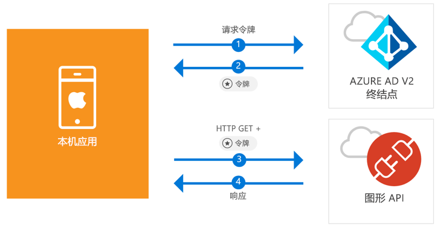

# <a name="quickstart-sign-in-users-and-call-the-microsoft-graph-api-from-an-ios-native-app"></a>快速入门：从 iOS 本机应用将用户登录并调用 Microsoft Graph API

[!INCLUDE [active-directory-develop-applies-v2-msal](../../../includes/active-directory-develop-applies-v2-msal.md)]

本快速入门包含了一个代码示例，该示例演示了本机 iOS 应用程序如何将个人、工作和学校帐户进行登录，获取访问令牌以及调用 Microsoft Graph API。



> [!div renderon="docs"]
> ## <a name="register-and-download"></a>注册和下载
> ### <a name="register-and-configure-your-application-and-code-sample"></a>注册并配置应用程序和代码示例
> #### <a name="step-1-register-your-application"></a>步骤 1：注册应用程序
> 若要注册应用程序并将应用程序注册信息添加到解决方案，请执行以下操作：
> 1. 转到 [Microsoft 应用程序注册门户](https://apps.dev.microsoft.com/portal/register-app)注册应用程序。
> 1. 在“应用程序名称”框中输入应用程序的名称。
> 1. 确保未选中“指导式设置”复选框，然后选择“创建”。
> 1. 依次选择“添加平台”、“本机应用程序”和“保存”。

> [!div renderon="portal" class="sxs-lookup"]
> #### <a name="step-1-configure-your-application"></a>步骤 1：配置应用程序
> 为使此快速入门中的代码示例正常运行，需要将答复 URL 添加为 `msal<AppId>://auth`（其中，msal<AppId> 是此应用程序 ID）。
> > [!div renderon="portal" id="makechanges" class="nextstepaction"]
> > [为我执行此更改]()
>
> > [!div id="appconfigured" class="alert alert-info"]
> >  应用程序已使用此属性进行配置

#### <a name="step-2-download-your-web-server-or-project"></a>步骤 2：下载 Web 服务器或项目

- [下载 XCode 项目](https://github.com/Azure-Samples/active-directory-ios-swift-native-v2/archive/master.zip)

#### <a name="step-3-configure-your-project"></a>步骤 3：配置项目

1. 解压缩 zip 文件并在 XCode 中打开该项目。
1. 编辑 **ViewController.swift** 并将以“let kClientID”开头的行替换为以下代码片段：

    > [!div renderon="portal" class="sxs-lookup"]
    > ```swift
    > let kClientID = "Enter_the_Application_Id_here"
    > ```

    > [!div renderon="docs"]
    > ```swift
    > let kClientID = "<ENTER_THE_APPLICATION_ID_HERE>"
    > ```   
1. 在按住 Control 的同时单击 **Info.plist** 以显示上下文菜单，然后选择“打开为” > “源代码”。
1. 在 dict 根节点下添加以下代码：

    > [!div renderon="portal" class="sxs-lookup"]
    > ```xml
    > <key>CFBundleURLTypes</key>
    > <array>
    >     <dict>
    >         <key>CFBundleTypeRole</key>
    >         <string>Editor</string>
    >         <key>CFBundleURLName</key>
    >         <string>$(PRODUCT_BUNDLE_IDENTIFIER)</string>
    >         <key>CFBundleURLSchemes</key>
    >         <array>
    >             <string>msalEnter_the_Application_Id_here</string>
    >         </array>
    >     </dict>
    > </array>
    > ```

    > [!div renderon="docs"]
    > ```xml
    > <key>CFBundleURLTypes</key>
    > <array>
    >     <dict>
    >         <key>CFBundleTypeRole</key>
    >         <string>Editor</string>
    >         <key>CFBundleURLName</key>
    >         <string>$(PRODUCT_BUNDLE_IDENTIFIER)</string>
    >         <key>CFBundleURLSchemes</key>
    >         <array>
    >             <string>msal<ENTER_THE_APPLICATION_ID_HERE></string>
    >         </array>
    >     </dict>
    > </array>
    > ```
    
> [!div renderon="docs"]
> <span>5.</span>将 `<ENTER_THE_APPLICATION_ID_HERE>` 替换为你的应用程序的“应用程序 ID”。 如果需要查找“应用程序 ID”，请转到“概述”页面。

## <a name="more-information"></a>更多信息

阅读以下各部分来详细了解本快速入门。

### <a name="msal"></a>MSAL

MSAL ([MSAL.framework](https://github.com/AzureAD/microsoft-authentication-library-for-objc)) 是一个库，用于用户登录和请求令牌，此类令牌用于访问受 Microsoft Azure Active Directory 保护的 API。 可以使用以下过程将 MSAL 添加到应用程序中：

```
$ vi Podfile
```
将以下内容添加到 podfile：

```
 target 'QuickStart' do
   use_frameworks!
 pod 'MSAL'
 end
```

### <a name="msal-initialization"></a>MSAL 初始化

可以通过添加以下代码，为 MSAL 添加引用：

```swift
import MSAL
```

然后，使用以下代码对 MSAL 进行初始化：

```swift
let authority = MSALAuthority(url: URL(string: kAuthority)!)
self.applicationContext = try MSALPublicClientApplication(clientId: kClientID, authority: authority)
```

> |其中： ||
> |---------|---------|
> | `clientId` | 在 *portal.azure.com* 中注册的应用程序的应用程序 ID |
> | `authority` | Azure AD v2.0 终结点。 在大多数情况下，这将是 *https<span/>://login.microsoftonline.com/common* |

### <a name="requesting-tokens"></a>请求令牌

MSAL 有两种用来获取令牌的方法：`acquireToken` 和 `acquireTokenSilent`。

#### <a name="getting-an-access-token-interactively"></a>以交互方式获取访问令牌

在某些情况下，需要强制用户与 Azure Active Directory (Azure AD) v2.0 终结点进行交互，这将导致进行上下文切换以转到系统浏览器，以验证用户的凭据或表示同意。 示例包括：

* 用户首次登录应用程序
* 由于密码已过期，用户可能需要重新输入凭据的情况
* 应用程序正在请求访问用户需要同意的资源的情况
* 需要双重身份验证的情况

```swift
applicationContext.acquireToken(forScopes: self.kScopes) { (result, error) in /* Add your handling logic */}
```

> |其中：||
> |---------|---------|
> | `forScopes` | 包含所请求的作用域（即，[ "user.read" ]` for Microsoft Graph or `[ "<Application ID URL>/scope" ]` for custom Web APIs (i.e. `api://<Application ID>/access_as_user`)） |

#### <a name="getting-an-access-token-silently"></a>以无提示方式获取访问令牌

你不希望在用户每次需要访问资源时都要求其验证其凭据。 大多数情况下，你希望在无需任何用户交互的情况下进行令牌获取和续订。 可以使用 `acquireTokenSilent` 方法获取令牌，以在初始 `acquireToken` 方法后访问受保护资源：

```swift
applicationContext.acquireTokenSilent(forScopes: self.kScopes, account: applicationContext.allAccounts().first) { (result, error) in /* Add your handling logic */}
```

> |其中： ||
> |---------|---------|
> | `forScopes` | 包含所请求的作用域（即针对 Microsoft Graph 的 `[ "user.read" ]` 或针对自定义 Web API 的 `[ "<Application ID URL>/scope" ]`（即 `api://<Application ID>/access_as_user`）） |
> | `account` | 请求令牌的帐户（MSAL 支持单个应用中的多个帐户）。 对于本快速入门，此值指向高速缓存中的第一个帐户 (`applicationContext.allAccounts().first`)。 |

## <a name="next-steps"></a>后续步骤

试用 iOS 教程，了解有关构建应用程序和新功能的完整分步指南，包括本快速入门的完整说明。

### <a name="learn-the-steps-to-create-the-application-used-in-this-quickstart"></a>了解创建本快速入门中使用的应用程序的步骤

> [!div class="nextstepaction"]
> [调用 Graph API iOS 教程](https://docs.microsoft.com/azure/active-directory/develop/guidedsetups/active-directory-ios)

[!INCLUDE [Help and support](../../../includes/active-directory-develop-help-support-include.md)]
