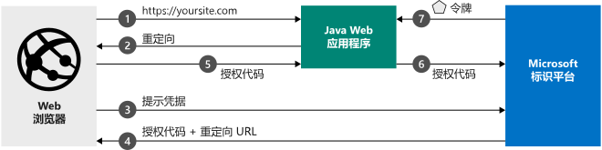

# <a name="quickstart-add-sign-in-with-microsoft-to-a-java-web-app"></a>快速入门：向 Java Web 应用添加 Microsoft 登录功能

[!INCLUDE [active-directory-develop-applies-v2](../../../includes/active-directory-develop-applies-v2.md)]

本快速入门介绍如何将 Java Web 应用与 Microsoft 标识平台集成。 应用会将用户登录，获取用于调用 Microsoft Graph API 的访问令牌，并针对 Microsoft Graph API 发出请求。 

完成本指南后，应用程序将接受个人 Microsoft 帐户（包括 outlook.com、live.com 和其他帐户）进行登录，还能够接受使用 Azure Active Directory 的任何公司或组织的工作或学校帐户进行登录。



## <a name="prerequisites"></a>先决条件

若要运行此示例，需要： 
- Java 开发工具包 (JDK) 8 或更高版本以及 Maven。

> [!div renderon="docs"]
> ## <a name="register-and-download-your-quickstart-app"></a>注册并下载快速入门应用
> 可以使用两个选项来启动快速入门应用程序：“快速”（选项 1）和“手动”（选项 2）
> 
> ### <a name="option-1-register-and-auto-configure-your-app-and-then-download-your-code-sample"></a>选项 1：注册并自动配置应用，然后下载代码示例
>
> 1. 访问 [Azure 门户 - 应用注册](https://portal.azure.com/#blade/Microsoft_AAD_IAM/ActiveDirectoryMenuBlade/RegisteredApps)。
> 1. 输入应用程序的名称并选择“注册”  。
> 1. 遵照说明下载内容，系统会自动配置新应用程序。
>
> ### <a name="option-2-register-and-manually-configure-your-application-and-code-sample"></a>选项 2：注册并手动配置应用程序和代码示例
> 
>
> #### <a name="step-1-download-the-code-sample"></a>步骤 1：下载代码示例
> 
> - [下载代码示例](https://github.com/Azure-Samples/ms-identity-java-webapp/archive/master.zip)
>
> #### <a name="step-2-open-applicationproperties"></a>步骤 2：打开 application.properties
>
> 1. 将 zip 文件解压缩到某个本地文件夹。
> 1. （可选）如果使用集成开发环境，请在偏好的 IDE 中打开示例。
> 1. 打开 *application.properties* 文件。 在下一步骤中注册应用程序时，将插入 `aad.clientId`、`aad.authority` 和 `aad.secretKey` 的值。


> #### <a name="step-3-register-your-application"></a>步骤 3：注册应用程序
> 若要注册应用程序并将应用的注册信息手动添加到解决方案，请执行以下步骤：
>
> 1. 使用工作或学校帐户或个人 Microsoft 帐户登录到 [Azure 门户](https://portal.azure.com)。
> 1. 如果你的帐户有权访问多个租户，请在右上角选择该帐户，并将门户会话设置为所需的 Azure AD 租户。
> 1. 导航到面向开发人员的 Microsoft 标识平台的[应用注册](https://go.microsoft.com/fwlink/?linkid=2083908)页。
> 1. 选择“新注册”。 
> 1. 出现“注册应用程序”页后，请输入应用程序的注册信息： 
>    - 在“名称”  部分输入一个会显示给应用用户的有意义的应用程序名称，例如 `java-webapp`。
>    - 暂时将“重定向 URI”留空，并选择“注册”。  
> 1. 找到应用程序的“应用程序(客户端) ID”值。  更新 *application.properties* 文件中的 `Enter_the_Application_Id_here` 值。
> 1. 找到应用程序的“目录(租户) ID”值。  更新 *application.properties* 文件中的 `Enter_the_Tenant_Info_Here` 值。 
> 1. 选择“身份验证”菜单，然后添加以下信息  ：
>    - 在“重定向 URI”中添加 `http://localhost:8080/msal4jsamples/secure/aad` 和 `https://localhost:8080/msal4jsamples/graph/users`。 
>    - 选择“保存”。 
> 1. 在左侧菜单中选择“证书和机密”，然后在“客户端机密”部分单击“新建客户端机密”：   
>     
>    - 键入（实例应用机密）的密钥说明。
>    - 选择密钥持续时间“1 年”。 
>    - 单击“添加”时，将显示密钥值。  
>    - 复制密钥的值。 打开前面下载的 *application.properties* 文件，并使用密钥值更新 `Enter_the_Client_Secret_Here` 的值。 
>
> [!div class="sxs-lookup" renderon="portal"]
> #### <a name="step-1-configure-your-application-in-the-azure-portal"></a>步骤 1：在 Azure 门户中配置应用程序
> 若要正常运行本快速入门中的代码示例，需要：
> 1. 添加 `http://localhost:8080/msal4jsamples/secure/aad` 和 `https://localhost:8080/msal4jsamples/graph/users` 作为回复 URL。
> 1. 创建客户端机密。
> > [!div renderon="portal" id="makechanges" class="nextstepaction"]
> > [执行此更改]()
>
> > [!div id="appconfigured" class="alert alert-info"]
> >  应用程序已使用这些属性进行配置。
> 
> #### <a name="step-2-download-the-code-sample"></a>步骤 2：下载代码示例
> 
> - [下载代码示例](https://github.com/Azure-Samples/ms-identity-java-webapp/archive/master.zip)
> 
> #### <a name="step-3-configure-the-code-sample"></a>步骤 3：配置代码示例 
> 
> 1. 将 zip 文件解压缩到某个本地文件夹。
> 1. 如果使用集成开发环境，请在偏好的 IDE 中打开示例（可选）。
> 1. 打开 *src/main/resources/* 中的 **application.properties** 文件。
> 1. 替换应用程序属性。
>   1. 查找 `aad.clientId` 并使用你注册的应用程序的“应用程序 (客户端) ID”  值更新 `Enter_the_Application_Id_here` 的值。 
>   1. 找到 `aad.authority`，并使用已注册的应用程序的“目录(租户) ID”值更新 `Enter_the_Tenant_Name_Here` 的值。 
>   1. 找到 `aad.secretKey`，并使用在已注册应用程序的“证书和机密”中创建的“客户端机密”更新 `Enter_the_Client_Secret_Here` 的值。  

#### <a name="step-4-run-the-code-sample"></a>步骤 4：运行代码示例
1. 运行代码示例，然后打开浏览器并导航到 *http://localhost:8080* 。
1. 首页包含一个“登录”按钮。  单击“登录”按钮重定向到 Azure Active Directory。  系统将提示用户输入其凭据。  
1. 在 Azure Active Directory 中成功完成身份验证后，用户将重定向到 *http://localhost:8080/msal4jsamples/secure/aad* 。 他们将正式登录到应用程序，页面上应会显示已登录帐户的信息。 页面上还包含以下按钮： 
    - *注销*：从应用程序中注销当前用户，并将其重定向到主页。
    - *显示用户*：获取 Microsoft Graph 的令牌，然后使用请求中附加的令牌来调用 Microsoft Graph，以获取租户中的所有用户。


## <a name="more-information"></a>详细信息

### <a name="getting-msal"></a>获取 MSAL
MSAL4J 是一个库，用于用户登录和请求令牌，此类令牌用于访问受 Microsoft 标识平台保护的 API。 可以使用 Maven 或 Gradle 将 MSAL4J 添加到应用程序，以通过对应用程序中的 pom.xml 或 build.gradle 文件进行以下更改来管理依赖项。 

```XML
<dependency>
    <groupId>com.microsoft.azure</groupId>
    <artifactId>msal4j</artifactId>
    <version>0.5.0-preview</version>
</dependency>
```

```$xslt
compile group: 'com.microsoft.azure', name: 'msal4j', version: '0.5.0-preview'
```


### <a name="msal-initialization"></a>Msal 初始化
可以通过将以下代码添加到要在其中使用 MSAL4J 的文件的顶部，来添加对 MSAL4J 的引用： 

```Java
import com.microsoft.aad.msal4j.*;
```

## <a name="next-steps"></a>后续步骤

了解有关权限和许可的详细信息：

> [!div class="nextstepaction"]
> [权限和许可](https://docs.microsoft.com/en-us/azure/active-directory/develop/v2-permissions-and-consent)

若要详细了解此方案的授权流，请查看 Oauth 2.0 授权代码流：

> [!div class="nextstepaction"]
> [授权代码 Oauth 流](https://docs.microsoft.com/en-us/azure/active-directory/develop/v2-oauth2-auth-code-flow)

帮助我们改进 Microsoft 标识平台。 通过完成简短的两问题调查，告诉我们你的想法。

> [!div class="nextstepaction"]
> [Microsoft 标识平台调查](https://forms.office.com/Pages/ResponsePage.aspx?id=v4j5cvGGr0GRqy180BHbRyKrNDMV_xBIiPGgSvnbQZdUQjFIUUFGUE1SMEVFTkdaVU5YT0EyOEtJVi4u)

[!INCLUDE [Help and support](../../../includes/active-directory-develop-help-support-include.md)]
