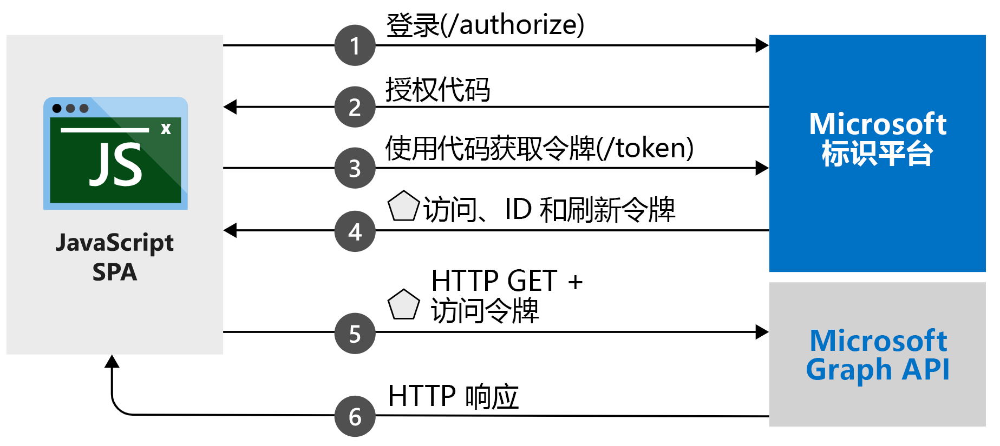

# <a name="quickstart-sign-in-users-and-get-an-access-token-in-a-javascript-spa-using-the-auth-code-flow"></a>快速入门：使用授权代码流在 JavaScript SPA 中登录用户并获取访问令牌

本快速入门通过一个代码示例演示 JavaScript 单页应用程序 (SPA) 如何通过使用授权代码流使用个人帐户、工作帐户和学校帐户将用户登录。 此代码示例还演示如何获取访问令牌来调用 Web API，在本例中为 Microsoft Graph API。 有关说明，请参阅[示例工作原理](#how-the-sample-works)。

本快速入门将 MSAL.js 2.0 与授权代码流配合使用。 若要查看将 MSAL 1.0 与隐式流结合使用的类似快速入门，请参阅 [快速入门：在 JavaScript 单页应用中登录用户](https://docs.microsoft.com/azure/active-directory/develop/quickstart-v2-javascript)。

[!INCLUDE [MSAL.js 2.0 and Azure AD B2C temporary incompatibility notice](../../../includes/msal-b2c-cors-compatibility-notice.md)]

## <a name="prerequisites"></a>先决条件

* Azure 订阅 - [免费创建 Azure 订阅](https://azure.microsoft.com/free/?WT.mc_id=A261C142F)
* [Node.js](https://nodejs.org/en/download/)
* [Visual Studio Code](https://code.visualstudio.com/download) 或其他代码编辑器

> [!div renderon="docs"]
> ## <a name="register-and-download-your-quickstart-application"></a>注册并下载快速入门应用程序
> 若要启动快速入门应用程序，请使用以下选项之一。
>
> ### <a name="option-1-express-register-and-auto-configure-your-app-and-then-download-your-code-sample"></a>选项 1（快速）：注册并自动配置应用，然后下载代码示例
>
> 1. 登录 [Azure 门户](https://portal.azure.com)。
> 1. 如果你的帐户有权访问多个租户，请在右上角选择该帐户，然后将门户会话设置为要使用的 Azure Active Directory (Azure AD) 租户。
> 1. 选择[“应用注册”](https://portal.azure.com/#blade/Microsoft_AAD_RegisteredApps/ApplicationsListBlade/quickStartType/JavascriptSpaQuickstartPage/sourceType/docs)。
> 1. 输入应用程序的名称。
> 1. 在“支持的帐户类型”下，选择“任何组织目录中的帐户和个人 Microsoft 帐户”。
> 1. 选择“注册”。
> 1. 转到快速入门窗格，按说明下载并自动配置新应用程序。
>
> ### <a name="option-2-manual-register-and-manually-configure-your-application-and-code-sample"></a>选项 2（手动）：注册并手动配置应用程序和代码示例
>
> #### <a name="step-1-register-your-application"></a>步骤 1：注册应用程序
>
> 1. 登录 [Azure 门户](https://portal.azure.com)。
> 1. 如果你的帐户有权访问多个租户，请在右上角选择该帐户，然后将门户会话设置为要使用的 Azure AD 租户。
> 1. 选择[“应用注册”](https://go.microsoft.com/fwlink/?linkid=2083908)。
> 1. 选择“新注册”。
> 1. “注册应用程序”页显示后，请输入应用程序的名称。
> 1. 在“支持的帐户类型”下，选择“任何组织目录中的帐户和个人 Microsoft 帐户”。
> 1. 选择“注册”。 在应用的“概述”页上，记下“应用程序(客户端) ID”值，供稍后使用 。
> 1. 在已注册的应用程序的左窗格中，选择“身份验证”。
> 1. 在“平台配置”下，选择“添加平台” 。 在打开的窗格中，选择“单页应用程序”。
> 1. 将“重定向 URI”值设为 `http://localhost:3000/`
> 1. 选择“配置”。

> [!div class="sxs-lookup" renderon="portal"]
> #### <a name="step-1-configure-your-application-in-the-azure-portal"></a>步骤 1：在 Azure 门户中配置应用程序
> 为使本快速入门中的代码示例正常运行，需将 `http://localhost:3000/` 添加为 `redirectUri`。
> > [!div renderon="portal" id="makechanges" class="nextstepaction"]
> > [为我进行这些更改]()
>
> > [!div id="appconfigured" class="alert alert-info"]
> >  应用程序已使用这些属性进行配置。

#### <a name="step-2-download-the-project"></a>步骤 2：下载项目

> [!div renderon="docs"]
> 若要使用 Node.js 在 Web 服务器中运行项目，请[下载核心项目文件](https://github.com/Azure-Samples/ms-identity-javascript-v2/archive/master.zip)。

> [!div renderon="portal" class="sxs-lookup"]
> 使用 Node.js 在 Web 服务器中运行项目

> [!div renderon="portal" class="sxs-lookup" id="autoupdate" class="nextstepaction"]
> [下载代码示例](https://github.com/Azure-Samples/ms-identity-javascript-v2/archive/master.zip)

> [!div renderon="docs"]
> #### <a name="step-3-configure-your-javascript-app"></a>步骤 3：配置 JavaScript 应用
>
> 在“应用”文件夹中打开“authConfig.js”文件并更新 `msalConfig` 对象中的 `clientID``authority` 和 `redirectUri` 值 。
>
> ```javascript
> // Config object to be passed to Msal on creation
> const msalConfig = {
>   auth: {
>     clientId: "Enter_the_Application_Id_Here",
>     authority: "Enter_the_Cloud_Instance_Id_HereEnter_the_Tenant_Info_Here",
>     redirectUri: "Enter_the_Redirect_Uri_Here",
>   },
>   cache: {
>     cacheLocation: "sessionStorage", // This configures where your cache will be stored
>     storeAuthStateInCookie: false, // Set this to "true" if you are having issues on IE11 or Edge
>   }
> };
> ```

> [!div renderon="portal" class="sxs-lookup"]
> > [!NOTE]
> > `Enter_the_Supported_Account_Info_Here`

> [!div renderon="docs"]
>
> 修改 `msalConfig` 部分中的值，如下所述：
>
> - `Enter_the_Application_Id_Here` 是已注册应用程序的应用程序（客户端）ID。
> - `Enter_the_Cloud_Instance_Id_Here` 是 Azure 云的实例。 对于主要云或全球 Azure 云，请输入 `https://login.microsoftonline.com/`。 对于**国家**云（例如“中国”云），请参阅[国家云](authentication-national-cloud.md)。
> - `Enter_the_Tenant_info_here` 设置为以下选项之一：
>   - 如果应用程序支持“此组织目录中的帐户”，请将此值替换为“租户 ID”或“租户名称”。 例如，`contoso.microsoft.com`。
>   - 如果应用程序支持“任何组织目录中的帐户”，请将该值替换为“`organizations`”。
>   - 如果应用支持“任何组织目录中的帐户和个人 Microsoft 帐户”，请将此值替换为“`common`”。 本快速入门中使用 `common`。
>   - 若要限制对“仅限个人 Microsoft 帐户”的支持，请将此值替换为“`consumers`”。
> - `Enter_the_Redirect_Uri_Here` 为 `http://localhost:3000/`。
>
> 如果使用的是主要（全球）Azure 云，则 authConfig 中的 `authority` 值应类似于：
>
> ```javascript
> authority: "https://login.microsoftonline.com/common",
> ```
>
> > [!TIP]
> > 若要查找“应用程序(客户端) ID”、“目录(租户) ID”和“支持的帐户类型”的值，请转到 Azure 门户中应用注册的“概览”页。
>
> [!div class="sxs-lookup" renderon="portal"]
> #### <a name="step-3-your-app-is-configured-and-ready-to-run"></a>步骤 3：应用已配置并可以运行
> 我们已经为项目配置了应用属性的值。

> [!div renderon="docs"]
>
> 然后，仍在同一文件夹中，编辑 graphConfig.js 文件并更新 `apiConfig` 对象中的 `graphMeEndpoint` 和 `graphMailEndpoint` 值。
>
> ```javascript
>   // Add here the endpoints for MS Graph API services you would like to use.
>   const graphConfig = {
>     graphMeEndpoint: "Enter_the_Graph_Endpoint_Herev1.0/me",
>     graphMailEndpoint: "Enter_the_Graph_Endpoint_Herev1.0/me/messages"
>   };
>
>   // Add here scopes for access token to be used at MS Graph API endpoints.
>   const tokenRequest = {
>       scopes: ["Mail.Read"]
>   };
> ```
>
> [!div renderon="docs"]
>
> `Enter_the_Graph_Endpoint_Here` 是将针对其进行 API 调用的终结点。 对于主要或全局 Microsoft Graph API 服务，请输入 `https://graph.microsoft.com/`（包括末尾的正斜杠）。 若要详细了解国家云上的 Microsoft Graph，请参阅[国家云部署](https://docs.microsoft.com/graph/deployments)。
>
> 如果使用的是主要（全球）Microsoft Graph API 服务，则 graphConfig.js 中的 `graphMeEndpoint` 和`graphMailEndpoint` 值应该类似于：
>
> ```javascript
> graphMeEndpoint: "https://graph.microsoft.com/v1.0/me",
> graphMailEndpoint: "https://graph.microsoft.com/v1.0/me/messages"
> ```
>
> #### <a name="step-4-run-the-project"></a>步骤 4：运行项目

使用 Node.js 在 Web 服务器中运行项目：

1. 若要启动服务器，请从项目目录中运行以下命令：
    ```console
    npm install
    npm start
    ```
1. 浏览到 `http://localhost:3000/`。

1. 选择“登录”以启动登录过程，然后调用该 Microsoft Graph API。

    首次登录时，系统会提示你允许应用程序访问你的个人资料并将你登录。 成功登录后，你的用户个人资料信息应会显示在页面上。

## <a name="more-information"></a>详细信息

### <a name="how-the-sample-works"></a>示例工作原理



### <a name="msaljs"></a>msal.js

MSAL.js 库会登录用户并请求令牌，这些令牌用于访问受 Microsoft 标识平台保护的 API。 示例的 index.html 文件包含对库的引用：

```html
<script type="text/javascript" src="https://alcdn.msauth.net/browser/2.0.0-beta.0/js/msal-browser.js" integrity=
"sha384-r7Qxfs6PYHyfoBR6zG62DGzptfLBxnREThAlcJyEfzJ4dq5rqExc1Xj3TPFE/9TH" crossorigin="anonymous"></script>
```

如果已安装 Node.js，则可通过 Node.js 包管理器 (npm) 下载最新版本：

```console
npm install @azure/msal-browser
```

## <a name="next-steps"></a>后续步骤

若要查看生成本快速入门中使用的应用程序的详细分步指南，请参阅以下教程：

> [!div class="nextstepaction"]
> [有关登录和调用 MS Graph 的教程 >](https://docs.microsoft.com/azure/active-directory/develop/tutorial-v2-javascript-auth-code)
