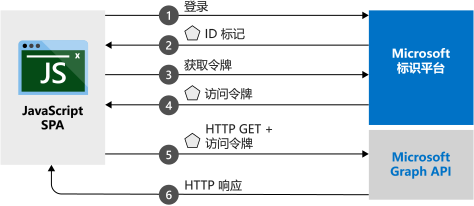

# <a name="quickstart-sign-in-users-and-get-an-access-token-in-a-javascript-spa"></a>快速入门：登录用户并在 JavaScript SPA 中获取访问令牌

在本快速入门中，你将使用代码示例了解 JavaScript 单页应用程序 (SPA) 如何登录个人帐户、工作帐户和学校帐户的用户。 JavaScript SPA 还可以获取用于调用 Microsoft Graph API 或任何 Web API 的访问令牌。 （有关说明，请参阅[示例工作原理](#how-the-sample-works)。）

## <a name="prerequisites"></a>必备条件

* Azure 订阅 - [创建免费帐户](https://azure.microsoft.com/free/?WT.mc_id=A261C142F)
* [Node.js](https://nodejs.org/en/download/)。
* [Visual Studio Code](https://code.visualstudio.com/download)（用于编辑项目文件）或 [Visual Studio 2019](https://visualstudio.microsoft.com/downloads/)（或将项目作为 Visual Studio 解决方案运行）。

> [!div renderon="docs"]
> ## <a name="register-and-download-your-quickstart-application"></a>注册并下载快速入门应用程序
> 若要启动快速入门应用程序，请使用以下选项之一。
>
> ### <a name="option-1-express-register-and-auto-configure-your-app-and-then-download-your-code-sample"></a>选项 1（快速）：注册并自动配置应用，然后下载代码示例
>
> 1. 使用工作或学校帐户或个人 Microsoft 帐户登录到 [Azure 门户](https://portal.azure.com)。
> 1. 如果你的帐户有权访问多个租户，请在右上角选择该帐户，然后将门户会话设置为要使用的 Azure Active Directory (Azure AD) 租户。
> 1. 转到新的 [Azure 门户 - 应用注册](https://portal.azure.com/#blade/Microsoft_AAD_RegisteredApps/ApplicationsListBlade/quickStartType/JavascriptSpaQuickstartPage/sourceType/docs)窗格。
> 1. 输入应用程序的名称并选择“注册”  。
> 1. 遵照说明下载内容，系统会自动配置新应用程序。
>
> ### <a name="option-2-manual-register-and-manually-configure-your-application-and-code-sample"></a>选项 2（手动）：注册并手动配置应用程序和代码示例
>
> #### <a name="step-1-register-your-application"></a>步骤 1：注册应用程序
>
> 1. 使用工作或学校帐户或个人 Microsoft 帐户登录到 [Azure 门户](https://portal.azure.com)。
>
> 1. 如果你的帐户有权访问多个租户，请在右上角选择该帐户，然后将门户会话设置为要使用的 Azure AD 租户。
> 1. 转到面向开发人员的 Microsoft 标识平台的[应用注册](https://go.microsoft.com/fwlink/?linkid=2083908)页。
> 1. 选择“新注册”。 
> 1. “注册应用程序”页显示后，请输入应用程序的名称。 
> 1. 在“支持的帐户类型”下，选择“任何组织目录中的帐户和个人 Microsoft 帐户”。  
> 1. 在“重定向 URI”部分的下拉列表中，选择“Web”平台，然后将值设置为 `http://localhost:30662/`。  
> 1. 选择“注册”  。 在应用的“概述”页上，记下“应用程序(客户端) ID”值，供稍后使用   。
> 1. 本快速入门要求启用[隐式授权流](v2-oauth2-implicit-grant-flow.md)。 在已注册的应用程序的左窗格中，选择“身份验证”  。
> 1. 在“高级设置”部分的“隐式授权”下，选中“ID 令牌”和“访问令牌”复选框。     由于此应用需要将用户登录并调用 API，因此需要 ID 令牌和访问令牌。
> 1. 在窗格顶部，选择“保存”  。

> [!div class="sxs-lookup" renderon="portal"]
> #### <a name="step-1-configure-your-application-in-the-azure-portal"></a>步骤 1：在 Azure 门户中配置应用程序
> 为使本快速入门的代码示例正常运行，需将 `redirectUri` 添加为 `http://localhost:30662/` 并启用“隐式授权”。 
> > [!div renderon="portal" id="makechanges" class="nextstepaction"]
> > [为我进行这些更改]()
>
> > [!div id="appconfigured" class="alert alert-info"]
> >  应用程序已使用这些属性进行配置。

#### <a name="step-2-download-the-project"></a>步骤 2：下载项目

选择适合你的开发环境的选项：

* 若要使用 Node.js 在 Web 服务器中运行项目，请[下载核心项目文件](https://github.com/Azure-Samples/active-directory-javascript-graphapi-v2/archive/quickstart.zip)。 若要打开这些文件，请使用 [Visual Studio Code](https://code.visualstudio.com/) 之类的编辑器。

* （可选）若要使用 IIS 服务器运行项目，请[下载 Visual Studio 项目](https://github.com/Azure-Samples/active-directory-javascript-graphapi-v2/archive/vsquickstart.zip)。 将 zip 文件提取到本地文件夹（例如，C:\Azure-Samples  ）。

#### <a name="step-3-configure-your-javascript-app"></a>步骤 3：配置 JavaScript 应用

> [!div renderon="docs"]
> 编辑 *JavaScriptSPA* 文件夹中的 *index.html*，并设置 `msalConfig` 下的 `clientID` 和 `authority` 值。

> [!div class="sxs-lookup" renderon="portal"]
> 编辑 *JavaScriptSPA* 文件夹中的 *index.html*，将 `msalConfig` 替换为以下代码：

```javascript
var msalConfig = {
    auth: {
        clientId: "Enter_the_Application_Id_here",
        authority: "https://login.microsoftonline.com/Enter_the_Tenant_info_here",
        redirectUri: "http://localhost:30662/"
    },
    cache: {
        cacheLocation: "localStorage",
        storeAuthStateInCookie: true
    }
};

```
> [!div renderon="portal"]
> > [!NOTE]
> > 本快速入门支持 Enter_the_Supported_Account_Info_Here。


> [!div renderon="docs"]
>
> 其中：
> - *\<Enter_the_Application_Id_here>* 是已注册的应用程序的“应用程序(客户端) ID”  。
> - *\<Enter_the_Tenant_info_here>* 设置为以下选项之一：
>    - 如果应用程序支持“此组织目录中的帐户”  ，请将此值替换为“租户 ID”  或“租户名称”  （例如，*contoso.microsoft.com*）。
>    - 如果应用程序支持“任何组织目录中的帐户”，请将此值替换为 **organizations**  。
>    - 如果应用程序支持“任何组织目录中的帐户和个人 Microsoft 帐户”  ，请将此值替换为 **common**。 若要限制对“仅限个人 Microsoft 帐户”  的支持，请将此值替换为 **consumers**。
>
> > [!TIP]
> > 若要查找“应用程序(客户端) ID”、“目录(租户) ID”和“支持的帐户类型”的值，请转到 Azure 门户中应用的“概述”页。    
>

#### <a name="step-4-run-the-project"></a>步骤 4：运行项目

* 如果使用 [Node.js](https://nodejs.org/en/download/)：

    1. 若要启动服务器，请从项目目录运行以下命令：

        ```batch
        npm install
        node server.js
        ```

    1. 打开 Web 浏览器并转到 `http://localhost:30662/`。
    1. 选择“登录”  开始登录，然后调用 Microsoft Graph API。


* 如果使用的是 [Visual Studio](https://visualstudio.microsoft.com/downloads/)，请选择项目解决方案，然后选择 F5 运行项目。

在浏览器加载应用程序后，选择“登录”。  首次登录时，系统会提示你同意允许应用程序访问你的个人资料并登录。 成功登录后，你的用户个人资料信息应会显示在页面上。

## <a name="more-information"></a>详细信息

### <a name="how-the-sample-works"></a>示例工作原理



### <a name="msaljs"></a>msal.js

MSAL 库会将登录用户，并请求用于访问受 Microsoft 标识平台保护的 API 的令牌。 快速入门 *index.html* 文件包含对该库的引用：

```html
<script src="https://secure.aadcdn.microsoftonline-p.com/lib/1.0.0/js/msal.min.js"></script>
```
> [!TIP]
> 可将上述版本替换为 [MSAL.js 版本](https://github.com/AzureAD/microsoft-authentication-library-for-js/releases)中列出的最新发布版本。


另外，如果已安装 Node.js，则可通过 Node.js 包管理器 (npm) 下载最新版本：

```batch
npm install msal
```

### <a name="msal-initialization"></a>MSAL 初始化

快速入门代码还演示了如何初始化 MSAL 库：

```javascript
var msalConfig = {
    auth: {
        clientId: "Enter_the_Application_Id_here",
        authority: "https://login.microsoftonline.com/Enter_the_Tenant_Info_Here",
        redirectUri: "http://localhost:30662/"
    },
    cache: {
        cacheLocation: "localStorage",
        storeAuthStateInCookie: true
    }
};

var myMSALObj = new Msal.UserAgentApplication(msalConfig);
```

> |其中  |  |
> |---------|---------|
> |`clientId`     | 在 Azure 门户中注册的应用程序的应用程序 ID|
> |`authority`    | （可选）支持帐户类型的颁发机构 URL，如前面的配置部分所述。 默认颁发机构为 `https://login.microsoftonline.com/common`。 |
> |`redirectUri`     | 应用程序注册配置的答复/redirectUri。 在本例中为 `http://localhost:30662/`。 |
> |`cacheLocation`  | （可选）针对身份验证状态设置浏览器存储。 默认为 sessionStorage。   |
> |`storeAuthStateInCookie`  | （可选）用于存储身份验证请求状态的库，验证浏览器 Cookie 中的身份验证流时需要该状态。 此 Cookie 是针对 IE 和 Edge 浏览器设置的，目的是缓解某些[已知问题](https://github.com/AzureAD/microsoft-authentication-library-for-js/wiki/Known-issues-on-IE-and-Edge-Browser#issues)。 |

有关可用的可配置选项的详细信息，请阅读[初始化客户端应用程序](msal-js-initializing-client-applications.md)。

### <a name="sign-in-users"></a>用户登录

以下代码片段演示如何进行用户登录：

```javascript
var requestObj = {
    scopes: ["user.read"]
};

myMSALObj.loginPopup(requestObj).then(function (loginResponse) {
    //Login Success callback code here
}).catch(function (error) {
    console.log(error);
});
```

> |其中  |  |
> |---------|---------|
> | `scopes`   | （可选）包含在登录时为了获得用户许可而请求的范围。 例如：`[ "user.read" ]` 适用于 Microsoft Graph，`[ "<Application ID URL>/scope" ]` 适用于自定义 Web API（即 `api://<Application ID>/access_as_user`）。 |

> [!TIP]
> 另外，你可能希望使用 `loginRedirect` 方法将当前页重定向到登录页，而不是显示弹出窗口。

### <a name="request-tokens"></a>请求令牌

MSAL 使用三个方法来获取令牌：`acquireTokenRedirect`、`acquireTokenPopup` 和 `acquireTokenSilent`

#### <a name="get-a-user-token-silently"></a>以无提示方式获取用户令牌

`acquireTokenSilent` 方法处理令牌获取和续订，无需进行任何用户交互。 首次执行 `loginRedirect` 或 `loginPopup` 方法后，通常使用 `acquireTokenSilent` 方法获取用于访问受保护资源的令牌，以便进行后续调用。 进行请求或续订令牌的调用时，以静默方式进行。

```javascript
var requestObj = {
    scopes: ["user.read"]
};

myMSALObj.acquireTokenSilent(requestObj).then(function (tokenResponse) {
    // Callback code here
    console.log(tokenResponse.accessToken);
}).catch(function (error) {
    console.log(error);
});
```

> |其中  |  |
> |---------|---------|
> | `scopes`   | 包含请求的需要在 API 的访问令牌中返回的作用域。 例如：`[ "user.read" ]` 适用于 Microsoft Graph，`[ "<Application ID URL>/scope" ]` 适用于自定义 Web API（即 `api://<Application ID>/access_as_user`）。|

#### <a name="get-a-user-token-interactively"></a>以交互方式获取用户令牌

在某些情况下，需要强制用户与 Microsoft 标识平台终结点交互。 例如：
* 由于密码已过期，用户可能需要重新输入凭据。
* 应用程序正在请求访问用户需要许可的其他资源范围。
* 需要双重身份验证。

建议用于大多数应用程序的常用模式是先调用 `acquireTokenSilent`，然后捕获异常，然后再调用 `acquireTokenPopup`（或 `acquireTokenRedirect`），以便启动交互式请求。

调用 `acquireTokenPopup` 会显示用于登录的弹出窗口。 （调用 `acquireTokenRedirect` 会将用户重定向到 Microsoft 标识平台终结点。）在该窗口中，为了进行交互，用户需要确认其凭证、为所需的资源提供许可，或者完成双重身份验证。

```javascript
var requestObj = {
    scopes: ["user.read"]
};

myMSALObj.acquireTokenPopup(requestObj).then(function (tokenResponse) {
    // Callback code here
    console.log(tokenResponse.accessToken);
}).catch(function (error) {
    console.log(error);
});
```

> [!NOTE]
> 本快速入门在 Microsoft Internet Explorer 中使用 `loginRedirect` 和 `acquireTokenRedirect` 方法，因为 Internet Explorer 浏览器处理弹出窗口时会出现一个[已知问题](https://github.com/AzureAD/microsoft-authentication-library-for-js/wiki/Known-issues-on-IE-and-Edge-Browser#issues)。

## <a name="next-steps"></a>后续步骤

有关为本快速入门生成应用程序的更详细分步指导，请参阅：

> [!div class="nextstepaction"]
> [有关登录和调用 MS Graph 的教程](https://docs.microsoft.com/azure/active-directory/develop/guidedsetups/active-directory-javascriptspa)

若要浏览 MSAL 存储库中的文档、常见问题解答、问题等，请参阅：

> [!div class="nextstepaction"]
> [MSAL.js GitHub 存储库](https://github.com/AzureAD/microsoft-authentication-library-for-js)

帮助我们改进 Microsoft 标识平台。 通过完成简短的两问题调查，告诉我们你的想法。

> [!div class="nextstepaction"]
> [Microsoft 标识平台调查](https://forms.office.com/Pages/ResponsePage.aspx?id=v4j5cvGGr0GRqy180BHbRyKrNDMV_xBIiPGgSvnbQZdUQjFIUUFGUE1SMEVFTkdaVU5YT0EyOEtJVi4u)
