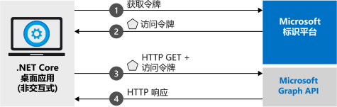

# <a name="quickstart-acquire-a-token-and-call-microsoft-graph-api-from-a-console-app-using-apps-identity"></a>快速入门：使用应用的标识获取令牌并从控制台应用中调用 Microsoft Graph API

本快速入门介绍如何编写 .NET Core 应用程序，以便使用应用的自身标识获取访问令牌，然后调用 Microsoft Graph API，以便在目录中显示[用户列表](https://docs.microsoft.com/graph/api/user-list)。 此方案适用于无外设且无人参与的作业或 Windows 服务需要使用应用程序标识而非用户标识运行的情况。



## <a name="prerequisites"></a>先决条件

本快速入门需要 [.NET Core 2.2](https://www.microsoft.com/net/download/dotnet-core/2.2)。

> [!div renderon="docs"]
> ## <a name="register-and-download-your-quickstart-app"></a>注册并下载快速入门应用

> [!div renderon="docs" class="sxs-lookup"]
>
> 可以使用两个选项来启动快速入门应用程序：
> * [快速][选项 1：注册并自动配置应用，然后下载代码示例](#option-1-register-and-auto-configure-your-app-and-then-download-your-code-sample)
> * [手动][选项 2：注册并手动配置应用程序和代码示例](#option-2-register-and-manually-configure-your-application-and-code-sample)
>
> ### <a name="option-1-register-and-auto-configure-your-app-and-then-download-your-code-sample"></a>选项 1：注册并自动配置应用，然后下载代码示例
>
> 1. 转到新的 [Azure 门户 - 应用注册](https://portal.azure.com/?Microsoft_AAD_RegisteredApps=true#blade/Microsoft_AAD_RegisteredApps/applicationsListBlade/quickStartType/DotNetCoreDaemonQuickstartPage/sourceType/docs)窗格。
> 1. 输入应用程序的名称并选择“注册”  。
> 1. 遵照说明下载内容，并只需单击一下自动配置新应用程序。
>
> ### <a name="option-2-register-and-manually-configure-your-application-and-code-sample"></a>选项 2：注册并手动配置应用程序和代码示例

> [!div renderon="docs"]
> #### <a name="step-1-register-your-application"></a>步骤 1：注册应用程序
> 若要手动注册应用程序并将应用的注册信息添加到解决方案，请执行以下步骤：
>
> 1. 使用工作或学校帐户或个人 Microsoft 帐户登录到 [Azure 门户](https://portal.azure.com)。
> 1. 如果你的帐户有权访问多个租户，请在右上角选择该帐户，并将门户会话设置为所需的 Azure AD 租户。
> 1. 导航到面向开发人员的 Microsoft 标识平台的[应用注册](https://go.microsoft.com/fwlink/?linkid=2083908)页。
> 1. 选择“新注册”。 
> 1. 出现“注册应用程序”页后，请输入应用程序的注册信息。  
> 1. 在“名称”  部分输入一个会显示给应用用户的有意义的应用程序名称，例如 `Daemon-console`，然后选择“注册”以创建应用程序。 
> 1. 注册以后，选择“证书和机密”菜单。 
> 1. 在“客户端机密”下，选择“+ 新建客户端机密”。   为它提供一个名称，然后选择“添加”。  将机密复制到安全位置。 稍后需要在代码中使用它。
> 1. 现在请依次选择“API 权限”菜单、“+ 添加权限”按钮、“Microsoft Graph”。   
> 1. 选择“应用程序权限”。 
> 1. 在“用户”节点下选择“User.Read.All”，然后选择“添加权限”。   

> [!div class="sxs-lookup" renderon="portal"]
> ### <a name="download-and-configure-your-quickstart-app"></a>下载并配置快速入门应用
> 
> #### <a name="step-1-configure-your-application-in-azure-portal"></a>步骤 1：在 Azure 门户中配置应用程序
> 为使本快速入门的代码示例正常运行，需创建客户端机密，并添加 Graph API 的 **User.Read.All** 应用程序权限。
> > [!div renderon="portal" id="makechanges" class="nextstepaction"]
> > [为我进行这些更改]()
>
> > [!div id="appconfigured" class="alert alert-info"]
> >  应用程序已使用这些属性进行配置。

#### <a name="step-2-download-your-visual-studio-project"></a>步骤 2：下载 Visual Studio 项目

[下载 Visual Studio 项目](https://github.com/Azure-Samples/active-directory-dotnetcore-daemon-v2/archive/msal3x.zip)

#### <a name="step-3-configure-your-visual-studio-project"></a>步骤 3：配置 Visual Studio 项目

1. 将 zip 文件提取到靠近磁盘根目录的本地文件夹，例如 **C:\Azure-Samples**。
1. 在 Visual Studio 中打开解决方案 - **daemon-console.sln**（可选）。
1. 编辑 **appsettings.json**，将字段 `ClientId`、`Tenant`、`ClientSecret` 的值替换为以下内容：

    ```json
    "Tenant": "Enter_the_Tenant_Id_Here",
    "ClientId": "Enter_the_Application_Id_Here",
    "ClientSecret": "Enter_the_Client_Secret_Here"
    ```
    > > [!div renderon="portal" id="certandsecretspage" class="sxs-lookup"]
    > > [生成新的客户端机密]()
    
    > [!div class="sxs-lookup" renderon="portal"]
    > > [!NOTE]
    > > 本快速入门支持 Enter_the_Supported_Account_Info_Here。
    
    > [!div renderon="docs"]
    >> 其中：
    >> * `Enter_the_Application_Id_Here` - 是已注册应用程序的**应用程序（客户端）ID**。
    >> * `Enter_the_Tenant_Id_Here` - 将此值替换为**租户 ID** 或**租户名称**（例如 contoso.microsoft.com）
    >> * `Enter_the_Client_Secret_Here` - 将此值替换为在步骤 1 中创建的客户端机密。

    > [!div renderon="docs"]
    > > [!TIP]
    > > 若要查找“应用程序(客户端) ID”、“目录(租户) ID”的值，请转到 Azure 门户中应用的“概览”页。    若要生成新密钥，请转到“证书和机密”页。 
    
#### <a name="step-4-admin-consent"></a>步骤 4：管理员同意

如果尝试在此时运行应用程序，则会收到“HTTP 403 - 禁止访问”  错误：`Insufficient privileges to complete the operation`。 之所以发生这种情况，是因为任何仅限应用的权限都需要管理员许可  ，这意味着目录的全局管理员必须为应用程序授予许可。 根据自己的角色选择下面的一个选项：

##### <a name="global-tenant-administrator"></a>全局租户管理员

> [!div renderon="docs"]
> 如果你是全局租户管理员，请转到  Azure 门户的应用程序注册（预览版）中的“API 权限”页，选择“为 {租户名称} 授予管理员许可”  （其中，{租户名称} 是目录的名称）。

> [!div renderon="portal" class="sxs-lookup"]
> 如果你是全局管理员，请转到“API 权限”页，  选择“为 Enter_the_Tenant_Name_Here 授予管理员许可” 
> > [!div id="apipermissionspage"]
> > [转到“API 权限”页]()

##### <a name="standard-user"></a>标准用户

如果你是租户的标准用户，则需请求全局管理员为你的应用程序授予管理员许可。 为此，请将以下 URL 提供给管理员：

```url
https://login.microsoftonline.com/Enter_the_Tenant_Id_Here/adminconsent?client_id=Enter_the_Application_Id_Here
```

> [!div renderon="docs"]
>> 其中：
>> * `Enter_the_Tenant_Id_Here` - 将此值替换为**租户 ID** 或**租户名称**（例如 contoso.microsoft.com）
>> * `Enter_the_Application_Id_Here` - 是已注册应用程序的**应用程序（客户端）ID**。

> [!NOTE]
> 在使用前面的 URL 授予应用许可以后，可能会出现错误“AADSTS50011:  未为应用程序注册回复地址”。 之所以发生该错误，是因为此应用程序和 URL 没有重定向 URI - 请忽略该错误。

#### <a name="step-5-run-the-application"></a>步骤 5：运行应用程序

如果使用 Visual Studio，请按 **F5** 运行该应用程序，否则请通过命令提示符或控制台来运行该应用程序：

```console
cd {ProjectFolder}\daemon-console
dotnet run
```

> 其中：
> * *{ProjectFolder}* 是在其中解压缩了 zip 文件的文件夹。 示例 **C:\Azure-Samples\active-directory-dotnetcore-daemon-v2**

应该会在 Azure AD 目录中看到作为结果的用户列表。

> [!IMPORTANT]
> 本快速入门应用程序使用客户端机密将自己标识为机密客户端。 由于客户端机密是以纯文本形式添加到项目文件的，因此为了安全起见，建议在考虑将应用程序用作生产应用程序之前，使用证书来代替客户端机密。 若要详细了解如何使用证书，请参阅 GitHub 存储库中有关此示例的[这些说明](https://github.com/Azure-Samples/active-directory-dotnetcore-daemon-v2/#variation-daemon-application-using-client-credentials-with-certificates)。

## <a name="more-information"></a>详细信息

### <a name="msalnet"></a>MSAL.NET

MSAL ([Microsoft.Identity.Client](https://www.nuget.org/packages/Microsoft.Identity.Client)) 是一个库，用于用户登录和请求令牌，此类令牌用于访问受 Microsoft 标识平台保护的 API。 如前所述，本快速入门请求令牌的方法是使用应用程序自身的标识而不是委托的权限。 在此示例中使用的身份验证流称为  [客户端凭据 oauth 流](v2-oauth2-client-creds-grant-flow.md)。 若要详细了解如何将 MSAL.NET 与客户端凭据流配合使用，请参阅[此文](https://aka.ms/msal-net-client-credentials)。

 可在 Visual Studio 的包管理器控制台中运行以下命令，以便安装 MSAL.NET  ：

```powershell
Install-Package Microsoft.Identity.Client -Pre
```

或者，如果不使用 Visual Studio，则可运行以下命令，将 MSAL 添加到项目：

```console
dotnet add package Microsoft.Identity.Client
```

### <a name="msal-initialization"></a>MSAL 初始化

可以通过添加以下代码，为 MSAL 添加引用：

```csharp
using Microsoft.Identity.Client;
```

然后，使用以下代码对 MSAL 进行初始化：

```csharp
IConfidentialClientApplication app;
app = ConfidentialClientApplicationBuilder.Create(config.ClientId)
                                          .WithClientSecret(config.ClientSecret)
                                          .WithAuthority(new Uri(config.Authority))
                                          .Build();
);
```

> | 其中： ||
> |---------|---------|
> | `config.ClientSecret` | 是在 Azure 门户中为应用程序创建的客户端机密。 |
> | `config.ClientId` | 是在 Azure 门户中注册的应用程序的**应用程序(客户端) ID**。 可以在 Azure 门户的应用的“概览”  页中找到此值。 |
> | `config.Authority`    | （可选）用户要进行身份验证的 STS 终结点。 对于公有云，通常为 <https://login.microsoftonline.com/{tenant}>，其中 {tenant} 是租户名称或租户 ID。|

有关详细信息，请参阅 [`ConfidentialClientApplication` 的参考文档](https://docs.microsoft.com/dotnet/api/microsoft.identity.client.iconfidentialclientapplication?view=azure-dotnet)

### <a name="requesting-tokens"></a>请求令牌

若要通过应用的标识来请求令牌，请使用 `AcquireTokenForClient` 方法：

```csharp
result = await app.AcquireTokenForClient(scopes)
                  .ExecuteAsync();
```

> |其中：| |
> |---------|---------|
> | `scopes` | 包含请求的范围。 对于机密客户端，这应该使用与 `{Application ID URI}/.default` 类似的格式，指示所请求的范围是在 Azure 门户的应用对象集中静态定义的范围（就 Microsoft Graph 来说，`{Application ID URI}` 指向 `https://graph.microsoft.com`）。 就自定义 Web API 来说，`{Application ID URI}` 在  Azure 门户的应用程序注册（预览版）的“公开 API”部分定义。 |

有关详细信息，请参阅 [`AcquireTokenForClient` 的参考文档](https://docs.microsoft.com/dotnet/api/microsoft.identity.client.confidentialclientapplication.acquiretokenforclientasync?view=azure-dotnet#Microsoft_Identity_Client_ConfidentialClientApplication_AcquireTokenForClientAsync_System_Collections_Generic_IEnumerable_System_String__)

[!INCLUDE [Help and support](../../../includes/active-directory-develop-help-support-include.md)]

## <a name="next-steps"></a>后续步骤

> [!div class="nextstepaction"]
> [.NET Core 守护程序示例](https://github.com/Azure-Samples/active-directory-dotnetcore-daemon-v2)

了解有关权限和许可的详细信息：

> [!div class="nextstepaction"]
> [权限和许可](v2-permissions-and-consent.md)

若要详细了解此方案的身份验证流，请查看 Oauth 2.0 客户端凭据流：

> [!div class="nextstepaction"]
> [客户端凭据 Oauth 流](v2-oauth2-client-creds-grant-flow.md)

> [!div class="nextstepaction"]
> [MSAL.NET 的客户端凭据流](https://aka.ms/msal-net-client-credentials)
