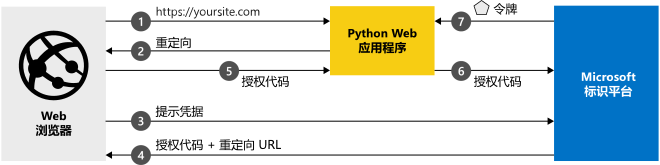

# <a name="quickstart-add-sign-in-with-microsoft-to-a-python-web-app"></a>快速入门：向 Python Web 应用添加 Microsoft 登录功能

本快速入门介绍如何将 Python Web 应用程序与 Microsoft 标识平台集成。 应用会将用户登录，获取用于调用 Microsoft Graph API 的访问令牌，并针对 Microsoft Graph API 发出请求。

完成本指南后，应用程序将接受个人 Microsoft 帐户（包括 outlook.com、live.com 和其他帐户）进行登录，还能够接受使用 Azure Active Directory 的任何公司或组织的工作或学校帐户进行登录。 （有关说明，请参阅[示例工作原理](#how-the-sample-works)。）

## <a name="prerequisites"></a>先决条件

若要运行此示例，需要：

- [Python 2.7+](https://www.python.org/downloads/release/python-2713) 或 [Python 3+](https://www.python.org/downloads/release/python-364/)
- [Flask](http://flask.pocoo.org/)、[Flask-Session](https://pypi.org/project/Flask-Session/)、[请求](https://requests.kennethreitz.org/en/master/)
- [MSAL Python](https://github.com/AzureAD/microsoft-authentication-library-for-python)

> [!div renderon="docs"]
>
> ## <a name="register-and-download-your-quickstart-app"></a>注册并下载快速入门应用
>
> 可以使用两个选项来启动快速入门应用程序：“快速”（选项 1）和“手动”（选项 2）
>
> ### <a name="option-1-register-and-auto-configure-your-app-and-then-download-your-code-sample"></a>选项 1：注册并自动配置应用，然后下载代码示例
>
> 1. 访问 [Azure 门户 - 应用注册](https://portal.azure.com/#blade/Microsoft_AAD_RegisteredApps/applicationsListBlade/quickStartType/PythonQuickstartPage/sourceType/docs)。
> 1. 输入应用程序的名称并选择“注册”  。
> 1. 遵照说明下载内容，系统会自动配置新应用程序。
>
> ### <a name="option-2-register-and-manually-configure-your-application-and-code-sample"></a>选项 2：注册并手动配置应用程序和代码示例
>
> #### <a name="step-1-register-your-application"></a>步骤 1：注册应用程序
>
> 若要手动注册应用程序并将应用的注册信息添加到解决方案，请执行以下步骤：
>
> 1. 使用工作或学校帐户或个人 Microsoft 帐户登录到 [Azure 门户](https://portal.azure.com)。
> 1. 如果你的帐户有权访问多个租户，请在右上角选择该帐户，并将门户会话设置为所需的 Azure AD 租户。
> 1. 导航到面向开发人员的 Microsoft 标识平台的[应用注册](https://go.microsoft.com/fwlink/?linkid=2083908)页。
> 1. 选择“新注册”。 
> 1. “注册应用程序”页出现后，请输入应用程序的注册信息： 
>      - 在“名称”  部分输入一个会显示给应用用户的有意义的应用程序名称，例如 `python-webapp`。
>      - 在“支持的帐户类型”下，选择“任何组织目录中的帐户和个人 Microsoft 帐户”。  
>      - 选择“注册”  。
>      - 在应用的“概述”页上，记下“应用程序(客户端) ID”值，供稍后使用   。
> 1. 从菜单选择“身份验证”，然后添加以下信息  ：
>    - 添加 **Web** 平台配置。 添加 `http://localhost:5000/getAToken` 作为“重定向 URI”。 
>    - 选择“保存”。 
> 1. 在左侧菜单中选择“证书和机密”，然后在“客户端机密”部分单击“新建客户端机密”：   
>
>      - 键入（实例应用机密）的密钥说明。
>      - 选择密钥持续时间“1 年”。 
>      - 单击“添加”时，将显示密钥值。 
>      - 复制密钥的值。 稍后需要用到此值。
> 1. 选择“API 权限”部分 
>
>      - 单击“添加权限”  按钮，然后
>      - 确保已选中“Microsoft API”选项卡 
>      - 在“常用 Microsoft API”部分中，单击“Microsoft Graph”  
>      - 在“委托的权限”部分中，确保已勾选正确的权限  ：**User.ReadBasic.All**。 如有必要，请使用搜索框。
>      - 选择“添加权限”按钮 
>
> [!div class="sxs-lookup" renderon="portal"]
>
> #### <a name="step-1-configure-your-application-in-azure-portal"></a>步骤 1：在 Azure 门户中配置应用程序
>
> 若要正常运行本快速入门中的代码示例，需要：
>
> 1. 将答复 URL 添加为 `http://localhost:5000/getAToken`。
> 1. 创建客户端机密。
> 1. 添加 Microsoft Graph API 的 User.ReadBasic.All 委托的权限。
>
> > [!div renderon="portal" id="makechanges" class="nextstepaction"]
> > [为我进行这些更改]()
> > [!div id="appconfigured" class="alert alert-info"]
> >  应用程序已使用此属性进行配置

#### <a name="step-2-download-your-project"></a>步骤 2：下载项目
> [!div renderon="docs"]
> [下载代码示例](https://github.com/Azure-Samples/ms-identity-python-webapp/archive/master.zip)

> [!div class="sxs-lookup" renderon="portal"]
> 下载项目并将 zip 文件解压缩到更靠近根文件夹的本地文件夹（例如，**C:\Azure-Samples**）
> [!div renderon="portal" id="autoupdate" class="nextstepaction"]
> [下载代码示例](https://github.com/Azure-Samples/ms-identity-python-webapp/archive/master.zip)

> [!div class="sxs-lookup" renderon="portal"]
> > [!NOTE]
> > `Enter_the_Supported_Account_Info_Here`

> [!div renderon="docs"]
> #### <a name="step-3-configure-the-application"></a>步骤 3：配置应用程序
>
> 1. 将 zip 文件提取到更靠近根文件夹的本地文件夹（例如，**C:\Azure-Samples**）
> 1. 如果使用集成开发环境，请在偏好的 IDE 中打开示例（可选）。
> 1. 打开 **app_config.py** 文件，该文件可以在根文件夹中找到，并替换为以下代码片段：
>
> ```python
> CLIENT_ID = "Enter_the_Application_Id_here"
> CLIENT_SECRET = "Enter_the_Client_Secret_Here"
> AUTHORITY = "https://login.microsoftonline.com/Enter_the_Tenant_Name_Here"
> ```
> 其中：
>
> - `Enter_the_Application_Id_here` - 是已注册应用程序的应用程序 ID。
> - `Enter_the_Client_Secret_Here` - 是你在“证书和机密”  中为注册的应用程序创建的**客户端密码**。
> - `Enter_the_Tenant_Name_Here` - 是注册的应用程序的目录（租户）ID 值  。

> [!div class="sxs-lookup" renderon="portal"]
> #### <a name="step-3-run-the-code-sample"></a>步骤 3：运行代码示例

> [!div renderon="docs"]
> #### <a name="step-4-run-the-code-sample"></a>步骤 4：运行代码示例

1. 需要安装 MSAL Python 库、Flask 框架、Flask-Sessions，以便使用 pip 进行服务器端会话管理和请求，如下所示：

    ```Shell
    pip install -r requirements.txt
    ```

2. 从 shell 或命令行运行 app.py：

    ```Shell
    python app.py
    ```
   > [!IMPORTANT]
   > 本快速入门应用程序使用客户端机密将自己标识为机密客户端。 由于客户端机密是以纯文本形式添加到项目文件的，因此为了安全起见，建议在考虑将应用程序用作生产应用程序之前，使用证书来代替客户端机密。 有关如何使用证书的详细信息，请参阅[这些说明](https://docs.microsoft.com/azure/active-directory/develop/active-directory-certificate-credentials)。

## <a name="more-information"></a>详细信息

### <a name="how-the-sample-works"></a>示例工作原理


### <a name="getting-msal"></a>获取 MSAL
MSAL 是一个库，用于用户登录和请求令牌，此类令牌用于访问受 Microsoft 标识平台保护的 API。
可以使用 Pip 将 MSAL Python 添加到应用程序中。

```Shell
pip install msal
```

### <a name="msal-initialization"></a>MSAL 初始化
可以通过将以下代码添加到要在其中使用 MSAL 的文件的顶部，来添加对 MSAL Python 的引用：

```Python
import msal
```

## <a name="next-steps"></a>后续步骤

详细了解登录用户然后调用 Web API 的 Web 应用：

> [!div class="nextstepaction"]
> [场景：登录用户的 Web 应用](scenario-web-app-sign-user-overview.md)

[!INCLUDE [Help and support](../../../includes/active-directory-develop-help-support-include.md)]
