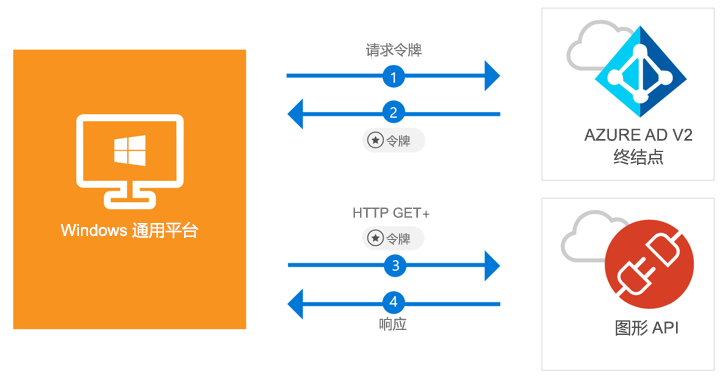

# <a name="call-the-microsoft-graph-api-from-a-universal-windows-platform-uwp-application"></a>从通用 Windows 平台 (UWP) 应用程序调用 Microsoft Graph API

[!INCLUDE [active-directory-develop-applies-v2-msal](../../../includes/active-directory-develop-applies-v2-msal.md)]

本快速入门包含了一个代码示例，该示例演示了通用 Windows 平台 (UWP) 应用程序如何让用户使用个人、工作和学校帐户进行登录，获取访问令牌以及调用 Microsoft Graph API。



> [!div renderon="docs"]
> ## <a name="register-and-download"></a>注册和下载
> ### <a name="register-and-configure-your-application-and-code-sample"></a>注册并配置应用程序和代码示例
> #### <a name="step-1-register-your-application"></a>步骤 1：注册应用程序
> 若要注册应用程序并将应用程序注册信息添加到解决方案，请执行以下操作：
> 1. 转到 [Microsoft 应用程序注册门户](https://apps.dev.microsoft.com/portal/register-app)注册应用程序。
> 1. 在“应用程序名称”框中输入应用程序的名称。
> 1. 确保未选中“指导式设置”复选框，然后选择“创建”。
> 1. 依次选择“添加平台”、“本机应用程序”和“保存”。

> [!div renderon="portal" class="sxs-lookup alert alert-info"]
> #### <a name="step-1-configure-your-application"></a>步骤 1：配置应用程序
> 为使此快速入门中的代码示例正常运行，需要将重定向 URL 添加为 **urn:ietf:wg:oauth:2.0:oob**。
> > [!div renderon="portal" id="makechanges" class="nextstepaction"]
> > [为我执行此更改]()
>
> > [!div id="appconfigured" class="alert alert-info"]
> >  应用程序已使用这些属性进行了配置

#### <a name="step-2-download-your-visual-studio-project"></a>步骤 2：下载 Visual Studio 项目

 - [下载 Visual Studio 2017 项目](https://github.com/Azure-Samples/active-directory-dotnet-native-uwp-v2/archive/master.zip)

#### <a name="step-3-configure-your-visual-studio-project"></a>步骤 3：配置 Visual Studio 项目

1. 将 zip 文件提取到本地文件夹（例如，**C:\Azure-Samples**）
1. 在 Visual Studio 中打开项目
1. 编辑 **App.Xaml.cs** 并将以 `private static string ClientId` 开头的行替换为以下内容：

    ```csharp
    private static string ClientId = "Enter_the_Application_Id_here";
    ```

## <a name="more-information"></a>更多信息

下面是本快速入门的概述：

### <a name="msalnet"></a>MSAL.NET

MSAL ([Microsoft.Identity.Client](https://www.nuget.org/packages/Microsoft.Identity.Client)) 属于库，用于用户登录和请求用于访问由 Microsoft Azure Active Directory 保护的 API 的令牌库。 可在 Visual Studio 的包管理器控制台中运行以下命令，以进行安装：

```powershell
Install-Package Microsoft.Identity.Client -Pre
```

### <a name="msal-initialization"></a>MSAL 初始化

可以通过添加以下行，为 MSAL 添加引用：

```csharp
using Microsoft.Identity.Client;
```

然后，使用以下行对 MSAL 进行初始化：

```csharp
public static PublicClientApplication PublicClientApp = new PublicClientApplication(ClientId);
```

> |其中： ||
> |---------|---------|
> |ClientId | 在 *portal.microsoft.com* 中注册的应用程序的应用程序 ID |

### <a name="requesting-tokens"></a>请求令牌

MSAL 有两种用来获取令牌的方法 - `AcquireTokenAsync` 和 `AcquireTokenSilentAsync`：

#### <a name="get-a-user-token-interactively"></a>以交互方式获取用户令牌

 在某些情况下，需要通过弹出窗口强制用户与 Azure Active Directory v2 终结点进行交互，以验证其凭据或表示同意 - 一些示例如下：

- 用户首次登录应用程序
- 由于密码已过期，用户可能需要重新输入凭据
- 应用程序正在请求访问用户需要同意的资源
- 需要双重身份验证

```csharp
authResult = await App.PublicClientApp.AcquireTokenAsync(scopes);
```

> |其中：||
> |---------|---------|
> |scopes | 包含所请求的作用域（即针对 Microsoft Graph 的 `{ "user.read" }` 或针对自定义 Web API 的 `{ "api://<Application ID>/access_as_user" }`） |

#### <a name="get-a-user-token-silently"></a>以无提示方式获取用户令牌

你不希望在用户每次需要访问资源时都要求其验证其凭据 - 大多数情况下，你希望在无需任何用户交互的情况下进行令牌获取和续订 - `AcquireTokenSilentAsync` 是用于在初始 `AcquireTokenAsync` 后获取用来访问受保护资源的令牌的常用方法：

```csharp
var accounts = await App.PublicClientApp.GetAccountsAsync();
authResult = await App.PublicClientApp.AcquireTokenSilentAsync(scopes, accounts.FirstOrDefault());
```

> |其中： ||
> |---------|---------|
> |scopes | 包含所请求的作用域（即针对 Microsoft Graph 的 `{ "user.read" }` 或针对自定义 Web API 的 `{ "api://<Application ID>/access_as_user" }`） |
> |accounts.FirstOrDefault() | 缓存中的第一个用户（MSAL 支持单个应用中的多个用户） |

## <a name="next-steps"></a>后续步骤

试用 Windows 桌面教程，了解有关构建应用程序和构建新功能的完整分步指南，包括本快速入门的完整说明。

### <a name="learn-the-steps-to-create-the-application-used-in-this-quickstart"></a>了解创建本快速入门中使用的应用程序的步骤

> [!div class="nextstepaction"]
> [UWP - 调用 Graph API 教程](tutorial-v2-windows-uwp.md)

[!INCLUDE [Help and support](../../../includes/active-directory-develop-help-support-include.md)]