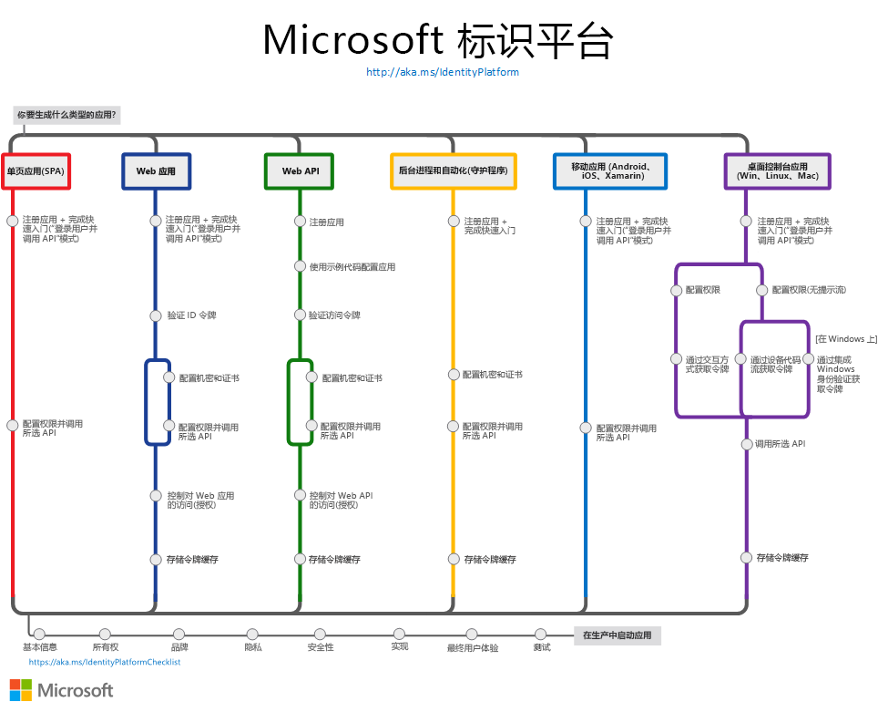

# Microsoft 标识平台 (v2.0) 概述

Microsoft 标识平台是 Azure Active Directory (Azure AD) 标识服务和开发人员平台的一种演变。 开发人员可以通过它来生成应用程序，从而可以采用所有 Microsoft 标识登录，以及获取令牌来调用 Microsoft Graph 等 Microsoft API 或开发人员生成的 API。 Microsoft 标识平台包括：

- **符合 OAuth 2.0 和 OpenID Connect 标准的身份验证服务**，使开发人员能够对任何 Microsoft 标识进行身份验证并，包括：
  - 工作或学校帐户（通过 Azure AD 预配的）
  - 个人 Microsoft 帐户（例如 Skype、Xbox 和 Outlook.com）
  - 社交或本地帐户（通过 Azure AD B2C）
- **开放源代码库**：Microsoft 身份验证库 (MSAL)，并支持其他符合标准的库
- **应用程序管理门户**：Azure 门户中内置的注册和配置体验，以及你的所有其他 Azure 管理功能。
- **应用程序配置 API 和 PowerShell**：允许通过 REST API（Microsoft Graph 和 Azure Active Directory Graph 1.6）和 PowerShell 以编程方式配置你的应用程序，以便可以自动执行 DevOps 任务。
- **开发人员内容**：概念性和参考文档、快速入门示例、代码示例、教程以及操作指南。

对于开发人员而言，Microsoft 标识平台可无缝集成到标识和安全领域的创新中，例如无密码身份验证、升级身份验证和条件访问。  你不需要自己实现这样的功能：集成了 Microsoft 标识平台的应用程序原本就可以利用这样的创新。

使用 Microsoft 标识平台，你可以编写一次代码并影响任何用户。 你可以构建一次应用并使其在许多平台上运行，也可以构建充当客户端以及资源应用程序 (API) 的应用。

## 入门

可以轻松使用标识。 选择适合你的方案 - 每个方案路径都有一个快速入门和一个概述页面，可以通过它们在数分钟内实现正常运转：

- [构建单页应用](scenario-spa-overview.md)
- [构建用于让用户登录的 Web 应用](scenario-web-app-sign-user-overview.md)
- [构建调用 Web API 的 Web 应用](scenario-web-app-call-api-overview.md)
- [构建受保护的 Web API](scenario-protected-web-api-overview.md)
- [构建调用 Web API 的 Web 应用](scenario-web-api-call-api-overview.md)
- [构建桌面应用](scenario-desktop-overview.md)
- [构建守护程序应用](scenario-daemon-overview.md)
- [构建移动应用](scenario-mobile-overview.md)

下图概述了常见的身份验证应用方案 - 将 Microsoft 标识平台与你的应用程序集成时，可以使用它作为参考。

## 后续步骤

如果要详细了解核心身份验证概念，建议你先阅读以下主题：

- [身份验证基础知识](authentication-scenarios.md)
- [应用程序和服务主体](app-objects-and-service-principals.md)
- [受众](v2-supported-account-types.md)
- [权限和许可](v2-permissions-and-consent.md)
- [ID 令牌](id-tokens.md)和[访问令牌](access-tokens.md)

构建调用 [Microsoft Graph](https://docs.microsoft.com/graph/overview) 的富数据应用程序。

当准备好在**生产环境**中启动你的应用后，查看以下最佳做法：

- 在你的应用程序中[启用日志记录](msal-logging.md)。
- 在你的应用程序中启用遥测。
- 启用[代理并自定义 HTTP 客户端](msal-net-provide-httpclient.md)。
- 按照 [Microsoft 标识平台集成清单](identity-platform-integration-checklist.md)测试你的集成。

## 了解详细信息

如果你打算构建以社交和本地标识进行登录的面向客户的应用程序，请查看 [Azure AD B2C 概述](https://docs.microsoft.com/azure/active-directory-b2c/tutorial-add-identity-providers)。