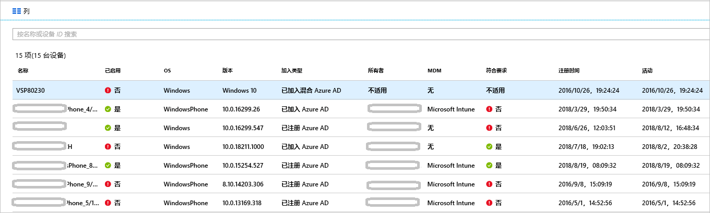

# <a name="how-to-manage-stale-devices-in-azure-ad"></a>如何：在 Azure AD 中管理陈旧的设备

理想情况下，若要完成生命周期，应该注销不再需要的已注册设备。 但是，在发生遗失、失窃、设备损坏或 OS 重装等情况下，环境中通常就会出现陈旧的设备。 IT 管理员可能希望通过某种方法来删除陈旧的设备，以便将资源重点投放在真正需要管理的设备上。

本文介绍如何有效地在环境中管理陈旧的设备。
  

## <a name="what-is-a-stale-device"></a>什么是陈旧的设备？

陈旧的设备是指已注册到 Azure AD，但在特定的时间范围内未曾用来访问过任何云应用的设备。 陈旧的设备会影响对租户中的设备和用户进行管理和支持，因为： 

- 重复的设备可能使支持人员难以识别哪些设备当前处于活动状态。
- 有更多的设备创建不必要的设备写回，增加了 AAD Connect 同步时间。
- 出于整洁与合规性目的，你可能希望设备保持整齐有序。 

Azure AD 中的陈旧设备可能会影响到针对组织中设备实施的常规生命周期策略。

## <a name="detect-stale-devices"></a>检测陈旧的设备

由于陈旧设备定义为已注册的、但在特定的时间范围内未曾用来访问过任何云应用的设备，因此，检测陈旧设备需要时间戳相关的属性。 在 Azure AD 中，此属性称为 **ApproximateLastLogonTimestamp** 或**活动时间戳**。 如果某个设备的当前时间与**活动时间戳**值之间的差超过了为活动设备定义的时间范围，则将该设备视为陈旧设备。 此**活动时间戳**目前以公共预览版提供。

## <a name="how-is-the-value-of-the-activity-timestamp-managed"></a>如何管理活动时间戳的值？  

设备尝试身份验证时，会触发活动时间戳的评估。 在以下情况下，Azure AD 会评估活动时间戳：

- 需要条件性访问策略[被管理的设备](../conditional-access/require-managed-devices.md)或[批准的客户端应用](../conditional-access/app-based-conditional-access.md)已触发。
- 已加入 Azure AD 或已加入混合 Azure AD 的 Windows 10 设备在网络中处于活动状态。 
- Intune 受管理设备已签入服务。

如果活动时间戳的现有值与当前值之间的差超过 14 天，则将现有值替换为新值。

## <a name="how-do-i-get-the-activity-timestamp"></a>如何获取活动时间戳？

可通过两个选项检索活动时间戳的值：

- Azure 门户中[设备页](https://portal.azure.com/#blade/Microsoft_AAD_IAM/DevicesMenuBlade/Devices)上的“活动”列 

    

- [Get-MsolDevice](https://docs.microsoft.com/powershell/module/msonline/get-msoldevice?view=azureadps-1.0) cmdlet

    

## <a name="plan-the-cleanup-of-your-stale-devices"></a>规划陈旧设备的清理

若要有效清理环境中的陈旧设备，应该定义一个相关的策略。 此策略可帮助确保捕获陈旧设备相关的所有注意事项。 以下部分提供了有关常见策略注意事项的示例。 

### <a name="cleanup-account"></a>清理帐户

若要更新 Azure AD 中的设备，需要一个具有以下角色之一的帐户：

- 全局管理员角色
- 云设备管理员（现已推出新角色！）
- Intune 服务管理员

在清理策略中，选择具有所需角色的帐户。 

### <a name="timeframe"></a>时间范围

定义作为陈旧设备指标的时间范围。 定义时间范围时，请在值中考虑到更新活动时间戳所需的 14 天期限。 例如，不应该将短于 14 天的时间戳视为陈旧设备的指标。 在某些情况下，某个设备看似是陈旧设备，但实际上并不是。 例如，相关设备的所有者可能正在度假或请了病假。  超过陈旧设备的时间范围。

### <a name="disable-devices"></a>禁用设备

不建议立即删除看似陈旧的设备，因为如果误删，将无法撤消操作。 最佳做法是，先禁用设备，过了一个宽限期之后再将其删除。 在策略中，定义在删除设备之前禁用设备的时间范围。

### <a name="mdm-controlled-devices"></a>MDM 控制的设备

如果设备受 Intune 或其他任何 MDM 解决方案的控制，请先在管理系统中解除该设备，然后再将其禁用或删除。

### <a name="system-managed-devices"></a>系统管理的设备

不要删除系统管理的设备。 这些设备通常用于自动试运行等目的。 删除后无法重新预配这些设备。 默认情况下，新的 `get-msoldevice` cmdlet 可以排除系统管理的设备。 

### <a name="hybrid-azure-ad-joined-devices"></a>混合 Azure AD 加入设备

加入混合 Azure AD 的设备应该遵循本地陈旧设备管理的策略。 

清理 Azure AD：

- **Windows 10 设备** - 在本地 AD 中禁用或删除 Windows 10 设备，并让 Azure AD Connect 将更改的设备状态同步到 Azure AD。
- **Windows 7/8** - 在 Azure AD 中禁用或删除 Windows 7/8 设备。 无法使用 Azure AD Connect 在 Azure AD 中禁用或删除 Windows 7/8 设备。

### <a name="azure-ad-joined-devices"></a>Azure AD 加入设备

在 Azure AD 中禁用或删除已加入 Azure AD 的设备。

### <a name="azure-ad-registered-devices"></a>Azure AD 注册设备

在 Azure AD 中禁用或删除 Azure AD 注册的设备。

## <a name="clean-up-stale-devices-in-the-azure-portal"></a>在 Azure 门户中清理陈旧的设备  

可以在 Azure 门户中清理陈旧的设备，但使用 PowerShell 脚本可以更高效地处理此过程。 在最新的 PowerShell V1 模块中可以使用时间戳筛选器，并可以筛选出系统管理的设备，例如自动试运行设备。 目前不建议使用 PowerShell V2。

典型的例程包括以下步骤：

1. 使用 [Connect-MsolService](https://docs.microsoft.com/powershell/module/msonline/connect-msolservice?view=azureadps-1.0) cmdlet 连接到 Azure Active Directory
1. 获取设备列表
1. 使用 [Disable-MsolDevice](https://docs.microsoft.com/powershell/module/msonline/disable-msoldevice?view=azureadps-1.0) cmdlet 禁用设备。 
1. 在删除设备之前，将等待所选天数的宽限期。
1. 使用 [Remove-MsolDevice](https://docs.microsoft.com/powershell/module/msonline/remove-msoldevice?view=azureadps-1.0) cmdlet 删除设备。

### <a name="get-the-list-of-devices"></a>获取设备列表

获取所有设备并将返回的数据存储在 CSV 文件中：

```PowerShell
Get-MsolDevice -all | select-object -Property Enabled, DeviceId, DisplayName, DeviceTrustType, Approxi
mateLastLogonTimestamp | export-csv devicelist-summary.csv
```

如果你的目录中有大量设备，使用时间戳筛选器缩小返回的设备数。 获取时间戳超过特定日期的所有设备并将返回的数据存储在 CSV 文件中： 

```PowerShell
$dt = [datetime]’2017/01/01’
Get-MsolDevice -all -LogonTimeBefore $dt | select-object -Property Enabled, DeviceId, DisplayName, DeviceTrustType, ApproximateLastLogonTimestamp | export-csv devicelist-olderthan-Jan-1-2017-summary.csv
```

## <a name="what-you-should-know"></a>要点

### <a name="why-is-the-timestamp-not-updated-more-frequently"></a>为何时间戳不经常更新？

更新时间戳是为了支持设备生命周期方案。 这并非审核。 使用登录审核日志可以在设备上进行更频繁的更新。

### <a name="why-should-i-worry-about-my-bitlocker-keys"></a>为何需要注意保管 BitLocker 密钥？

为 Windows 10 设备配置的 BitLocker 密钥存储在 Azure AD 中的设备对象上。 如果删除某个陈旧设备，则也会删除该设备上存储的 BitLocker 密钥。 在删除陈旧设备之前，应该确定清理策略是否与设备的实际生命周期相一致。 

### <a name="how-do-i-know-all-the-type-of-devices-joined"></a>如何知道所有已加入的设备类型？

若要详细了解不同的类型，请参阅[设备管理概述](overview.md)。

### <a name="what-happens-when-i-disable-a-device"></a>禁用某个设备时会发生什么情况？

将拒绝使用该设备在 Azure AD 中进行身份验证。 常见示例包括：

- **已加入混合 Azure AD 的设备** - 用户也许可以使用该设备登录到其本地域。 但是，他们无法访问 Office 365 等 Azure AD 资源。
- **已加入 Azure AD 的设备** - 用户无法使用该设备登录。 
- **移动设备** - 用户无法访问 Office 365 等 Azure AD 资源。 

## <a name="next-steps"></a>后续步骤

若要大致了解如何在 Azure 门户中管理设备，请参阅[使用 Azure 门户管理设备](device-management-azure-portal.md)
