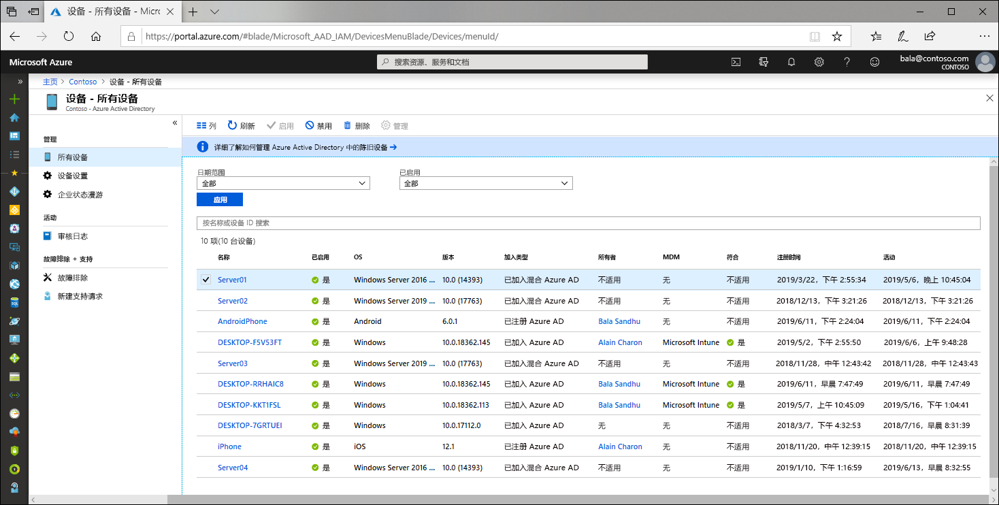

# 什么是设备标识？

随着各种形状和大小的设备不断问世以及自带设备 (BYOD) 概念的出现，IT 专业人员面临着两个有所对立的目标：

- 使用户能够随时随地保持高效的工作
- 保护组织的资产

若要保护这些资产，IT 人员首先需要管理设备标识。 IT 工作人员可以使用 Microsoft Intune 等工具基于设备标识生成解决方案，以确保符合安全与合规标准。 Azure Active Directory (Azure AD) 允许从任何位置通过这些设备以单一登录方式登录到设备、应用和服务。

- 用户可以访问你的组织中他们所需的资产。 
- IT 工作人员可以使用所需的控制措施来保护组织的安全。

设备标识管理是[基于设备的条件访问](../conditional-access/require-managed-devices.md)的基础。 通过基于设备的条件访问策略，可确保只有受管理设备才能访问环境中的资源。

## 在 Azure AD 中获取设备

若要获取 Azure AD 中的设备，可以使用多个选项：

- **已注册到 Azure AD**
   - 已注册到 Azure AD 的设备通常是个人拥有的设备或移动设备，并已登录到个人 Microsoft 帐户或其他本地帐户。
      - Windows 10
      - iOS
      - Android
      - MacOS
- **已加入 Azure AD**
   - 已加入 Azure AD 的设备由组织拥有，已登录到属于该组织的 Azure AD 帐户。 这些设备位于云中。
      - Windows 10 
- **已加入混合 Azure AD**
   - 已加入混合 Azure AD 的设备由组织拥有，已登录到属于该组织的 Azure AD 帐户。 这些设备位于云中和本地。
      - Windows 7、8.1 或 10
      - Windows Server 2008 或更高版本

## 设备管理

使用 Microsoft Intune、System Center Configuration Manager、组策略（混合 Azure AD 加入）、移动应用管理 (MAM) 工具等移动设备管理 (MDM) 工具或其他第三方工具，来管理 Azure AD 中的设备。

## 资源访问

注册和加入操作可让用户无缝单一登录 (SSO) 到云资源，并可让管理员将条件访问策略应用到这些资源。 

已加入 Azure AD 或加入混合 Azure AD 的设备可受益于组织本地资源以及云资源的 SSO。 在[本地资源的 SSO 在已加入 Azure AD 的设备上的工作原理](azuread-join-sso.md)一文中可以找到详细信息。

## 设备安全性

- **已注册到 Azure AD 的设备**利用最终用户管理的帐户，此帐户是使用以下一项或多项措施保护的 Microsoft 帐户或其他本地管理的凭据。
   - 密码
   - PIN
   - 模式
   - Windows Hello
- **已加入 Azure AD 或混合 Azure AD 的设备**利用 Azure AD 中受以下一项或多项措施保护的组织帐户。
   - 密码
   - Windows Hello for Business

## 设置

可通过自助方式或者由管理员执行的受控预配流程，将设备加入 Azure AD。

## 摘要

使用 Azure AD 中的设备标识管理能够：

- 简化在 Azure AD 中引入和管理设备的过程
- 方便用户访问组织中基于云的资源

## 许可要求

[!INCLUDE [Active Directory P1 license](../../../includes/active-directory-p1-license.md)]

## 后续步骤

- 详细了解[已注册到 Azure AD 的设备](concept-azure-ad-register.md)
- 详细了解[已加入 Azure AD 的设备](concept-azure-ad-join.md)
- 详细了解[已加入混合 Azure AD 的设备](concept-azure-ad-join-hybrid.md)
- 若要大致了解如何在 Azure 门户中管理设备标识，请参阅[使用 Azure 门户管理设备标识](device-management-azure-portal.md)。
- 若要详细了解基于设备的条件访问，请参阅[配置 Azure Active Directory 基于设备的条件访问策略](../conditional-access/require-managed-devices.md)。
