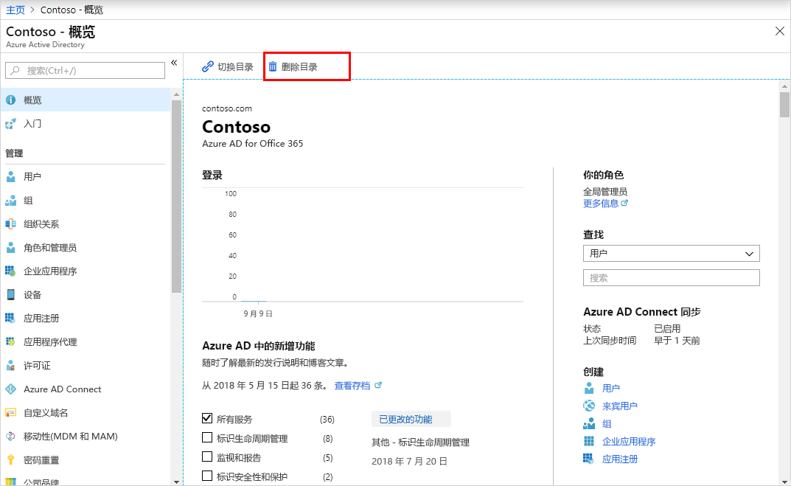

# 快速入门：在 Azure Active Directory 中创建一个新租户
可使用 Azure Active Directory (Azure AD) 门户执行所有管理任务，包括为组织创建新的租户。 

在该快速入门中，你将学习如何转到 Azure 门户和 Azure Active Directory，以及如何为组织创建基本租户。

如果还没有 Azure 订阅，可以在开始前创建一个[免费帐户](https://azure.microsoft.com/free/)。

## 登录到 Azure 门户
使用全局管理员帐户登录到组织的 [Azure 门户](https://portal.azure.com/)。

## 为组织创建新的租户
登录到 Azure 门户后，即可为组织创建新的租户。 新的租户代表你的组织，可帮助你管理面向内部和外部用户的特定 Microsoft 云服务实例。

### 创建新的租户
1. 依次选择“创建资源”、“标识”、“Azure Active Directory”。

    随即出现“创建目录”页面。

    

2.  在“创建目录”页面上，输入以下信息：
    
    - 在“组织名称”框中键入 Contoso。

    - 在“初始域名”框中键入 Contoso。

    - 保留“国家或地区”框中的“美国”选项。

3. 选择“创建”。

新租户是使用 contoso.onmicrosoft.com 域创建的。

## 清理资源
如果不计划继续使用此应用程序，可按以下步骤删除此租户：

- 选择 Azure Active Directory，然后在“Contoso - 概述”页面上，选择“删除目录”。

    这会删除此租户及其关联信息。

    

## 后续步骤
- 要更改或添加其他域名，请参阅[如何向 Azure Active Directory 添加自定义域名](add-custom-domain.md)

- 要添加用户，请参阅[添加新用户或删除用户](add-users-azure-active-directory.md)

- 要添加组和成员，请参阅[创建基本组并添加成员](active-directory-groups-create-azure-portal.md)

- 为帮助管理组织的应用程序和资源访问权限，请了解[使用 Privileged Identity Management 基于角色进行访问](../../role-based-access-control/pim-azure-resource.md)和[条件访问](../../role-based-access-control/conditional-access-azure-management.md)。

- 了解 Azure AD，包括[基本许可信息、术语和关联的功能](active-directory-whatis.md)。
