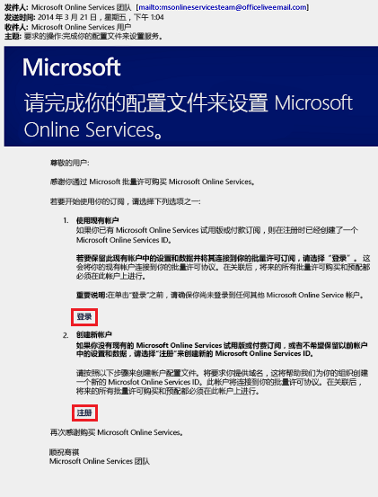
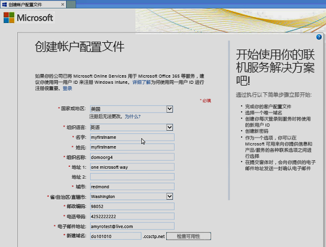
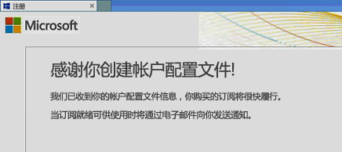
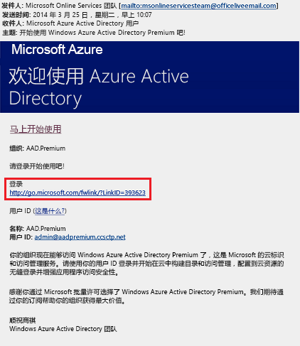
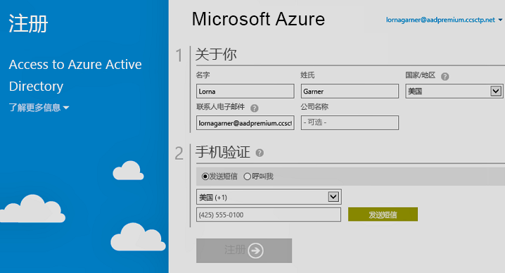

# 注册 Azure Active Directory Premium 版本
可购买 Azure Active Directory (Azure AD) Premium 版本并将其与 Azure 订阅进行关联。 如果需要创建新的 Azure 订阅，则还需要激活许可计划和 Azure AD 服务访问权限。

> [!NOTE]
>在中国，使用 Azure Active Directory 全球实例的客户可以使用 Azure AD 高级和基本版。 中国区 21Vianet 运营的 Azure 服务目前不支持 Azure AD Premium 和 Azure AD Basic 版本。 有关详细信息，请通过 [Azure Active Directory 论坛](https://feedback.azure.com/forums/169401-azure-active-directory/)与我们联系。

在注册 Active Directory Premium 1 和 Premium 2 之前，必须先确定要使用哪个现有订阅或计划：

- 通过现有的 Azure 或 Office 365 订阅

- 通过企业移动性 + 安全性许可计划

- 通过 Microsoft 批量许可计划

如果注册时使用的 Azure 订阅具有之前购买并激活的 Azure AD 许可证，则会在同一目录中自动激活这些许可证。 如果不是如此，则仍必须激活许可证计划和 Azure AD 访问权限。 要详细了解如何激活许可证计划，请参阅[激活新的许可证计划](#activate-your-new-license-plan)。 要详细了解如何激活 Azure AD 访问权限，请参阅[激活 Azure AD 访问权限](#activate-your-azure-ad-access)。 

## 通过现有的 Azure 或 Office 365 订阅进行注册
Azure 或 Office 365 订阅者可在线购买 Azure Active Directory Premium 版本。 有关详细步骤，请参阅 [How to Purchase Azure Active Directory Premium - Existing Customers](https://channel9.msdn.com/Series/Azure-Active-Directory-Videos-Demos/How-to-Purchase-Azure-Active-Directory-Premium-Existing-Customer)（如何购买 Azure Active Directory Premium - 现有客户）或 [How to Purchase Azure Active Directory Premium - New Customers](https://channel9.msdn.com/Series/Azure-Active-Directory-Videos-Demos/How-to-Purchase-Azure-Active-Directory-Premium-New-Customers)（如何购买 Azure Active Directory Premium - 新客户）。

## 通过企业移动性 + 安全性许可计划进行注册
“企业移动性 + 安全性”是一个套件，其中包括 Azure AD Premium、Azure 信息保护和 Microsoft Intune。 如果已具有 EMS 许可证，可通过下述许可选项之一开始使用 Azure AD：

有关 EMS 的详细信息，请参阅[“企业移动性 + 安全性”网站](https://www.microsoft.com/cloud-platform/enterprise-mobility-security)。

- 通过免费的[企业移动性 + 安全性 E5 试用订阅](https://signup.microsoft.com/Signup?OfferId=87dd2714-d452-48a0-a809-d2f58c4f68b7&ali=1)试用 EMS

- 购买[企业移动性 + 安全性 E5 许可证](https://signup.microsoft.com/Signup?OfferId=e6de2192-536a-4dc3-afdc-9e2602b6c790&ali=1)

- 购买[企业移动性 + 安全性 E3 许可证](https://signup.microsoft.com/Signup?OfferId=4BBA281F-95E8-4136-8B0F-037D6062F54C&ali=1)

## 通过 Microsoft 批量许可计划进行登录
通过 Microsoft 批量许可计划，可根据要获取的许可证数量使用下述任一计划注册 Azure AD Premium：

- 对于 250 个或更多许可证： [Microsoft 企业协议](https://www.microsoft.com/en-us/licensing/licensing-programs/enterprise.aspx)

- 对于 5 个至 250 个许可证： [打开批量许可](https://www.microsoft.com/en-us/licensing/licensing-programs/open-license.aspx)

要详细了解批量许可购买选项，请参阅 [How to purchase through Volume Licensing](https://www.microsoft.com/en-us/licensing/how-to-buy/how-to-buy.aspx)（如何通过批量许可进行购买）。

## 激活新的许可计划
如果已注册使用新的 Azure AD 许可计划，必须使用购买后收到的确认电子邮件为你的组织激活该计划。

### 激活许可计划
- 打开在注册后从 Microsoft 处收到的确认电子邮件，然后单击“登录”或“注册”。
   
    

    - 登录。 如果当前具有租户，则选择此链接，然后使用现有的管理员帐户进行登录。 你必须是要激活许可证的租户上的全局管理员。

    - 注册。 如果要打开“创建帐户配置文件”页面并为许可计划创建新的 Azure AD 租户，请选择此链接。

        

完成后，将看到一个确认框，其中显示了感谢你为租户激活许可计划的消息。

## 激活 Azure AD 访问权限
如果要向现有订阅添加新的 Azure AD Premium 许可证，则应已激活 Azure AD 访问权限。 否则，需在收到欢迎电子邮件后激活 Azure AD 访问权限。  

在目录中预配了所购买的许可证之后，你将收到一封欢迎电子邮件。 此电子邮件确认你可开始管理 Azure AD Premium 或“企业移动性 + 安全性”的许可证和功能。 

> [!TIP]
> 在通过欢迎电子邮件激活 Azure AD 目录访问权限之前，无法访问新租户的 Azure AD。

### 激活 Azure AD 访问权限

1. 打开“欢迎电子邮件”，然后单击“登录”。
   
    

2. 成功登录后，要使用移动设备完成双重验证。
   
    

激活过程通常只需几分钟的时间，然后即可使用 Azure AD 租户。 

## 后续步骤
你已具有 Azure AD Premium，接下来即可[自定义域](add-custom-domain.md)、添加[公司品牌](customize-branding.md)、[创建租户](active-directory-access-create-new-tenant.md)以及[添加组](active-directory-groups-create-azure-portal.md)和[用户](add-users-azure-active-directory.md)。
