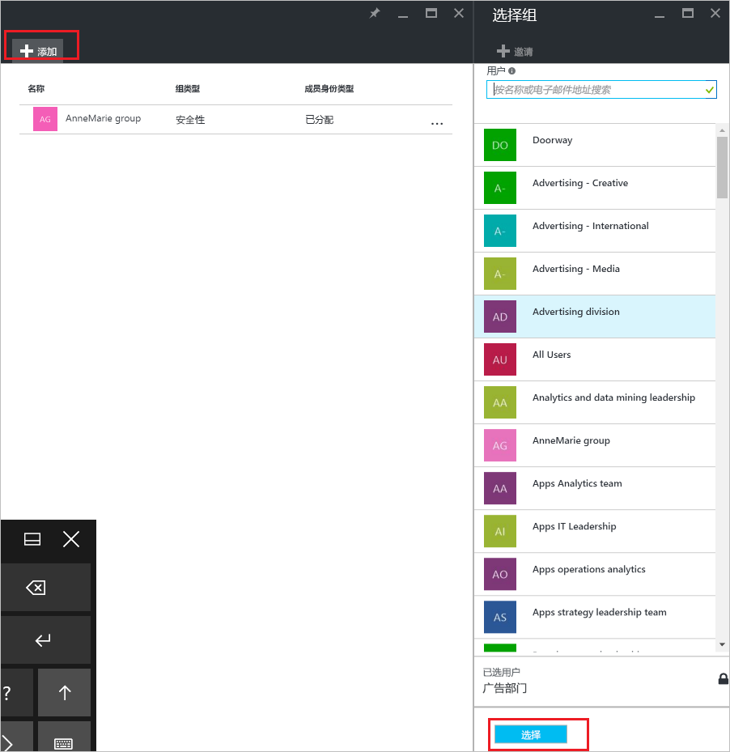
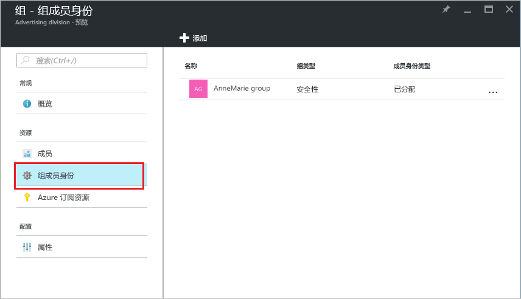

# 使用 Azure Active Directory 在组中添加或删除另一个组
本文可帮助使用 Azure Active Directory 在其他组中添加和删除组。

>[!Note]
>如果尝试删除父组，请参阅[如何更新或删除组及其成员](active-directory-groups-delete-group.md)。

## 将组添加到另一个组
可以将现有安全组添加到其他现有安全组（也称为“嵌套组”），以创建成员组（子组）和父组。 成员组会继承父组的特性和属性，从而节省配置时间。

>[!Important]
>当前不支持：<ul><li>将组添加到与本地 Active Directory 同步的组。</li><li>将安全组添加到 Office 365 组。</li><li>将 Office 365 组添加到安全组或其他 Office 365 组。</li><li>将应用分配到嵌套组。</li><li>将许可证应用于嵌套组。</li></ul>

### 若要将组作为成员添加到其他组

1. 使用目录的全局管理员帐户登录到 [Azure 门户](https://portal.azure.com)。

2. 选择“Azure Active Directory”，然后选择“组”。

3. 在“组 - 所有组”页上，搜索并选择要成为其他组成员的组。 在本练习中，我们使用的是“MDM 策略 - 西部”组。

    >[!Note]
    >一次只可以将组作为成员添加到一个组。 此外，“选择组”框会根据条目与用户或设备名称的任何部分的匹配来筛选显示内容。 但是，不支持通配符。

    

4. 在“MDM 策略 - 西部 - 组成员身份”页上，依次选择“组成员身份”、“添加”，找到希望组成为其成员的组，然后选中“选择”。 在本练习中，我们使用的是“MDM 策略 - 所有组织”组。

    “MDM 策略 - 西部”组现在是“MDM 策略 - 所有组织”组的成员，继承“MDM 策略 - 所有组织”组的所有属性和配置。

    

5. 查看“MDM 策略 - 西部 - 组成员身份”页，以查看组和成员关系。

    

6. 有关组和成员关系的更加详细的视图，请选择组名称（“MDM 策略 - 所有组织”）并查看“MDM 策略 - 西部”页详细信息。

    

## 从另一个组中删除组
可以从其他安全组中删除现有安全组。 但是，删除组也会删除其成员的所有继承特性和属性。

### 要从其他组中删除成员组
1. 在“组 - 所有组”页上，搜索并选择要作为其他组成员进行删除的组。 在本练习中，我们再次使用“MDM 策略 - 西部”组。

2. 在“MDM 策略 - 西部概述”页上，选择“组成员身份”。

    

3. 从“MDM 策略 - 西部 - 组成员身份”页中选择“MDM 策略 - 所有组织”组，然后选择“MDM 策略 - 西部”页详细信息中的“删除”。

    

## 其他信息
这些文章提供了有关 Azure Active Directory 的更多信息。

- [查看组和成员](active-directory-groups-view-azure-portal.md)

- [创建基本组并添加成员](active-directory-groups-create-azure-portal.md)

- [在组中添加或删除成员](active-directory-groups-members-azure-portal.md)

- [编辑组设置](active-directory-groups-settings-azure-portal.md)

- [使用组管理对 SaaS 应用程序的访问](../users-groups-roles/groups-saasapps.md)

- [在 Azure Active Directory 中使用组管理许可的方案、限制和已知问题](../users-groups-roles/licensing-group-advanced.md#limitations-and-known-issues)
