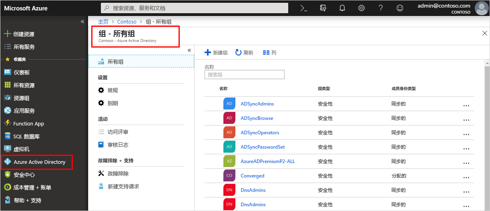

<!--As a brand-new Azure AD administrator, I need to view my organization’s groups along with the assigned members, so I can manage permissions to apps and services for people in my organization-->

# 快速入门：在 Azure Active Directory 中查看组织的组和成员
可以使用 Azure 门户查看组织的现有组和组成员。 组用于管理需要对可能受限的应用和服务的拥有相同访问权限和许可权限的所有用户（成员）。

本快速入门介绍如何查看组织的所有现有组和分配的成员。

如果还没有 Azure 订阅，可以在开始前创建一个[免费帐户](https://azure.microsoft.com/free/)。 

## 必备条件
在开始之前，需要：

- 创建一个 Azure Active Directory 租户。 有关详细信息，请参阅[访问 Azure Active Directory 门户并创建新租户](active-directory-access-create-new-tenant.md)。

## 登录到 Azure 门户
必须使用目录的全局管理员帐户登录到 [Azure 门户](https://portal.azure.com/)。

## 创建一个新组 
创建名为“MDM 策略 - 西部”的新组。  有关创建组的详细信息，请参阅[如何创建基本组并添加成员](active-directory-groups-create-azure-portal.md)。

1. 依次选择“Azure Active Directory”、“组”、“新建组”    。

2. 填写“组”页： 
    
    - **组类型：** 选择“安全性” 
    
    - **组名称：** 键入 MDM policy - West 
    
    - **成员身份类型：** 选择“分配”  。

3. 选择“创建”  。

## 创建新用户
创建名为 _Alain Charon_ 的新用户。 在将某个用户添加为组成员之前，该用户必须事先存在。 首先查看“自定义域名”选项卡，以获取要在其中创建用户的经过验证的域名。 有关创建用户的详细信息，请参阅[如何添加或删除用户](add-users-azure-active-directory.md)。

1. 依次选择“Azure Active Directory”、“用户”、“新建用户”。   

2. 填写“用户”页： 

    - **名称：** 键入 Alain Charon  。

    - **用户名:** 键入 alain\@contoso.com  。

3. 复制“密码”框中提供的自动生成的密码，然后选择“创建”。  

## 添加组成员
创建组和用户后，可将 _Alain Charon_ 作为成员添加到“MDM 策略 - 西部”组。  有关添加组成员的详细信息，请参阅[如何添加或删除组成员](active-directory-groups-members-azure-portal.md)。

1. 选择“Azure Active Directory”   >   “组”。

2. 在“组 - 所有组”页中，搜索并选择“MDM 策略 - 西部”组。  

3. 在“MDM 策略 - 西部概述”页中，从“管理”区域选择“成员”    。

4. 选择“添加成员”，然后搜索并选择“Alain Charon”。  

5. 选择“选择”。 

## 查看所有组
可在 Azure 门户的“组 - 所有组”页中查看组织的所有组。 

- 选择“Azure Active Directory”   >   “组”。

    此时会出现“组 - 所有组”页，其中显示了所有活动的组。 

    

## 搜索组
搜索“组 – 所有组”页，找到“MDM 策略 - 西部”组。  

1. 在“组 - 所有组”页上的“搜索”框中键入 _MDM_。  

    搜索结果将显示在“搜索”框下面，其中包括“MDM 策略 - 西部”组。  

    

3. 选择“MDM 策略 - 西部”组。 

4. 在“MDM 策略 - 西部概述”页上查看组信息，包括该组的成员数目。 

    

## 查看组成员
找到组后，可以查看所有已分配的成员。

- 从“管理”区域中选择“成员”，然后查看分配到该特定组的完整成员名称列表，包括“Alain Charon”。   

    

## 清理资源
本文档的“操作方法指南”部分中的多个操作流程都使用了此组。  但是，如果你不想要使用该组，可使用以下步骤删除该组以及分配到其中的成员：

1. 在“组 - 所有组”页上，搜索“MDM 策略 - 西部”组。  

2.  选择“MDM 策略 - 西部”组。 

    此时会显示“MDM 策略 - 西部概述”页。 

3. 选择“删除”。 

    随即会删除该组及其关联的成员。

    

    >[!Important]
    >这不会删除用户 Alain Charon，而只会删除他在该组中的成员身份。

## 后续步骤
转到下一篇文章，了解如何将订阅关联到 Azure AD 目录。

> [!div class="nextstepaction"]
> [关联 Azure 订阅](active-directory-how-subscriptions-associated-directory.md)
