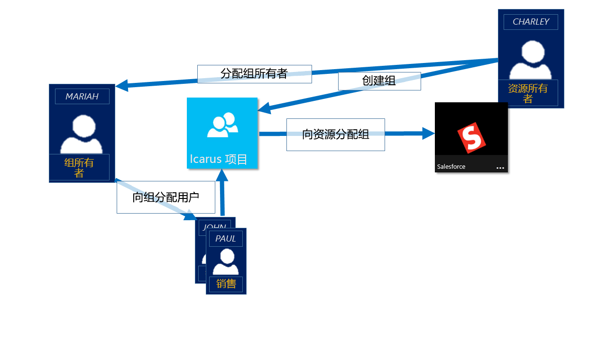
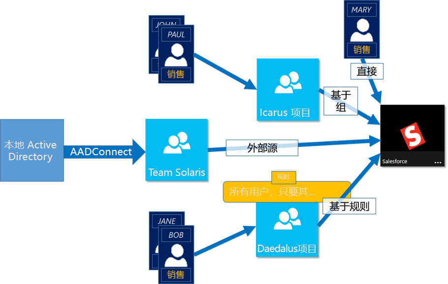

# 使用 Azure Active Directory 组管理应用和资源访问
Azure Active Directory （Azure AD）允许使用组来管理对基于云的应用、本地应用和资源的访问。 资源可以是 Azure AD 组织的一部分，例如通过 Azure AD 中的角色管理对象的权限，或组织外部的权限，例如，对于软件即服务（SaaS）应用、Azure 服务、SharePoint 站点和本地资源。

>[!NOTE]
>要使用 Azure Active Directory，需要一个 Azure 帐户。 如果没有帐户，可以[注册免费的 Azure 帐户](https://azure.microsoft.com/free/)。
>
> 在 Azure 门户中，可以看到某些组，在门户中无法管理其成员身份和组详细信息：
>
> - 从本地 Active Directory 同步的组只能在本地 Active Directory 中进行管理。
> - 其他组类型（如通讯组列表和启用邮件的安全组）仅在 Exchange 管理中心或 Microsoft 365 管理中心进行管理。 你必须登录到 Exchange 管理中心或 Microsoft 365 管理中心才能管理这些组。

## Azure AD 中的访问管理的工作方式

Azure AD 通过向单个用户或整个 Azure AD 组提供访问权限，帮助你授予组织资源的访问权限。 资源所有者（或 Azure AD 目录所有者）可以使用组将一组访问权限分配给组的所有成员，而无需逐个地提供权限。 资源或目录所有者还可将成员列表的管理权限授予其他某人（例如部门经理或支持管理员），让此人根据需要添加和删除成员。 有关如何管理组所有者的详细信息，请参阅[管理组所有者](active-directory-accessmanagement-managing-group-owners.md)

## 分配访问权限的方式

可通过四种方式将资源访问权限分配给用户：

- **直接分配。** 资源所有者直接将用户分配到资源。

- **组分配。** 资源所有者将 Azure AD 组分配到资源，这会自动向所有组成员授予对该资源的访问权限。 组成员身份由组所有者和资源所有者管理，允许任一所有者在该组中添加或删除成员。 有关添加或删除组成员身份的详细信息，请参阅[如何：使用 Azure Active Directory 门户在另一个组中添加或删除组](active-directory-groups-membership-azure-portal.md)。 

- **基于规则的分配。** 资源所有者创建一个组，并使用一条规则来定义要将哪些用户分配到特定的资源。 该规则基于分配给单个用户的属性。 资源所有者管理该规则，确定需要提供哪些属性和值才能访问该资源。 有关详细信息，请参阅[创建动态组和检查状态](../users-groups-roles/groups-create-rule.md)。

    也可以观看此简短视频，其中大致说明了如何创建和使用动态组：

    >[!VIDEO https://channel9.msdn.com/Series/Azure-Active-Directory-Videos-Demos/Azure-AD--Introduction-to-Dynamic-Memberships-for-Groups/player]

- **External authority assignment**（外部机构分配）。 访问来自外部源，例如本地目录或 SaaS 应用。 在这种情况下，资源所有者将分配一个组以提供资源访问权限，外部源将管理组成员。

   

## 用户是否无需分配即可加入组？
组所有者可让用户查找他们自己的要加入的组，而不是分配用户。 所有者还可将组设置为自动接受加入的所有用户或要求审批。

用户请求加入组后，该请求将转发到组所有者。 如果有必要，则所有者可以批准请求，并通知用户的组成员身份。 但是，如果有多个所有者，并且其中一个所有者拒绝了请求，则会通知用户，但不会将其添加到组中。 有关如何让用户请求加入组的详细信息和说明，请参阅[设置 Azure AD 以便用户可以请求加入组](../users-groups-roles/groups-self-service-management.md)

## 后续步骤
大致了解如何使用组进行访问管理之后，可以开始管理资源和应用。

- [使用 Azure Active Directory 创建新组](active-directory-groups-create-azure-portal.md)或[使用 PowerShell cmdlet 创建和管理新组](../users-groups-roles/groups-settings-v2-cmdlets.md)

- [使用组分配对集成式 SaaS 应用的访问权限](../users-groups-roles/groups-saasapps.md)

- [使用 Azure AD Connect 将本地组同步到 Azure](../hybrid/whatis-hybrid-identity.md)
