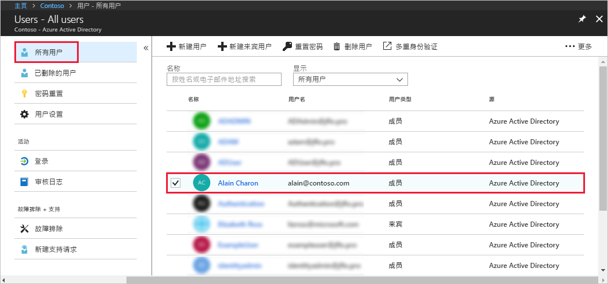
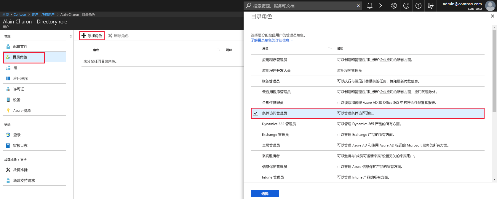

# 在 Azure Active Directory 中向用户分配管理员角色
本文介绍如何将管理角色分配给 Azure Active Directory (Azure AD) 中的用户。 有关添加组织中的新用户的信息，请参阅[将新用户添加到 Azure Active Directory](../add-users-azure-active-directory.md)。 默认情况下添加的用户没有管理员权限，但随时可以为其分配角色。

## 向用户分配角色
1. 使用目录的全局管理员或特权角色管理员的帐户登录到 [Azure 门户](https://portal.azure.com)。

2. 选择“Azure Active Directory”，选择“用户”，然后从列表中选择一个特定用户。

    

3. 针对选定的用户，选择“目录角色”，选择“添加角色”，然后从“目录角色”列表中选择合适的管理员角色，例如“条件访问管理员”。 有关管理员角色的详细信息，请参阅[在 Azure AD 中分配管理员角色](../active-directory-assign-admin-roles-azure-portal.md)。 

    

1. 按“选择”进行保存。

## 后续步骤
* [快速入门：在 Azure Active Directory 中添加或删除用户](add-users-azure-active-directory.md)
* [管理用户个人资料](active-directory-users-profile-azure-portal.md)
* [添加另一个目录中的来宾用户](../b2b/what-is-b2b.md) 
* [在 Azure AD 中为用户分配角色](active-directory-users-assign-role-azure-portal.md)
* [还原已删除的用户](active-directory-users-restore.md)
