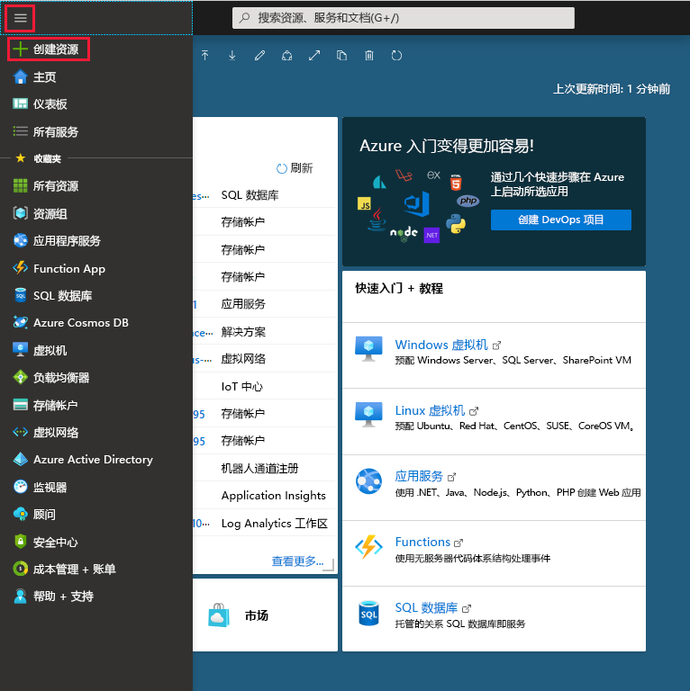
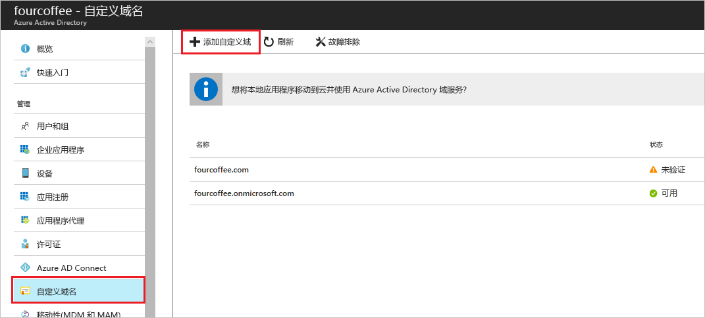

# 使用 Azure Active Directory 门户添加自定义域名
每个新的 Azure AD 租户都附带了初始域名 *domainname*.onmicrosoft.com。 无法更改或删除初始域名，但可以将组织的名称添加到列表中。 添加自定义域名有助于创建用户所熟悉的用户名，例如 *alain\@contoso.com*。

## 开始之前
添加自定义域名之前，必须在域注册机构处创建域名。 有关认证的域注册机构，请参阅 [ICANN 认证的注册机构](https://www.icann.org/registrar-reports/accredited-list.html)。

## 在 Azure AD 中创建目录
获取域名后，可以创建第一个 Azure AD 目录。

1. 使用具有订阅“所有者”  角色的帐户登录到 [Azure 门户](https://portal.azure.com/)，然后选择“Azure Active Directory”  。 有关订阅角色的详细信息，请参阅[经典订阅管理员角色、Azure RBAC 角色和 Azure AD 管理员角色](../../role-based-access-control/rbac-and-directory-admin-roles.md#azure-rbac-roles)。

    

    >[!TIP]
    > 如果计划使用 Azure AD 联合你的本地 Windows Server AD，则需要在运行 Azure AD Connect 工具来同步目录时选中“我计划将此域配置为使用本地 Active Directory 进行单一登录”复选框  。 还需要在向导的“Azure AD 域”步骤中注册选择用于与本地目录进行联合的域名  。 [这些说明](../hybrid/how-to-connect-install-custom.md#verify-the-azure-ad-domain-selected-for-federation)中示范了向导中该步骤的大致情形。 如果没有 Azure AD Connect 工具，可以 [在此处下载](https://go.microsoft.com/fwlink/?LinkId=615771)。

2. 遵循[为组织创建新租户](active-directory-access-create-new-tenant.md#create-a-new-tenant-for-your-organization)中的步骤创建新目录。

    >[!Important]
    >租户的创建者将自动成为该租户的全局管理员。 全局管理员可将其他管理员添加到租户中。

## 将自定义域名添加到 Azure AD
创建目录后，可以添加自定义域名。

1. 依次选择“自定义域名”、“添加自定义域”。  

    

2. 在“自定义域名”框中键入组织的新域名（例如 _contoso.com_），然后选择“添加域”。  

    随即会添加未验证的域，并出现“Contoso”页，其中显示了 DNS 信息。 

    >[!Important]
    >若要正常完成此过程，必须包含 .com、.net 或其他任何顶级扩展名。

    

4. 复制“Contoso”页中的 DNS 信息。  例如 MS=ms64983159。

    

## 将 DNS 信息添加到域注册机构
将自定义域名添加到 Azure AD 之后，必须返回到域注册机构，并添加已复制的 TXT 文件中的 Azure AD DNS 信息。 为域创建此 TXT 记录可以“验证”域名的所有权。

-  返回到域注册机构，根据复制的 DNS 信息为域创建新的 TXT 记录，将“TTL”（生存时间）设置为 3600 秒（60 分钟），然后保存信息。 

    >[!Important]
    >可以注册任意数目的域名。 但是，每个域将从 Azure AD 获取其自身的 TXT 记录。 在域注册机构处输入 TXT 文件信息时请小心。 如果输入了错误或重复的信息，则必须等到 TTL 超时（60 分钟），然后才能重试。

## 验证自定义域名
注册自定义域名后，需确保它在 Azure AD 中有效。 将信息从域注册机构传播到 Azure AD 有时可以瞬间完成，有时需要几天时间，具体取决于域注册机构的状况。

### 验证自定义域名
1. 使用目录的全局管理员帐户登录到 [Azure 门户](https://portal.azure.com/)。

2. 依次选择“Azure Active Directory”、“自定义域名”。  

3. 在“Fabrikam - 自定义域名”页上，选择自定义域名“Contoso”。  

    

4. 在“Contoso”页上，选择“验证”以确保自定义域已正确注册并且在 Azure AD 中有效。  

    

验证自定义域名后，可以删除验证 TXT 或 MX 文件。

## 常见验证问题
- 如果 Azure AD 无法验证自定义域名，请尝试以下建议的方法：
  - **至少等待一小时，然后重试**。 只有在传播 DNS 记录之后，Azure AD 才能验证域，而此过程可能需要一小时或更长时间。

  - **确保 DNS 记录正确。** 返回到域名注册机构站点，确保其中包含该条目，并且该条目与 Azure AD 提供的 DNS 条目信息相匹配。

    如果无法在注册机构站点上更新记录，必须与有权添加条目并验证其准确性的某人共享该条目。

- **确保域名尚未在另一目录中使用。** 只能在一个目录中验证一个域名，这意味着，如果当前在另一目录中验证你的域名，则无法同时在新目录中验证该域名。 若要解决此重复问题，必须从旧目录中删除该域名。 有关删除域名的详细信息，请参阅[管理自定义域名](../users-groups-roles/domains-manage.md)。

- **确保你没有任何未托管的 Power BI 租户。** 如果你的用户通过自助注册激活了 Power BI 并为你的组织创建了一个非托管租户，那么你必须使用 PowerShell 以内部或外部管理员的身份接管管理。 若要了解有关如何接管非托管目录的详细信息，请参阅[在 Azure Active Directory 中以管理员身份接管非托管目录](../users-groups-roles/domains-admin-takeover.md)。

## 后续步骤

- 将另一个全局管理员添加到目录。 有关详细信息，请参阅[如何分配角色和管理员](active-directory-users-assign-role-azure-portal.md)。

- 将用户添加到域，具体请参阅[如何添加或删除用户](add-users-azure-active-directory.md)。

- 在 Azure AD 中管理域名信息。 有关详细信息，请参阅[管理自定义域名](../users-groups-roles/domains-manage.md)。

- 若要结合 Azure Active Directory 使用 Windows Server 的本地版本，请参阅[将本地目录与 Azure Active Directory 集成](../connect/active-directory-aadconnect.md)。
