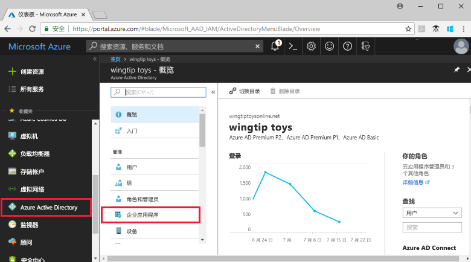
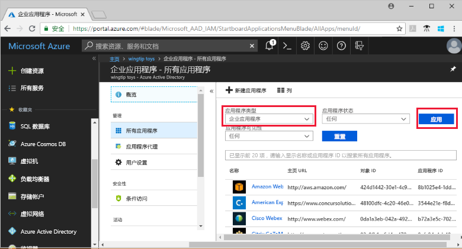
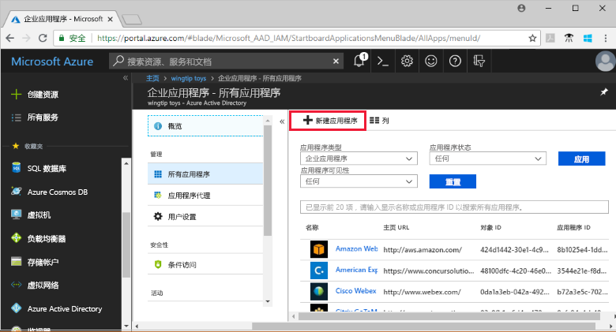
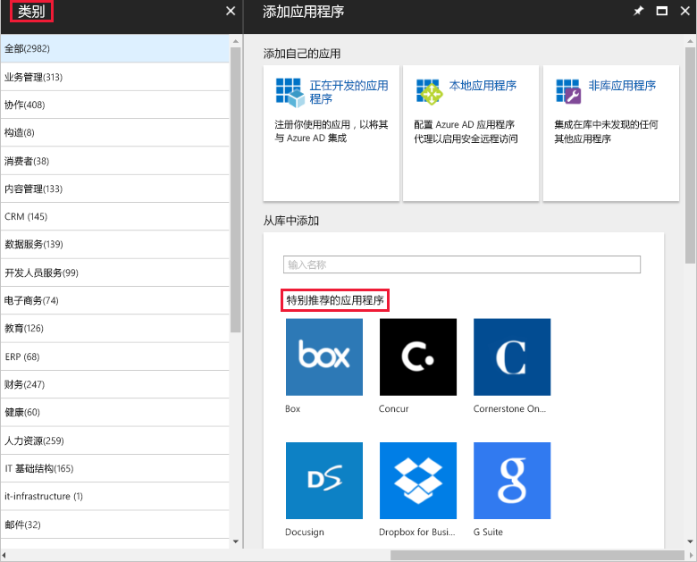
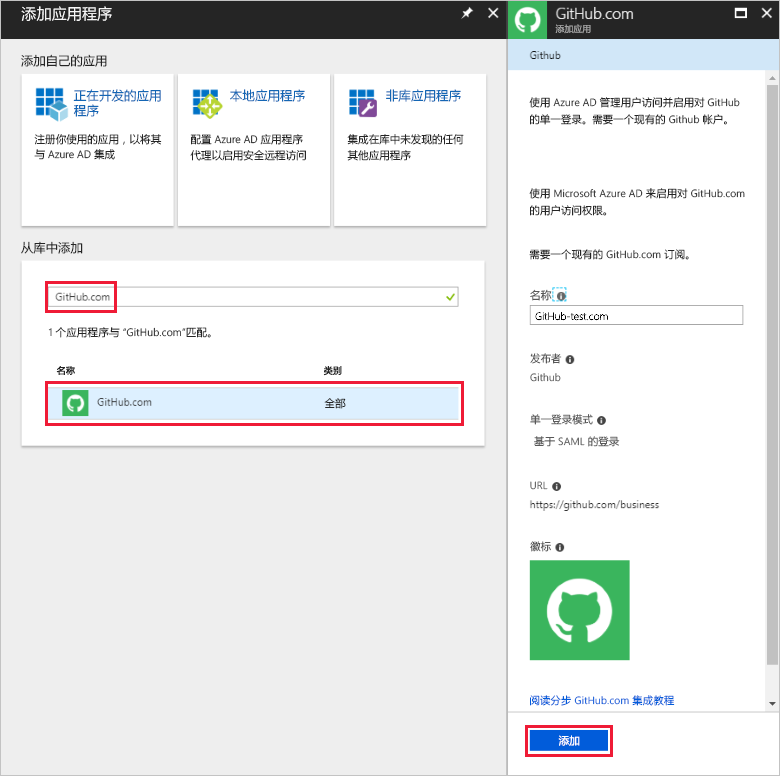
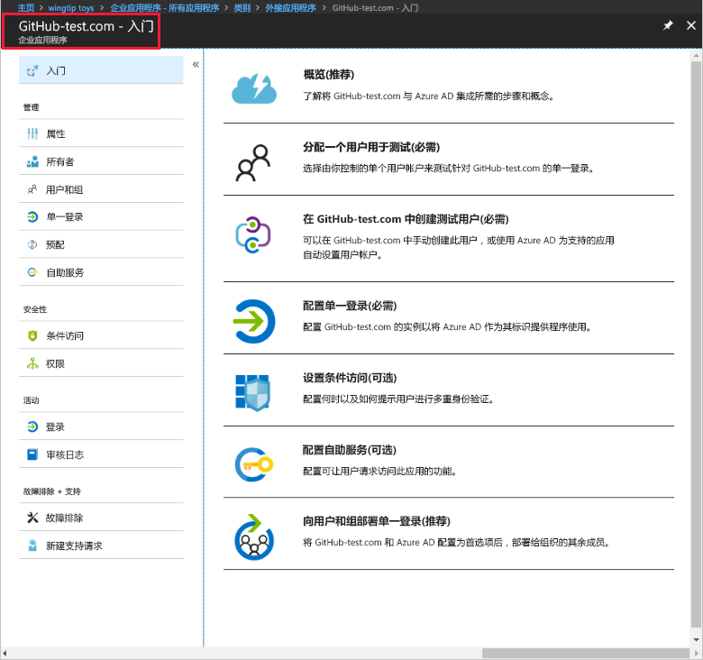
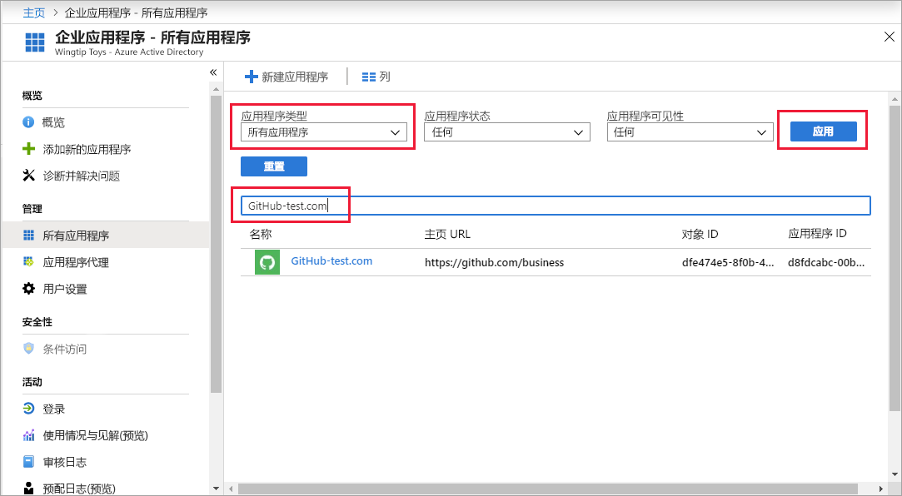
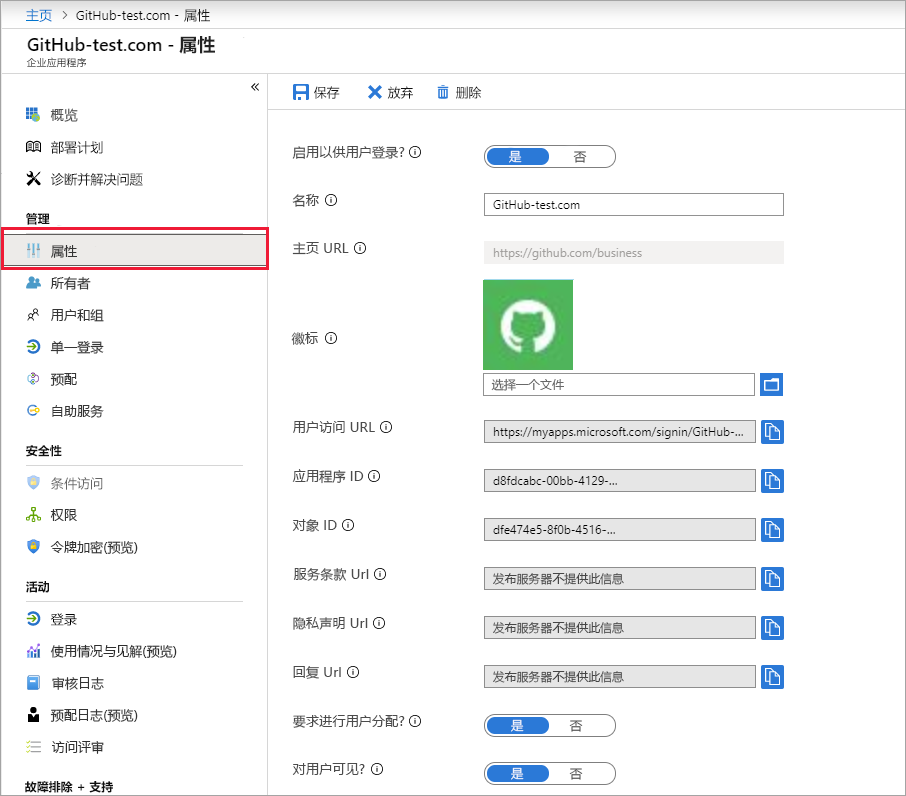
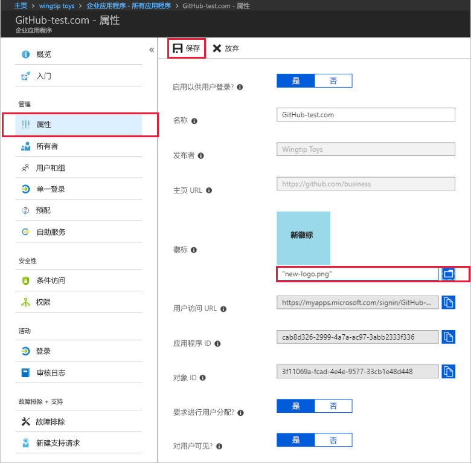

# 快速入门：向 Azure Active Directory 租户添加应用程序

Azure Active Directory (Azure AD) 有一个库，其中包含数千预集成的应用程序。 组织所用的某些应用程序可能在该库中。 本快速入门使用 Azure 门户向 your Azure Active Directory (Azure AD) 租户添加库应用程序。 
 
将某个应用程序添加到 Azure AD 租户以后，即可：

- 使用条件访问策略管理用户对应用程序的访问。
- 将用户配置为使用其 Azure AD 帐户通过单一登录方式登录到应用程序。

## 开始之前

若要向租户添加应用程序，需具备：

- Azure AD 订阅
- 适合应用程序且启用了单一登录的订阅

以 Azure AD 租户全局管理员、云应用程序管理员或应用程序管理员的身份登录到 [Azure 门户](https://portal.azure.com)。

若要测试本教程中的步骤，建议使用非生产环境。 如果没有 Azure AD 非生产环境，可以[获取一个月的试用版](https://azure.microsoft.com/pricing/free-trial/)。

## 向 Azure AD 租户添加应用程序

若要向 Azure AD 租户添加库应用程序，请执行以下操作：

1. 在 [Azure 门户](https://portal.azure.com)的左侧导航面板中，单击“Azure Active Directory”。 

2. 在“Azure Active Directory”边栏选项卡中，单击“企业应用程序”。 

    

3. 此时“所有应用程序”边栏选项卡会打开，显示 Azure AD 租户中应用程序的随机示例。 

    

4. 在“所有应用程序”边栏选项卡顶部，单击“新建应用程序”。

    

5. 若要查看库中应用程序的列表，最简单的方法是使用“类别”，因为“特色应用程序”下的图标是库应用程序的随机示例。 

    

    若要查看更多应用程序，可以单击“显示更多内容”。 建议不要以这种方式进行搜索，因为库中有数千应用程序。

6. 若要搜索应用程序，请在“从库中添加”下输入要添加的应用程序的名称。 从结果中选择应用程序，然后单击“添加”。 以下示例显示在搜索 GitHub.com 后显示的“添加应用”窗体。

    

6. 在特定于应用程序的窗体中，可以更改属性信息。 例如，可以根据组织需要编辑应用程序的名称。 此示例使用 **GitHub-test** 作为名称。

8. 完成对属性的更改后，请单击“添加”。

9. 此时会显示一个入门页面，其中包含为组织配置应用程序所需的选项。 

    

已完成添加应用程序的操作。 请稍作休息。  后续部分介绍如何更改徽标和编辑应用程序的其他属性。

## 查找 Azure AD 租户应用程序

假设你此前因故必须离开，现在回来继续配置应用程序。 首先需找到应用程序。

1. 在 **[Azure 门户](https://portal.azure.com)** 的左侧导航面板中，单击“Azure Active Directory”。 

2. 在“Azure Active Directory”边栏选项卡中，单击“企业应用程序”。 

3. 在“应用程序类型”下拉菜单中，选择“所有应用程序”，然后单击“应用”。 若要详细了解查看选项，请参阅[查看租户应用程序](view-applications-portal.md)。

4. 此时可以看到一个列表，其中包含 Azure AD 租户中的所有应用程序。  此列表为随机示例。 若要查看更多应用程序，请单击“显示更多内容”一次或多次。 

5. 若要快速查找租户中的应用程序，请在搜索框中输入应用程序名称，然后单击“应用”。 此示例查找以前添加的 GitHub-test 应用程序。

    

## 配置用户登录属性

找到应用程序以后，即可将其打开并配置其属性。

编辑应用程序属性的步骤

1. 单击应用程序将其打开。
2. 单击“属性”，打开供编辑的属性边栏选项卡。

    

3. 花点时间了解登录选项。 “启用以供用户登录”、“需要进行用户分配”和“对用户可见”组合起来，决定了分配或未分配给应用程序的用户能否登录，  以及用户能否看到访问面板中的应用程序。 

    - “启用以供用户登录”决定了分配给应用程序的用户能否登录。
    - “需要进行用户分配”决定了未分配给应用程序的用户能否登录。
    - “对用户可见”决定了分配给应用的用户能否在访问面板和 O365 启动器中看到它。 

4. 根据下面的表来选择最符合需求的选项。 

     - **已分配**用户的行为：

       | 应用程序属性设置 | | | 已分配用户的体验 | |
       |---|---|---|---|---|
       | 启用以供用户登录? | 需要进行用户分配? | 对用户可见? | 已分配用户能否登录? | 已分配用户能否看到应用程序?* |
       | 是 | 是 | 是 | 是 | 是  |
       | 是 | 是 | 否  | 是 | 否   |
       | 是 | 否  | 是 | 是 | 是  |
       | 是 | 否  | 否  | 是 | 否   |
       | 否  | 是 | 是 | 否  | 否   |
       | 否  | 是 | 否  | 否  | 否   |
       | 否  | 否  | 是 | 否  | 否   |
       | 否  | 否  | 否  | 否  | 否   |

     - **未分配**用户的行为：
  
       | 应用程序属性设置 | | | 未分配用户的体验 | |
       |---|---|---|---|---|
       | 启用以供用户登录? | 需要进行用户分配? | 对用户可见? | 未分配用户能否登录? | 未分配用户能否看到应用程序?* |
       | 是 | 是 | 是 | 否  | 否   |
       | 是 | 是 | 否  | 否  | 否   |
       | 是 | 否  | 是 | 是 | 否   |
       | 是 | 否  | 否  | 是 | 否   |
       | 否  | 是 | 是 | 否  | 否   |
       | 否  | 是 | 否  | 否  | 否   |
       | 否  | 否  | 是 | 否  | 否   |
       | 否  | 否  | 否  | 否  | 否   |

    *用户能否在访问面板和 Office 365 应用启动器中看到应用程序?

## 使用自定义徽标

若要使用自定义徽标，请执行以下操作：

1. 创建一个 215 x 215 像素的徽标，将其保存为 PNG 格式。
2. 由于已找到应用程序，请单击该应用程序。
2. 在左边栏选项卡中，单击“属性”。
4. 上传该徽标。
5. 完成后，单击“保存”。

    

## 后续步骤

在本快速入门中，你已了解如何将库应用程序添加到 Azure AD 租户， 以及如何编辑应用程序的属性。 

现在，可以配置进行单一登录的应用程序了。 

> [!div class="nextstepaction"]
> [配置单一登录](configure-single-sign-on-portal.md)

