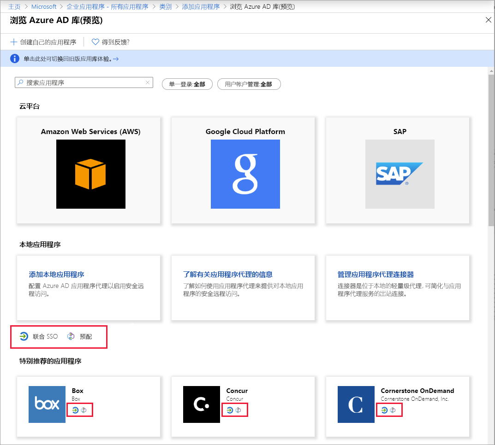
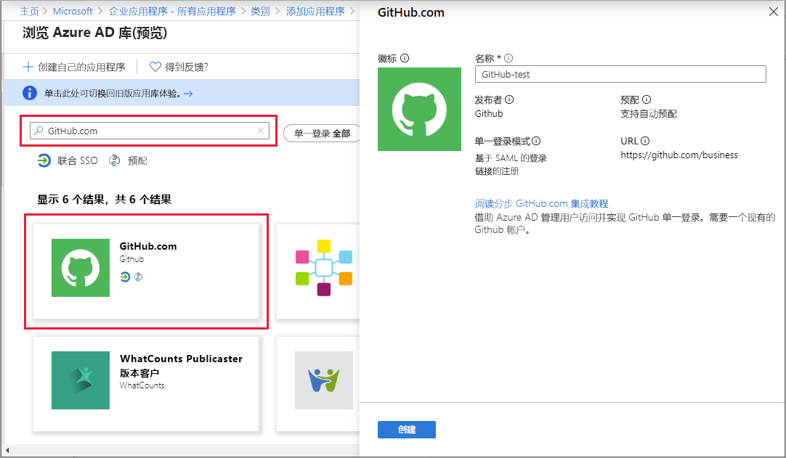

# 快速入门：向 Azure Active Directory (Azure AD) 租户添加应用程序

Azure Active Directory (Azure AD) 有一个库，其中包含数千预集成的应用程序。 组织使用的许多应用程序可能已包含在库中。

将某个应用程序添加到 Azure AD 租户以后，即可：

- 配置应用的属性。
- 使用条件访问策略管理用户对应用的访问。
- 配置单一登录，以便用户可以使用其 Azure AD 凭据登录到应用。

## 先决条件

若要将应用程序添加到 Azure AD 租户，需具备：

- 具有活动订阅的 Azure 帐户。 [免费创建帐户](https://azure.microsoft.com/free/?WT.mc_id=A261C142F)。
- 以下角色之一：全局管理员、云应用程序管理员、应用程序管理员或服务主体的所有者。
- （可选：完成[查看应用](view-applications-portal.md)）。

>[!IMPORTANT]
>建议使用非生产环境来测试此快速入门中的步骤。

## 将应用添加到 Azure AD 租户

向 Azure AD 租户添加应用程序：

1. 在 [Azure 门户](https://portal.azure.com)的左侧导航面板中，选择“Azure Active Directory”。
2. 在“Azure Active Directory”窗格中，选择“企业应用程序”。 此时会打开“所有应用程序”窗格，其中显示了 Azure AD 租户中应用程序的随机示例。
3. 在“企业应用程序”窗格中，选择“新建应用程序” 。 
    
4. 切换到新的库预览体验：在“添加应用程序”页顶部的横幅中，选择显示“单击此处以试用新的和改进的应用库”的链接 。
5. “浏览 Azure AD 库(预览版)”窗格会打开并显示云平台、本地应用程序和特别推荐应用程序的磁贴。 “特别推荐应用程序”部分中列出的应用程序带有指示其是否支持联合单一登录 (SSO) 和预配的图标。
    
6. 你可以在库中浏览要添加的应用程序，或通过在搜索框中输入其名称来搜索该应用程序。 然后，从结果中选择应用程序。 在表单中，可以根据组织的需要来编辑应用程序的名称。 在此示例中，我们已选择 GitHub 并将该名称更改为 GitHub-test。
    
    >[!TIP]
    >如果所寻找的应用程序未在库中，则可以单击“创建你自己的应用程序”链接，然后在“想要如何处理应用程序?”下选择“集成库中未发现的任何其他应用程序”。   Microsoft 已与多个应用程序开发人员合作，将应用预配置为使用 Azure AD。 这些是在库中显示的应用。 但如果未列出要添加的应用，可以创建一个新的通用应用，然后自行配置或根据创建该应用的开发人员的指导进行配置。
7. 选择“创建”。 此时会显示一个入门页面，其中包含为组织配置应用程序所需的选项。

已完成添加应用程序的操作。 接下来的快速入门介绍如何更改徽标和编辑应用程序的其他属性。

## 后续步骤

- [配置应用](add-application-portal-configure.md)
- [设置单一登录](add-application-portal-setup-sso.md)
- [删除应用](delete-application-portal.md)