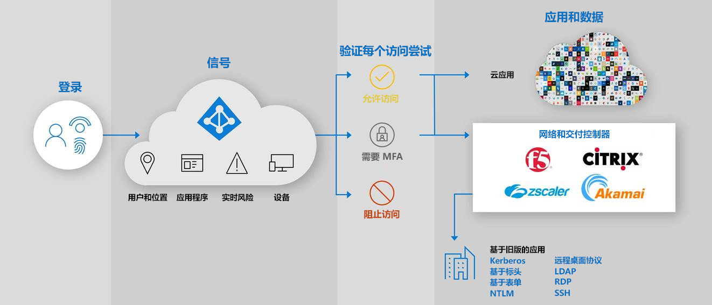

# 安全的混合访问：通过应用交付控制器和网络保护旧版应用

现在可以通过使用现有应用程序交付控制器或网络将本地和云旧版身份验证应用程序连接到 Azure AD 来保护这些应用程序。 这样，便可以使用 Azure AD 功能（如 Azure AD 条件访问和 Azure AD 标识保护）跨所有应用程序弥补差异并加强安全态势。

使用现有网络和交付控制器，可以轻松保护对业务流程仍然至关重要但以前无法使用 Azure AD 进行保护的旧版应用程序。 就像你已经有了开始保护这些应用程序所需的一切。

以下供应商提供与 Azure AD 集成的预建解决方案和详细指南。

* [Akamai 企业应用程序访问 (EAA)](../saas-apps/akamai-tutorial.md)
* [Citrix 应用程序传送控制器 (ADC)](../saas-apps/citrix-netscaler-tutorial.md)
* [F5 Big-IP APM](https://aka.ms/f5-hybridaccessguide)
* [Zscaler Private Access (ZPA)](https://aka.ms/zscaler-hybridaccessguide)
