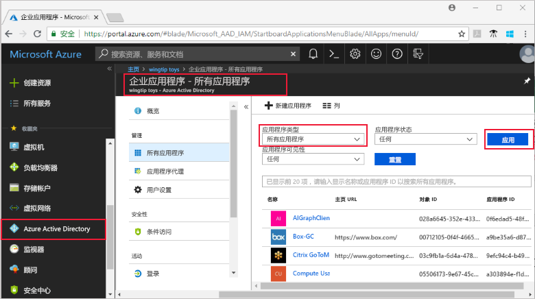
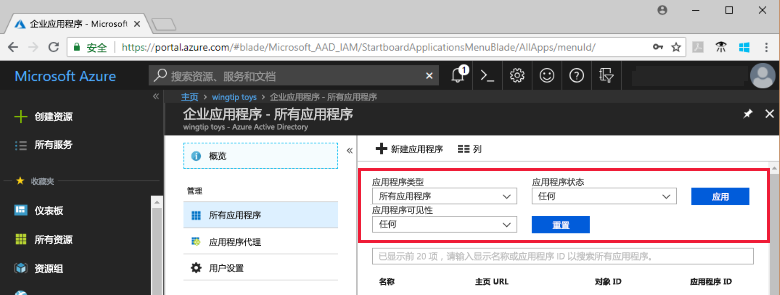
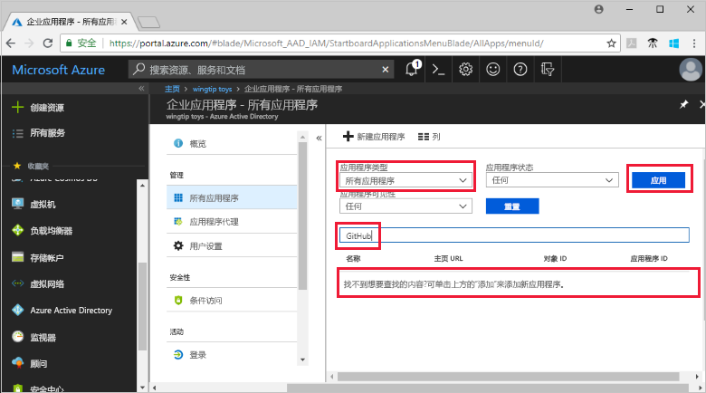
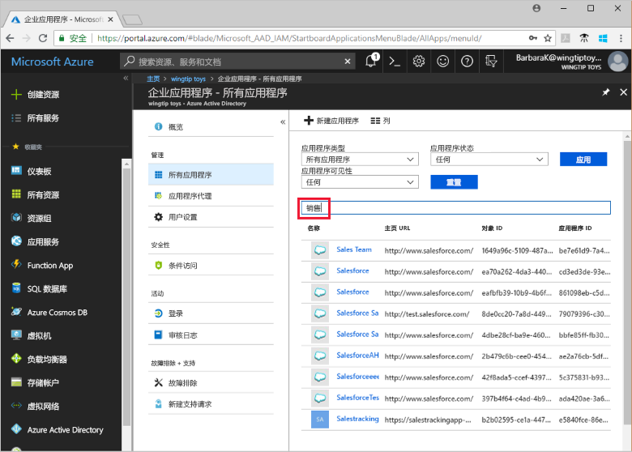

# 查看 Azure Active Directory 租户应用程序

本快速入门使用 Azure 门户查看 Azure Active Directory (Azure AD) 租户中的应用程序。

## 开始之前

若要查看结果，Azure AD 租户中需至少有一个应用程序。 若要添加应用程序，请参阅[添加应用程序](add-application-portal.md)快速入门。

以 Azure AD 租户全局管理员、云应用程序管理员或应用程序管理员的身份登录到 [Azure 门户](https://portal.azure.com)。

## 查找租户应用程序的列表

Azure AD 租户应用程序可以在 Azure 门户的“企业应用”部分查看。

若要查找租户应用程序，请执行以下操作：

1. 在 **[Azure 门户](https://portal.azure.com)** 的左侧导航面板中，单击“Azure Active Directory”。 

2. 在“Azure Active Directory”边栏选项卡中，单击“企业应用程序”。 

3. 在“应用程序类型”下拉菜单中，选择“所有应用程序”，然后单击“应用”。 此时会显示租户应用程序的随机示例。

    
   
4. 若要查看更多应用程序，请单击列表底部的“显示更多”。 根据租户中应用程序的数目，也许[搜索特定应用程序](#search-for-a-tenant-application)比滚动浏览整个列表要容易些。

## 选择查看选项

在此部分，请根据要查找的内容选择选项。

1. 可以根据“应用程序类型”、“应用程序状态”和“应用程序可见性”的相应选项查看应用程序。 

    

2. 在“应用程序类型”下选择下述选项之一：

    - “企业应用程序”显示非 Microsoft 应用程序。
    - “Microsoft 应用程序”显示 Microsoft 应用程序。
    - “所有应用程序”显示非 Microsoft 应用程序和 Microsoft 应用程序。

3. 在“应用程序状态”下选择“任何”、“已禁用”或“已启用”。 “任何”选项包括已禁用和已启用的应用程序。

4. 在“应用程序可见性”下选择“任何”或“已隐藏”。 “已隐藏”选项显示存在于租户中但对用户不可见的应用程序。

5. 选择所需选项后，请单击“应用”。
 

## 搜索租户应用程序

若要搜索特定的应用程序，请执行以下操作：

1. 在“应用程序类型”菜单中，选择“所有应用程序”，然后单击“应用”。

2. 输入要查找的应用程序的名称。 如果应用程序已添加到 Azure AD 租户中，则会显示在搜索结果中。 此示例显示 GitHub 尚未添加到租户应用程序中。

    

3. 尝试输入应用程序名称的头几个字母。  此示例显示以 **Sales** 开头的所有应用程序。

    

## 后续步骤

本快速入门介绍了如何查看 Azure AD 租户中的应用程序，以及如何通过应用程序类型、状态和可见性筛选应用程序列表。 另外还介绍了如何搜索特定应用程序。

找到要查找的应用程序以后，可以继续阅读[向租户添加更多应用程序](add-application-portal.md)，或者单击该应用程序，以便查看或编辑属性和配置选项。 例如，可以配置单一登录。 

> [!div class="nextstepaction"]
> [配置单一登录](configure-single-sign-on-portal.md)

