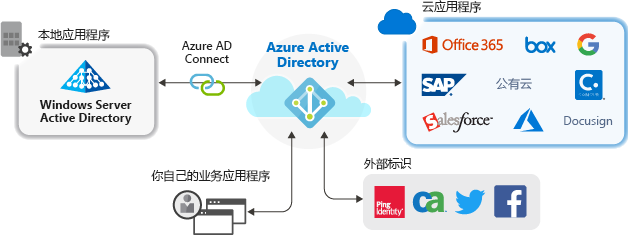

# 使用 Azure Active Directory 进行应用程序管理

Azure Active Directory (Azure AD) 为云和本地应用程序提供单一标识系统，以此简化了应用程序的管理方式。 可将软件即服务 (SaaS) 应用程序、本地应用程序和业务线 (LOB) 应用添加到 Azure AD。 然后，用户只需登录一次，即可安全无缝地访问这些应用程序，以及 Microsoft 提供的 Office 365 和其他商务应用程序。 可以通过[自动执行用户预配](../app-provisioning/user-provisioning.md)来降低管理成本。 还可以使用多重身份验证和条件访问策略提供安全的应用程序访问。

## 为何使用云解决方案管理应用程序？

组织通常拥有数以百计的应用程序，用户依赖这些应用程序来完成工作。 用户从许多设备和位置访问这些应用程序。 每一天都会添加、开发和停用新的应用程序。 在拥有众多应用程序和访问点的情况下，使用基于云的解决方案管理用户对所有应用程序的访问尤为重要。

## 可将哪些类型的应用程序与 Azure AD 集成？

可将四种主要类型的应用程序添加到**企业应用程序**，并使用 Azure AD 对其进行管理：

- **Azure AD 库应用程序** – Azure AD 提供了一个库，其中包含数千个已预先集成的、支持 Azure AD 单一登录的应用程序。 组织所用的某些应用程序可能在该库中。 [了解如何规划应用集成](plan-an-application-integration.md)，或者在 [SaaS 应用程序教程](https://docs.microsoft.com/azure/active-directory/saas-apps/)中获取单个应用的详细集成步骤。

- **使用应用程序代理的本地应用程序** – 使用 Azure AD 应用程序代理可将本地 Web 应用与 Azure AD 相集成，以支持单一登录。 然后，最终用户可以像访问 Office 365 和其他 SaaS 应用一样访问你的本地 Web 应用。 [了解使用应用程序代理的原因及其工作原理](what-is-application-proxy.md)。

- **定制开发的应用程序** – 生成自己的业务线应用程序时，可将其与 Azure AD 相集成，以支持单一登录。 将应用程序注册到 Azure AD 后，你可以控制应用程序的身份验证策略。 有关详细信息，请参阅[开发人员指南](developer-guidance-for-integrating-applications.md)。

- **非库应用程序** – 引入自己的应用程序！ 将这些应用程序添加到 Azure AD 即可支持其他应用的单一登录。 可以集成任何所需的 Web 链接，或集成呈现用户名和密码字段、支持 SAML 或 OpenID Connect 协议，或支持 SCIM 的任何应用程序。 有关详细信息，请参阅[配置非库应用的单一登录](configure-single-sign-on-non-gallery-applications.md)。

## 利用条件访问策略管理风险

将 Azure AD 单一登录 (SSO) 与[条件访问](../conditional-access/concept-conditional-access-cloud-apps.md)相结合可以提供访问应用程序时的高级安全性。 安全功能包括云级别标识保护、基于风险的访问控制、本机多重身份验证和条件访问策略。 这些功能可实现基于应用程序员的精细控制策略，或为组提供更高级别的安全性。

## 使用单一登录提高工作效率

跨应用程序启用单一登录 (SSO) 和 Office 365 能够通过减少或消除登录提示，为现有用户提供卓越的登录体验。 没有多个提示，也无需管理多个密码，这让用户的环境更具有凝聚力，并且让用户更不容易分心。 业务组可以通过自助服务和动态成员身份管理和批准访问权限。 让合适的业务人员管理对应用程序的访问权限可以提高标识系统的安全性。

SSO 可以提高安全性。 在没有单一登录的情况下，管理员需要针对每个应用程序创建和更新用户帐户，这会耗费大量的时间  。 此外，用户必须记录多个凭据才能访问应用程序。 因此，用户往往会写下密码或使用其他密码管理解决方案，这会带来数据安全风险。 [详细了解单一登录](what-is-single-sign-on.md)。

## 解决管理和符合性问题

借助 Azure AD，可通过利用安全信息和事件管理 (SIEM) 工具的报告监视应用程序登录情况。 可从门户或 API 访问报告。 以编程的方式审核有权访问应用程序的用户，并通过访问评审删除不活跃用户的访问权限。

## 管理成本

通过迁移到 Azure AD，可节约成本并消除管理本地基础结构的难题。 Azure AD 还提供对应用程序的自助式访问，同时为管理员和用户节约时间。 单一登录不需特定于应用程序的密码。 这种单一登录功能可以节约应用程序密码重置的相关费用，并避免在找回密码时失去工作效率。

## 后续步骤

- [什么是应用程序代理？](what-is-application-proxy.md)
- [快速入门：将库应用程序添加到 Azure AD 租户](add-application-portal.md)
