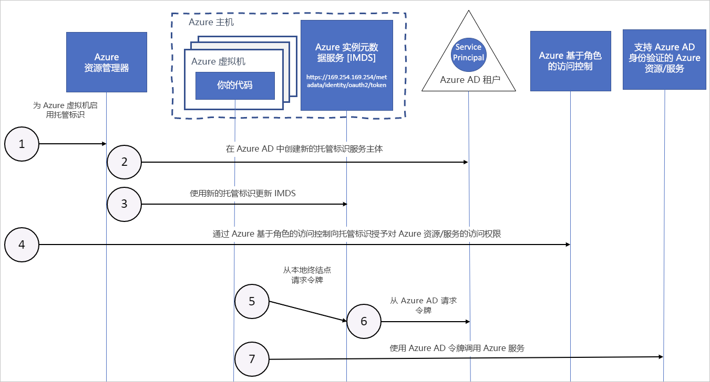

# 如何将 Azure 资源托管标识用于 Azure 虚拟机

Azure 资源的托管标识在 Azure Active Directory 中为 Azure 服务提供了一个自动托管标识。 此标识可用于通过支持 Azure AD 身份验证的任何服务的身份验证，这样就无需在代码中插入凭据了。

本文介绍如何将托管标识用于 Azure 虚拟机 (VM)。

## 工作原理

在内部，托管标识是特殊类型的服务主体，它们只能与 Azure 资源配合使用。 删除托管标识时，相应的服务主体也会自动删除。
此外，在创建用户分配的标识或系统分配的标识时，托管标识资源提供程序 (MSRP) 会在内部向该标识颁发证书。 

代码可以使用托管标识来请求支持 Azure AD 身份验证的服务的访问令牌。 Azure 负责滚动更新服务实例使用的凭据。 

下图演示了托管服务标识如何与 Azure 虚拟机 (VM) 协同工作：

|  properties    | 系统分配的托管标识 | 用户分配的托管标识 |
|------|----------------------------------|--------------------------------|
| 创建 |  作为 Azure 资源（例如 Azure 虚拟机或 Azure 应用服务）的一部分创建。 | 作为独立 Azure 资源创建。 |
| 生命周期 | 与用于创建托管标识的 Azure 资源共享生命周期。   删除父资源时，也会删除托管标识。 | 独立生命周期。   必须显式删除。 |
| 在 Azure 资源之间共享 | 无法共享。   只能与单个 Azure 资源相关联。 | 可以共享。   用户分配的同一个托管标识可以关联到多个 Azure 资源。 |
| 常见用例 | 包含在单个 Azure 资源中的工作负载。   需要独立标识的工作负荷。   例如，在单个虚拟机上运行的应用程序 | 在多个资源上运行的并可以共享单个标识的工作负荷。   需要在预配流程中预先对安全资源授权的工作负荷。   其资源经常回收，但权限应保持一致的工作负荷。   例如，其中的多个虚拟机需要访问同一资源的工作负荷 |

## 系统分配的托管标识

1. Azure 资源管理器收到请求，要求在 VM 上启用系统分配托管标识。

2. Azure 资源管理器在 Azure AD 中创建与 VM 标识相对应的服务主体。 服务主体在此订阅信任的 Azure AD 租户中创建。

3. Azure 资源管理器通过使用服务主体客户端 ID 和证书更新 Azure 实例元数据服务标识终结点来配置 VM 上的标识。

4. VM 有了标识以后，请根据服务主体信息向 VM 授予对 Azure 资源的访问权限。 要调用 Azure 资源管理器，请使用 Azure 基于角色的访问控制 (Azure RBAC) 向 VM 服务主体分配相应的角色。 若要调用 Key Vault，请授予代码对 Key Vault 中特定机密或密钥的访问权限。

5. 在 VM 上运行的代码可以从只能从 VM 中访问的 Azure 实例元数据服务终结点请求令牌：`http://169.254.169.254/metadata/identity/oauth2/token`
    - resource 参数指定了要向其发送令牌的服务。 若要向 Azure 资源管理器进行身份验证，请使用 `resource=https://management.azure.com/`。
    - API 版本参数指定 IMDS 版本，请使用 api-version=2018-02-01 或更高版本。

6. 调用了 Azure AD，以便使用在步骤 3 中配置的客户端 ID 和证书请求访问令牌（在步骤 5 中指定）。 Azure AD 返回 JSON Web 令牌 (JWT) 访问令牌。

7. 代码在调用支持 Azure AD 身份验证的服务时发送访问令牌。

## 用户分配的托管标识

1. Azure 资源管理器收到请求，要求创建用户分配托管标识。

2. Azure 资源管理器在 Azure AD 中创建与用户分配托管标识相对应的服务主体。 服务主体在此订阅信任的 Azure AD 租户中创建。

3. Azure 资源管理器收到在 VM 上配置用户分配的托管标识的请求，并使用用户分配的托管标识服务主体客户端 ID 和证书更新 Azure 实例元数据服务标识终结点。

4. 创建用户分配托管标识以后，请根据服务主体信息向标识授予对 Azure 资源的访问权限。 要调用 Azure 资源管理器，请使用 Azure RBAC 向用户分配的标识的服务主体分配相应角色。 若要调用 Key Vault，请授予代码对 Key Vault 中特定机密或密钥的访问权限。

   > [!Note]
   > 也可在步骤 3 之前执行此步骤。

5. 在 VM 上运行的代码可以从只能从 VM 中访问的 Azure 实例元数据服务标识终结点请求令牌：`http://169.254.169.254/metadata/identity/oauth2/token`
    - resource 参数指定了要向其发送令牌的服务。 若要向 Azure 资源管理器进行身份验证，请使用 `resource=https://management.azure.com/`。
    - 客户端 ID 参数指定为其请求令牌的标识。 当单台 VM 上有多个用户分配的标识时，此值是消除歧义所必需的。
    - API 版本参数指定 Azure 实例元数据服务版本。 请使用 `api-version=2018-02-01` 或指定更高的版本。

6. 调用了 Azure AD，以便使用在步骤 3 中配置的客户端 ID 和证书请求访问令牌（在步骤 5 中指定）。 Azure AD 返回 JSON Web 令牌 (JWT) 访问令牌。
7. 代码在调用支持 Azure AD 身份验证的服务时发送访问令牌。

## 后续步骤

请参阅以下快速入门，开始使用 Azure 资源托管标识功能：

* [使用 Windows VM 系统分配托管标识访问资源管理器](tutorial-windows-vm-access-arm.md)
* [使用 Linux VM 系统分配托管标识访问资源管理器](tutorial-linux-vm-access-arm.md)
