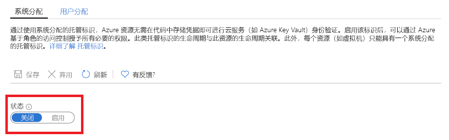

# 什么是 Azure 资源的托管标识？

[!INCLUDE [preview-notice](../../../includes/active-directory-msi-preview-notice.md)]

作为一名云开发人员，你可能正在寻找在代码中访问 Azure 资源的最简单、最安全的方法。 

Azure 资源托管标识可帮助你满足此需求，因为托管标识可以：

- 消除代码中对凭据的需要。
- 自动轮换凭据。
- 将你参与标识管理的程度降至最低。

## 工作原理 

所有支持托管标识的 Azure 资源都可以获取令牌来交换数据，而无需在代码中包含凭据。 此过程包括以下步骤：

 
1.  **启用** - 为资源创建托管标识。
2.  **授予访问权限** - 允许使用 Azure RBAC 访问资源。
3.  **访问** - 执行允许的操作。
4.  **禁用** - 删除托管标识。 

## 托管标识类型

托管标识分为两种类型：

- 系统分配的托管标识

- 用户分配的托管标识

对于独立的 Azure 资源，可以启用系统分配的托管标识。 从标识管理的角度来看，系统分配的托管标识提供了最便捷的支持。 只需单击一次，即可为资源启用标识的自动化生命周期管理。   

   

虽然系统分配的托管标识为独立资源提供了最方便的解决方案，但是如果你需要为同一任务管理一组 Azure 资源，则情况会有所不同。 在这种情况下，最好手动创建标识，并将此主标识分配给需要进行分组的所有 Azure 资源。 此分配称为用户分配的托管标识。 
  

## 支持的服务

可使用 Azure 资源托管标识向支持 Azure AD 身份验证的服务验证身份。 如需支持 Azure 资源托管标识功能的 Azure 服务的列表，请参阅[支持 Azure 资源托管标识的服务](services-support-msi.md)。

## 后续步骤

请参阅以下快速入门，开始使用 Azure 资源托管标识功能：

* [使用 Windows VM 系统分配托管标识访问资源管理器](tutorial-windows-vm-access-arm.md)
* [使用 Linux VM 系统分配托管标识访问资源管理器](tutorial-linux-vm-access-arm.md)
