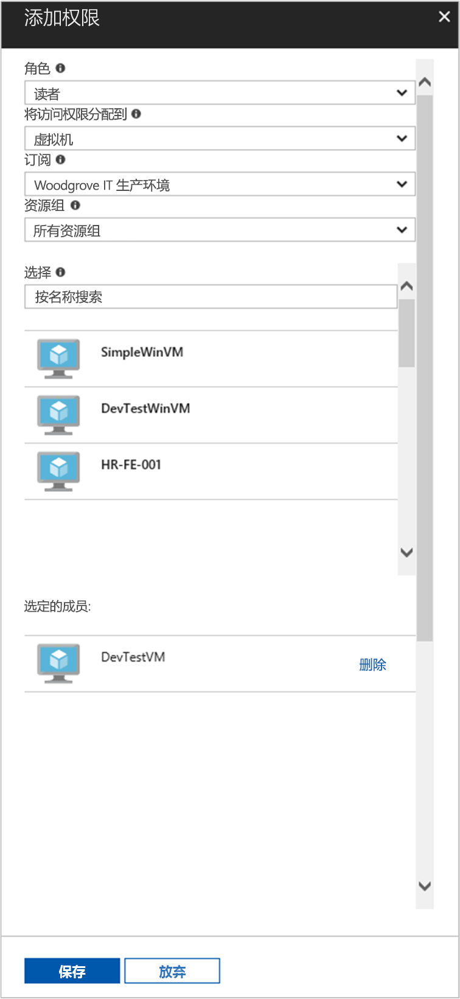

# <a name="use-a-linux-vm-system-assigned-managed-identity-to-access-azure-resource-manager"></a>使用 Linux VM 系统分配的托管标识访问 Azure 资源管理器

[!INCLUDE [preview-notice](../../../includes/active-directory-msi-preview-notice.md)]

本快速入门介绍了如何使用 Linux 虚拟机 (VM) 的系统分配的标识来访问 Azure 资源管理器 API。 Azure 资源的托管标识由 Azure 自动管理，可用于向支持 Azure AD 身份验证的服务进行身份验证，这样就无需在代码中插入凭据了。 学习如何：

> [!div class="checklist"]
> * 授予 VM 对 Azure 资源管理器中资源组的访问权限 
> * 使用 VM 标识获取访问令牌，并使用它调用 Azure 资源管理器 

## <a name="prerequisites"></a>先决条件

[!INCLUDE [msi-tut-prereqs](../../../includes/active-directory-msi-tut-prereqs.md)]

## <a name="grant-your-vm-access-to-a-resource-group-in-azure-resource-manager"></a>授予 VM 对 Azure 资源管理器中资源组的访问权限 

使用 Azure 资源的托管标识，代码可以获取访问令牌，对支持 Azure AD 身份验证的资源进行身份验证。 Azure 资源管理器 API 支持 Azure AD 身份验证。 首先，需要授予此 VM 标识对 Azure 资源管理器中资源（在此示例中，为包含 VM 的资源组）的访问权限。  

1. 转到“资源组”选项卡。
2. 选择之前创建的特定资源组。
3. 转到左侧面板中的“访问控制(IAM)”。
4. 单击“添加”，为 VM 添加新的角色分配。 选择“阅读器”作为“角色”。
5. 在下一个下拉列表中，把“将访问权限分配给”设置为资源“虚拟机”。
6. 接下来，请确保“订阅”下拉列表中列出的订阅正确无误。 对于“资源组”，请选择“所有资源组”。
7. 最后，在“选择”下拉列表中，选择 Linux 虚拟机，再单击“保存”。

    

## <a name="get-an-access-token-using-the-vms-system-assigned-managed-identity-and-use-it-to-call-resource-manager"></a>使用 VM 的系统分配的托管标识获取访问令牌并使用它来调用资源管理器 

若要完成这些步骤，需要使用 SSH 客户端。 如果使用的是 Windows，可以在[适用于 Linux 的 Windows 子系统](https://msdn.microsoft.com/commandline/wsl/about)中使用 SSH 客户端。 如果需要有关配置 SSH 客户端密钥的帮助，请参阅[如何在 Azure 上将 SSH 密钥与 Windows 配合使用](../../virtual-machines/linux/ssh-from-windows.md)或[如何创建和使用适用于 Azure 中 Linux VM 的 SSH 公钥和私钥对](../../virtual-machines/linux/mac-create-ssh-keys.md)。

1. 在门户中，转到 Linux VM，并单击“概述”中的“连接”。  
2. 使用所选的 SSH 客户端连接到 VM。 
3. 在终端窗口中，使用 CURL 向 Azure 资源终结点的本地托管标识发出请求，以获取 Azure 资源管理器的访问令牌。
 
    下面是用于获取访问令牌的 CURL 请求。  
    
    ```bash
    curl 'http://169.254.169.254/metadata/identity/oauth2/token?api-version=2018-02-01&resource=https%3A%2F%2Fmanagement.azure.com%2F' -H Metadata:true   
    ```
    
    > [!NOTE]
    > “resource”参数值必须与 Azure AD 预期值完全一致。  若为资源管理器资源 ID，必须在 URI 的结尾添加斜线。 
    
    响应包括访问 Azure 资源管理器所需的访问令牌。 
    
    响应：  

    ```bash
    {"access_token":"eyJ0eXAiOi...",
    "refresh_token":"",
    "expires_in":"3599",
    "expires_on":"1504130527",
    "not_before":"1504126627",
    "resource":"https://management.azure.com",
    "token_type":"Bearer"} 
    ```
    
    可以使用此访问令牌访问 Azure 资源管理器。例如，读取之前授予此 VM 有权访问的资源组的详细信息。 将 \<SUBSCRIPTION ID\>、\<RESOURCE GROUP\> 和 \<ACCESS TOKEN\> 的值替换为前面创建的值。 
    
    > [!NOTE]
    > URL 区分大小写。因此，请确保大小写与之前在命名资源组时使用的大小写完全相同，并确保“resourceGroup”使用的是大写“G”。  
    
    ```bash 
    curl https://management.azure.com/subscriptions/<SUBSCRIPTION ID>/resourceGroups/<RESOURCE GROUP>?api-version=2016-09-01 -H "Authorization: Bearer <ACCESS TOKEN>" 
    ```
    
    返回的响应包含具体的资源组信息：    
    ```bash
    {"id":"/subscriptions/98f51385-2edc-4b79-bed9-7718de4cb861/resourceGroups/DevTest","name":"DevTest","location":"westus","properties":{"provisioningState":"Succeeded"}} 
    ```     

## Next steps

In this quickstart, you learned how to use a system-assigned managed identity to access the Azure Resource Manager API.  To learn more about Azure Resource Manager see:

> [!div class="nextstepaction"]
>[Azure Resource Manager](/azure/azure-resource-manager/resource-group-overview)