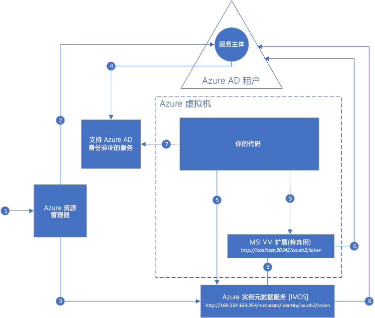

#  什么是 Azure 资源的托管服务标识？

[!INCLUDE[preview-notice](../../../includes/active-directory-msi-preview-notice.md)]

生成云应用程序时需要应对的常见挑战是，如何管理为了通过云服务的身份验证而需要插入代码的凭据。 保护这些凭据是一项非常重要的任务。 理想情况下，它们永远不会出现在开发者工作站上，也永远不会被签入源代码管理系统中。 虽然 Azure Key Vault 可用于安全存储凭据以及其他密钥和机密，但代码需要通过 Key Vault 的身份验证才能检索它们。 托管服务标识为 Azure 服务提供了 Azure Active Directory (Azure AD) 中的自动托管标识，更巧妙地解决了这个问题。 此标识可用于通过支持 Azure AD 身份验证的任何服务（包括 Key Vault）的身份验证，这样就无需在代码中插入任何凭据了。

Azure Active Directory Free 随附托管服务标识，这是 Azure 订阅的默认设置。 无需额外付费，即可使用托管服务标识。

## 工作原理

有两种类型的托管服务标识：**系统分配的**和**用户分配的**。

- **系统分配的标识**直接在 Azure 服务实例上启用。 启用后，Azure 将在服务实例的订阅信任的 Azure AD 租户中创建服务实例的标识。 创建标识后，会将其凭据预配到服务实例。 系统分配的标识的生命周期直接绑定到启用它的 Azure 服务实例。 如果服务实例遭删除，Azure 会自动清理 Azure AD 中的凭据和标识。
- **用户分配的标识**是作为独立的 Azure 资源创建的。 在创建过程中，Azure 会在由所使用的订阅信任的 Azure AD 租户中创建一个标识。 在创建标识后，可以将标识分配到一个或多个 Azure 服务实例。 用户分配的标识的生命周期与它分配给的 Azure 服务实例的生命周期是分开管理的。

因此，代码可以使用系统分配的或用户分配的标识来请求支持 Azure AD 身份验证的服务的访问令牌。 同时，Azure 负责滚动更新服务实例使用的凭据。

下面的示例展示了系统分配的标识如何与 Azure 虚拟机协同工作：

1. Azure 资源管理器收到请求，要求在 VM 上启用系统分配的标识。
2. Azure 资源管理器在 Azure AD 中创建服务主体，用于表示 VM 的标识。 服务主体是在此订阅信任的 Azure AD 租户中进行创建。
3. Azure 资源管理器在 VM 上配置标识：
    - 使用服务主体客户端 ID 和证书更新 Azure 实例元数据服务标识终结点。
    - 预配 VM 扩展并添加服务主体客户端 ID 和证书。 （即将弃用）
4. 现在，VM 已经有一个标识，我们将使用其服务主体信息来向 VM 授予对 Azure 资源的访问权限。 例如，如果代码需要调用 Azure 资源管理器，将会在 Azure AD 中使用基于角色的访问控制 (RBAC) 向 VM 的服务主体分配相应的角色。 如果代码需要调用 Key Vault，将会授予代码对 Key Vault 中特定机密或密钥的访问权限。
5. 在 VM 上运行的代码可以从只能从 VM 中访问的两个终结点请求令牌：

    - Azure 实例元数据服务 (IMDS) 标识终结点：http://169.254.169.254/metadata/identity/oauth2/token（推荐）
        - Resource 参数指定了要向其发送令牌的服务。 例如，如果希望代码通过 Azure 资源管理器的身份验证，需要使用 resource=https://management.azure.com/。
        - API 版本参数指定 IMDS 版本，请使用 api-version=2018-02-01 或更高版本。
    - VM 扩展终结点：http://localhost:50342/oauth2/token（即将弃用）
        - Resource 参数指定了要向其发送令牌的服务。 例如，如果希望代码通过 Azure 资源管理器的身份验证，需要使用 resource=https://management.azure.com/。

6. 调用了 Azure AD，使用在步骤3 中配置的客户端 ID 和证书请求在步骤 5 中指定的访问令牌。 Azure AD 返回 JSON Web 令牌 (JWT) 访问令牌。
7. 代码在调用支持 Azure AD 身份验证的服务时发送访问令牌。

下面的示例使用相同的关系图展示了用户分配的内容如何与 Azure 虚拟机协同工作。

1. Azure 资源管理器收到请求，要求创建用户分配的标识。
2. Azure 资源管理器在 Azure AD 中创建一个服务主体，用于表示用户分配的标识。 服务主体是在此订阅信任的 Azure AD 租户中进行创建。
3. Azure 资源管理器收到请求，要求在 VM 上配置用户分配的标识：
    - 使用用户分配的标识服务主体客户端 ID 和证书更新 Azure 实例元数据服务标识终结点。
    - 预配 VM 扩展并添加用户分配的标识服务主体客户端 ID 和证书（即将弃用）。
4. 现在已创建了用户分配的标识，我们将使用其服务主体信息来向它授予对 Azure 资源的访问权限。 例如，如果代码需要调用 Azure 资源管理器，则你将在 Azure AD 中使用基于角色的访问控制 (RBAC) 向用户分配的标识的服务主体分配相应的角色。 如果代码需要调用 Key Vault，将会授予代码对 Key Vault 中特定机密或密钥的访问权限。 注意：也可以在步骤 3 之前执行此步骤。
5. 在 VM 上运行的代码可以从只能从 VM 中访问的两个终结点请求令牌：

    - Azure 实例元数据服务 (IMDS) 标识终结点：http://169.254.169.254/metadata/identity/oauth2/token（推荐）
        - Resource 参数指定了要向其发送令牌的服务。 例如，如果希望代码通过 Azure 资源管理器的身份验证，需要使用 resource=https://management.azure.com/。
        - 客户端 ID 参数指定为其请求令牌的标识。 当单台 VM 上有多个用户分配的标识时，这是消除歧义所必需的。
        - API 版本参数指定 IMDS 版本，请使用 api-version=2018-02-01 或更高版本。

    - VM 扩展终结点：http://localhost:50342/oauth2/token（即将弃用）
        - Resource 参数指定了要向其发送令牌的服务。 例如，如果希望代码通过 Azure 资源管理器的身份验证，需要使用 resource=https://management.azure.com/。
        - 客户端 ID 参数指定为其请求令牌的标识。 当单台 VM 上有多个用户分配的标识时，这是消除歧义所必需的。
6. 调用了 Azure AD，使用在步骤3 中配置的客户端 ID 和证书请求在步骤 5 中指定的访问令牌。 Azure AD 返回 JSON Web 令牌 (JWT) 访问令牌。
7. 代码在调用支持 Azure AD 身份验证的服务时发送访问令牌。
     
## 试一试托管服务标识

试用“托管服务标识”教程以了解用于访问不同 Azure 资源的端到端方案：
  
| 从托管的支持标识的资源 | 了解如何操作 |
| ------- | -------- |
| A1 VM (Windows) | [使用 Windows VM 托管服务标识访问 Azure Data Lake Store](tutorial-windows-vm-access-datalake.md) |
|                    | [使用 Windows VM 托管服务标识访问 Azure 资源管理器](tutorial-windows-vm-access-arm.md) |
|                    | [使用 Windows VM 托管服务标识访问 Azure SQL](tutorial-windows-vm-access-sql.md) |
|                    | [使用 Windows VM 托管服务标识通过访问密钥访问 Azure 存储](tutorial-windows-vm-access-storage.md) |
|                    | [使用 Windows VM 托管服务标识通过 SAS 访问 Azure 存储](tutorial-windows-vm-access-storage-sas.md) |
|                    | [使用 Windows VM 托管服务标识访问非 Azure AD 资源和 Azure Key Vault](tutorial-windows-vm-access-nonaad.md) |
| Azure VM (Linux)   | [使用 Linux VM 托管服务标识访问 Azure Data Lake Store](tutorial-linux-vm-access-datalake.md) |
|                    | [使用 Linux VM 托管服务标识访问 Azure 资源管理器](tutorial-linux-vm-access-arm.md) |
|                    | [使用 Linux VM 托管服务标识通过访问密钥访问 Azure 存储](tutorial-linux-vm-access-storage.md) |
|                    | [使用 Linux VM 托管服务标识通过 SAS 访问 Azure 存储](tutorial-linux-vm-access-storage-sas.md) |
|                    | [使用 Linux VM 托管服务标识和 Azure Key Vault 访问非 Azure AD 资源](tutorial-linux-vm-access-nonaad.md) |
| Azure 应用服务  | [将托管服务标识与 Azure 应用服务或 Azure Functions 结合使用](/azure/app-service/app-service-managed-service-identity) |
| Azure Functions    | [将托管服务标识与 Azure 应用服务或 Azure Functions 结合使用](/azure/app-service/app-service-managed-service-identity) |
| Azure 服务总线  | [将托管服务标识与 Azure 服务总线配合使用](../../service-bus-messaging/service-bus-managed-service-identity.md) |
| Azure 事件中心   | [将托管服务标识与 Azure 事件中心一起使用](../../event-hubs/event-hubs-managed-service-identity.md) |
| Azure API 管理 | [将托管服务标识与 Azure API 管理一起使用](../../api-management/api-management-howto-use-managed-service-identity.md) |

## 哪些 Azure 服务支持托管服务标识？

托管标识可以用来向支持 Azure AD 身份验证的服务证明身份。 有关支持托管服务标识的 Azure 服务的列表，请参阅以下文章：
- [支持托管服务标识的服务](services-support-msi.md)

## 后续步骤

参阅以下快速入门来开始使用 Azure 托管服务标识：

* [使用 Windows VM 托管服务标识访问资源管理器 - Windows VM](tutorial-windows-vm-access-arm.md)
* [使用 Linux VM 托管服务标识访问 Azure 资源管理器 - Linux VM](tutorial-linux-vm-access-arm.md)
