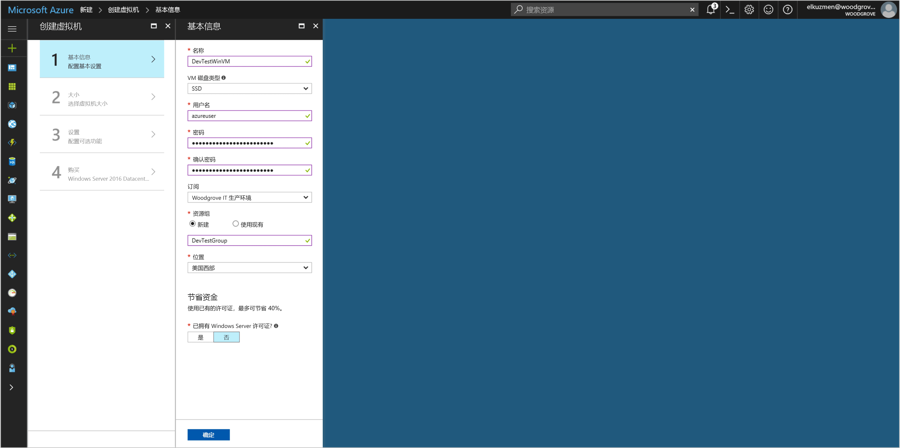
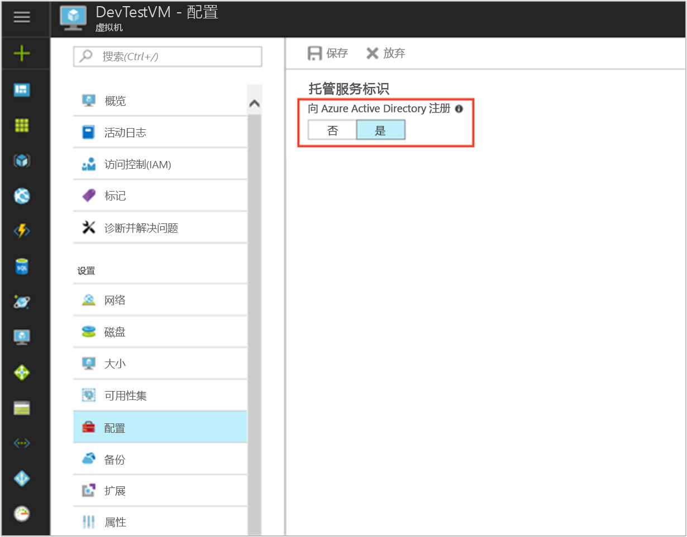

# <a name="tutorial-use-a-windows-vm-managed-service-identity-to-access-azure-data-lake-store"></a>教程：使用 Windows VM 托管服务标识访问 Azure Data Lake Store

[!INCLUDE[preview-notice](../../../includes/active-directory-msi-preview-notice.md)]

本教程介绍如何使用 Windows 虚拟机 (VM) 的托管服务标识访问 Azure Data Lake Store。 托管服务标识由 Azure 自动管理，可用于向支持 Azure AD 身份验证的服务进行身份验证，这样就无需在代码中插入凭据了。 学习如何：

> [!div class="checklist"]
> * 在 Windows VM 上启用托管服务标识 
> * 授予 VM 对 Azure Data Lake Store 的访问权限
> * 使用 VM 标识获取访问令牌，并使用它访问 Azure Data Lake Store

## <a name="prerequisites"></a>先决条件

[!INCLUDE [msi-qs-configure-prereqs](../../../includes/active-directory-msi-qs-configure-prereqs.md)]

[!INCLUDE [msi-tut-prereqs](../../../includes/active-directory-msi-tut-prereqs.md)]

## <a name="sign-in-to-azure"></a>登录 Azure

在 [https://portal.azure.com](https://portal.azure.com) 中登录 Azure 门户。

## <a name="create-a-windows-virtual-machine-in-a-new-resource-group"></a>在新的资源组中创建 Windows 虚拟机

本教程将新建 Windows VM。  还可以在现有 Azure VM 上启用托管服务标识。

1. 单击 Azure 门户左上角的“创建资源”按钮。
2. 选择“计算”，然后选择“Windows Server 2016 Datacenter”。 
3. 输入虚拟机信息。 此处创建的用户名和密码是用于登录虚拟机的凭据。
4. 在下拉列表中为虚拟机选择正确的订阅。
5. 要选择在其中创建虚拟机的新资源组，请选择“新建”。 完成后，单击“确定”。
6. 选择 VM 大小。 若要查看更多的大小，请选择“全部查看”或更改“支持的磁盘类型”筛选器。 在“设置”页中保留默认值，然后单击“确定”。

   

## <a name="enable-managed-service-identity-on-your-vm"></a>在 VM 上启用托管服务标识 

可以通过虚拟机托管标识从 Azure AD 中获取访问令牌，无需在代码中插入凭据。 启用托管服务标识会告诉 Azure 为 VM 创建托管标识。 在表面下，在 VM 上启用托管服务标识会执行两项操作：向 Azure Active Directory 注册 VM 以创建其托管标识，以及在 VM 上配置标识。

1. 对于“虚拟机”，请选择要在其上启用托管标识的虚拟机。  
2. 单击左侧导航栏中的“配置”。 
3. 此时，将会看到托管服务标识。 若要注册并启用托管服务标识，请选择“是”，若要禁用，请选择“否”。 
4. 务必单击“保存”，以保存配置。  
   

5. 若要查看并确认在此 VM 上安装了哪些扩展，请单击“扩展”。 如果托管服务标识已启用，则列表中会显示 **ManagedIdentityExtensionforWindows**。

   

## <a name="grant-your-vm-access-to-azure-data-lake-store"></a>授予 VM 对 Azure Data Lake Store 的访问权限

现在可以授予 VM 对 Azure Data Lake Store 中的文件和文件夹的访问权限。  对于此步骤，可以使用现有 Data Lake Store，也可以重新创建。  若要使用 Azure 门户新建 Data Lake Store，请按照此 [Azure Data Lake Store 快速入门](https://docs.microsoft.com/azure/data-lake-store/data-lake-store-get-started-portal)执行操作。 [Azure Data Lake Store 文档](https://docs.microsoft.com/azure/data-lake-store/data-lake-store-overview)中还提供了有关使用 Azure CLI 和 Azure PowerShell 执行这些操作的快速入门。

在 Data Lake Store 中新建文件夹，并向 VM 托管服务标识授予读取、写入和执行该文件夹中的文件的权限：

1. 在 Azure 门户中，单击左侧导航栏中的“Data Lake Store”。
2. 单击要用于本教程的 Data Lake Store。
3. 单击命令栏中的“数据资源管理器”。
4. 选择此 Data Lake Store 的根文件夹。  单击命令栏中的“访问权限”。
5. 单击 **“添加”**。  在“选择”字段中，输入 VM 的名称，如“DevTestVM”。  单击以从搜索结果中选择 VM，然后单击“选择”。
6. 单击“选择权限”。  选择“读取”和“执行”，并以“仅为访问权限”的形式添加到“此文件夹”。  单击“确定” 。  权限应已成功添加。
7. 关闭“访问权限”边栏选项卡。
8. 本教程将新建一个文件夹。  单击命令栏中的“新建文件夹”并为新文件夹命名，如“TestFolder”。  单击“确定” 。
9. 单击创建的文件夹，然后单击命令栏中的“访问权限”。
10. 与步骤 5 类似，单击“添加”，在“选择”字段中输入 VM 的名称，选中此名称，然后单击“选择”。
11. 与步骤 6 类似，单击“选择权限”，选择“读取”、“写入”和“执行”，并以“访问权限条目和默认访问权限条目”的形式添加到“此文件夹”。  单击“确定” 。  权限应已成功添加。

VM 托管服务标识现在可以对所创建文件夹中的文件执行所有操作。  若要详细了解管理 Data Lake Store 的访问权限，请在 [Data Lake Store 中的访问控制](https://docs.microsoft.com/azure/data-lake-store/data-lake-store-access-control)阅读相应文章。

## <a name="get-an-access-token-using-the-vm-managed-service-identity-and-use-it-to-call-the-azure-data-lake-store-filesystem"></a>使用 VM 托管服务标识获取访问令牌，并使用它调用 Azure Data Lake Store 文件系统

Azure Data Lake Store 原本就支持 Azure AD 身份验证，因此可以直接接受使用托管服务标识获取的访问令牌。  若要对 Data Lake Store 文件系统进行身份验证，请将 Azure AD 颁发的访问令牌发送到 Data Lake Store 文件系统终结点，并且身份验证标头的格式应为“Bearer <ACCESS_TOKEN_VALUE>”。  若要详细了解 Data Lake Store 对 Azure AD 身份验证的支持情况，请阅读[使用 Azure Active Directory 进行 Data Lake Store 身份验证](https://docs.microsoft.com/azure/data-lake-store/data-lakes-store-authentication-using-azure-active-directory)

> [!NOTE]
> Data Lake Store 文件系统客户端 SDK 目前不支持托管服务标识。  添加对 SDK 的支持后，本教程将随之更新。

在本教程中，将通过使用 PowerShell 发出 REST 请求来对 Data Lake Store 文件系统 REST API 进行身份验证。 若要使用 VM 托管服务标识进行身份验证，需要从 VM 发出此请求。

1. 在门户中，导航到“虚拟机”，转到 Windows VM，然后在“概述”中，单击“连接”。
2. 输入创建 Windows VM 时添加的用户名和密码。 
3. 现在，已经创建了与虚拟机的远程桌面连接，请在远程会话中打开 PowerShell。 
4. 使用 PowerShell 的 `Invoke-WebRequest` 向本地托管服务标识终结点发出请求，以获取 Azure Data Lake Store 的访问令牌。  Data Lake Store 的资源标识符是“https://datalake.azure.net/”。  Data Lake 对资源标识符执行完全匹配，因此尾部反斜杠非常重要。

   ```powershell
   $response = Invoke-WebRequest -Uri 'http://169.254.169.254/metadata/identity/oauth2/token?api-version=2018-02-01&resource=https%3A%2F%2Fdatalake.azure.net%2F' -Method GET -Headers @{Metadata="true"}
   ```
    
   将响应从 JSON 对象转换为 PowerShell 对象。 
    
   ```powershell
   $content = $response.Content | ConvertFrom-Json
   ```

   从响应中提取访问令牌。
    
   ```powershell
   $AccessToken = $content.access_token
   ```

5. 使用 PowerShell 的“Invoke-WebRequest”向 Data Lake Store 的 REST 终结点发出请求，在根文件夹中列出文件夹。  使用此方法可轻松检查是否所有内容都已正确配置。  身份验证标头中“Bearer”字符串的首字母“B”必须大写。  在 Azure 门户中，可以在 Data Lake Store 边栏选项卡中的“概述”部分找到你的 Data Lake Store 的名称。

   ```powershell
   Invoke-WebRequest -Uri https://<YOUR_ADLS_NAME>.azuredatalakestore.net/webhdfs/v1/?op=LISTSTATUS -Headers @{Authorization="Bearer $AccessToken"}
   ```

   成功响应如下所示：

   ```powershell
   StatusCode        : 200
   StatusDescription : OK
   Content           : {"FileStatuses":{"FileStatus":[{"length":0,"pathSuffix":"TestFolder","type":"DIRECTORY", "blockSize":0,"accessTime":1507934941392, "modificationTime":1507944835699,"replication":0, "permission":"770","ow..."
   RawContent        : HTTP/1.1 200 OK
                       Pragma: no-cache
                       x-ms-request-id: b4b31e16-e968-46a1-879a-3474aa7d4528
                       x-ms-webhdfs-version: 17.04.22.00
                       Status: 0x0
                       X-Content-Type-Options: nosniff
                       Strict-Transport-Security: ma...
   Forms             : {}
   Headers           : {[Pragma, no-cache], [x-ms-request-id, b4b31e16-e968-46a1-879a-3474aa7d4528],
                       [x-ms-webhdfs-version, 17.04.22.00], [Status, 0x0]...}
   Images            : {}
   InputFields       : {}
   Links             : {}
   ParsedHtml        : System.__ComObject
   RawContentLength  : 556
   ```

6. 现在可尝试将文件上传到 Data Lake Store。  首先，创建要上传的文件。

   ```powershell
   echo "Test file." > Test1.txt
   ```

7. 使用 PowerShell 的 `Invoke-WebRequest` 向 Data Lake Store 的 REST 终结点发出请求，将文件上传到之前创建的文件夹。  此请求需要执行两个步骤。  第一步，发出请求并重定向到应上传文件的目标位置。  第二步，实际上传文件。  如果使用的值与本教程中的值不同，请务必正确设置文件夹和文件的名称。 

   ```powershell
   $HdfsRedirectResponse = Invoke-WebRequest -Uri https://<YOUR_ADLS_NAME>.azuredatalakestore.net/webhdfs/v1/TestFolder/Test1.txt?op=CREATE -Method PUT -Headers @{Authorization="Bearer $AccessToken"} -Infile Test1.txt -MaximumRedirection 0
   ```

   查看 `$HdfsRedirectResponse` 的值时，它的外观应与以下响应类似：

   ```powershell
   PS C:\> $HdfsRedirectResponse

   StatusCode        : 307
   StatusDescription : Temporary Redirect
   Content           : {}
   RawContent        : HTTP/1.1 307 Temporary Redirect
                       Pragma: no-cache
                       x-ms-request-id: b7ab492f-b514-4483-aada-4aa0611d12b3
                       ContentLength: 0
                       x-ms-webhdfs-version: 17.04.22.00
                       Status: 0x0
                       X-Content-Type-Options: nosn...
   Headers           : {[Pragma, no-cache], [x-ms-request-id, b7ab492f-b514-4483-aada-4aa0611d12b3], 
                       [ContentLength, 0], [x-ms-webhdfs-version, 17.04.22.00]...}
   RawContentLength  : 0
   ```

   向重定向终结点发送请求以完成上传：

   ```powershell
   Invoke-WebRequest -Uri $HdfsRedirectResponse.Headers.Location -Method PUT -Headers @{Authorization="Bearer $AccessToken"} -Infile Test1.txt -MaximumRedirection 0
   ```

   成功响应如下所示：

   ```powershell
   StatusCode        : 201
   StatusDescription : Created
   Content           : {}
   RawContent        : HTTP/1.1 201 Created
                       Pragma: no-cache
                       x-ms-request-id: 1e70f36f-ead1-4566-acfa-d0c3ec1e2307
                       ContentLength: 0
                       x-ms-webhdfs-version: 17.04.22.00
                       Status: 0x0
                       X-Content-Type-Options: nosniff
                       Strict...
   Headers           : {[Pragma, no-cache], [x-ms-request-id, 1e70f36f-ead1-4566-acfa-d0c3ec1e2307],
                       [ContentLength, 0], [x-ms-webhdfs-version, 17.04.22.00]...}
   RawContentLength  : 0
   ```

使用其他 Data Lake Store 文件系统 API 可以执行追加文件、下载文件以及其他操作。

祝贺你！  你已成功使用 VM 托管服务标识向 Data Lake Store 证明了身份。

## <a name="next-steps"></a>后续步骤

在本教程中，你了解了如何使用 Windows 虚拟机的托管服务标识访问 Azure Data Lake Store。 若要了解有关 Azure Data Lake Store 的详细信息，请参阅：

> [!div class="nextstepaction"]
>[Azure Data Lake Store](/azure/data-lake-store/data-lake-store-overview)
