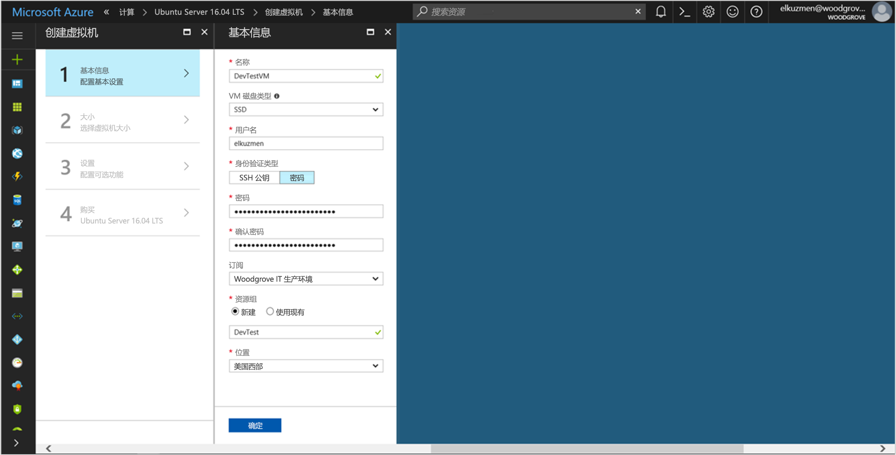
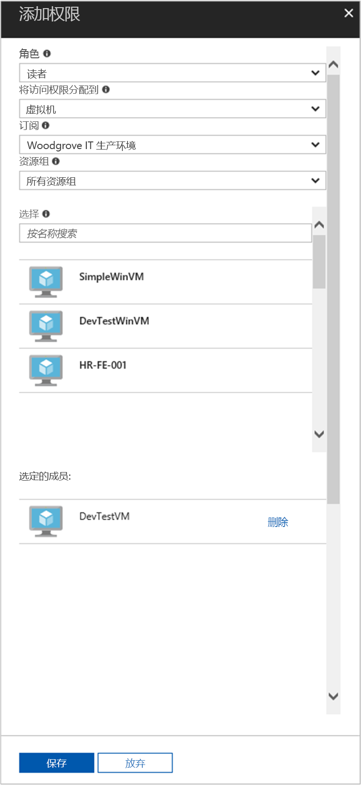

# <a name="use-a-linux-vm-managed-service-identity-msi-to-access-azure-resource-manager"></a>使用 Linux VM 托管服务标识 (MSI) 访问 Azure 资源管理器

[!INCLUDE[preview-notice](../../includes/active-directory-msi-preview-notice.md)]

本教程介绍了如何为 Linux 虚拟机启用托管服务标识 (MSI)，再使用此标识访问 Azure 资源管理器 API。 托管服务标识由 Azure 自动管理，可用于通过支持 Azure AD 身份验证的服务的身份验证，这样就无需在代码中插入凭据了。 学习如何：

> [!div class="checklist"]
> * 在 Linux 虚拟机上启用 MSI 
> * 授予 VM 对 Azure 资源管理器中资源组的访问权限 
> * 使用 VM 标识获取访问令牌，并使用它调用 Azure 资源管理器 


如果还没有 Azure 订阅，可以在开始前创建一个 [免费帐户](https://azure.microsoft.com/free/?WT.mc_id=A261C142F)。

## <a name="sign-in-to-azure"></a>登录 Azure

登录 Azure 门户 ([https://portal.azure.com](https://portal.azure.com))。

## <a name="create-a-linux-virtual-machine-in-a-new-resource-group"></a>在新的资源组中创建 Linux 虚拟机

本教程将新建一个 Linux VM。 另外，还可以在现有 VM 上启用 MSI。

1. 单击 Azure 门户左上角的“新建”按钮。
2. 选择“计算”，然后选择“Ubuntu Server 16.04 LTS”。
3. 输入虚拟机信息。 对于“身份验证类型”，选择“SSH 公钥”或“密码”。 使用创建的凭据可以登录 VM。

    

4. 在“订阅”下拉列表中，选择虚拟机对应的订阅。
5. 若要在新资源组中创建虚拟机，请选择“资源组”中的“新建”。 完成后，单击“确定”。
6. 选择 VM 大小。 若要查看更多大小，请选择“全部查看”或更改“支持的磁盘类型”筛选器。 在设置边栏选项卡中保留默认值，然后单击“确定”。

## <a name="enable-msi-on-your-vm"></a>在 VM 上启用 MSI

通过虚拟机 MSI，可以从 Azure AD 获取访问令牌，而无需在代码中插入凭据。 幕后运行机制是，启用 MSI 可以在 VM 上安装 MSI VM 扩展，并为 VM 启用 MSI。  

1. 选择要在其上启用 MSI 的虚拟机。
2. 单击左侧导航栏中的“配置”。
3. 此时，将会看到“托管服务标识”。 若要注册并启用 MSI，请选择“是”，若要禁用，请选择“否”。
4. 务必单击“保存”，以保存配置。

    

5. 若要检查在此 Linux VM 上安装了哪些扩展，请单击“扩展”。 如果 MSI 已启用，列表中会显示“ManagedIdentityExtensionforLinux”。

    

## <a name="grant-your-vm-access-to-a-resource-group-in-azure-resource-manager"></a>授予 VM 对 Azure 资源管理器中资源组的访问权限 

使用 MSI，代码可以获取访问令牌，通过支持 Azure AD 身份验证的资源的身份验证。 Azure 资源管理器 API 支持 Azure AD 身份验证。 首先，需要授予此 VM 标识对 Azure 资源管理器中资源（在此示例中，为包含 VM 的资源组）的访问权限。  

1. 转到“资源组”选项卡。
2. 选择之前创建的特定资源组。
3. 转到左侧面板中的“访问控制(IAM)”。
4. 单击“添加”，为 VM 添加新的角色分配。 选择“阅读器”作为“角色”。
5. 在下一个下拉列表中，把“将访问权限分配给”设置为资源“虚拟机”。
6. 接下来，请确保“订阅”下拉列表中列出的订阅正确无误。 对于“资源组”，请选择“所有资源组”。
7. 最后，在“选择”下拉列表中，选择 Linux 虚拟机，再单击“保存”。

    

## <a name="get-an-access-token-using-the-vms-identity-and-use-it-to-call-resource-manager"></a>使用 VM 标识获取访问令牌，并使用它调用资源管理器 

若要完成这些步骤，需要使用 SSH 客户端。 如果使用的是 Windows，可以在[适用于 Linux 的 Windows 子系统](https://msdn.microsoft.com/commandline/wsl/about)中使用 SSH 客户端。 如果需要有关配置 SSH 客户端密钥的帮助，请参阅[如何在 Azure 上将 SSH 密钥与 Windows 配合使用](../virtual-machines/linux/ssh-from-windows.md)或[如何创建和使用适用于 Azure 中 Linux VM 的 SSH 公钥和私钥对](../virtual-machines/linux/mac-create-ssh-keys.md)。

1. 在门户中，转到 Linux VM，并单击“概述”中的“连接”。  
2. 使用所选的 SSH 客户端连接到 VM。 
3. 在终端窗口中，使用 CURL 向本地 MSI 终结点发出请求，以获取访问 Azure 资源管理器所需的访问令牌。  
 
    下面是用于获取访问令牌的 CURL 请求。  
    
    ```bash
    curl http://localhost:50342/oauth2/token --data "resource=https://management.azure.com/" -H Metadata:true   
    ```
    
    > [!NOTE]
    > “resource”参数值必须与 Azure AD 预期值完全一致。  若为资源管理器资源 ID，必须在 URI 的结尾添加斜线。 
    
    响应包括访问 Azure 资源管理器所需的访问令牌。 
    
    响应：  

    ```bash
    {"access_token":"eyJ0eXAiOiJKV1QiLCJhbGciOiJSUzI1NiIsIng1dCI6IkhIQnlLVS0wRHFBcU1aaDZaRlBkMlZXYU90ZyIsImtpZCI6IkhIQnlLVS0wRHFBcU1aaDZaRlBkMlZXYU90ZyJ9.eyJhdWQiOiJodHRwczovL21hbmFnZW1lbnQuYXp1cmUuY29tIiwiaXNzIjoiaHR0cHM6Ly9zdHMud2luZG93cy5uZXQvNzJmOTg4YmYtODZmMS00MWFmLTkxYWItMmQ3Y2QwMTFkYjQ3LyIsImlhdCI6MTUwNDEyNjYyNywibmJmIjoxNTA0MTI2NjI3LCJleHAiOjE1MDQxMzA1MjcsImFpbyI6IlkyRmdZTGg2dENWSzRkSDlGWGtuZzgyQ21ZNVdBZ0E9IiwiYXBwaWQiOiI2ZjJmNmU2OS04MGExLTQ3NmEtOGRjZi1mOTgzZDZkMjUxYjgiLCJhcHBpZGFjciI6IjIiLCJpZHAiOiJodHRwczovL3N0cy53aW5kb3dzLm5ldC83MmY5ODhiZi04NmYxLTQxYWYtOTFhYi0yZDdjZDAxMWRiNDcvIiwib2lkIjoiMTEyODJiZDgtMDNlMi00NGVhLTlmYjctZTQ1YjVmM2JmNzJlIiwic3ViIjoiMTEyODJiZDgtMDNlMi00NGVhLTlmYjctZTQ1YjVmM2JmNzJlIiwidGlkIjoiNzJmOTg4YmYtODZmMS00MWFmLTkxYWItMmQ3Y2QwMTFkYjQ3IiwidXRpIjoib0U5T3JVZFJMMHVKSEw4UFdvOEJBQSIsInZlciI6IjEuMCJ9.J6KS7b9kFgDkegJ-Vfff19LMnu3Cfps4dL2uNGucb5M76rgDM5f73VO-19wZSRhQPxWmZLETzN3SljnIMQMkYWncp79MVdBud_xqXYyLdQpGkNinpKVJhTo1j1dY27U_Cjl4yvvpBTrtH3OX9gG0GtQs7PBFTTLznqcH3JR9f-bTSEN4wUhalaIPHPciVDtJI9I24_vvMfVqxkXOo6gkL0mEPfpXZRLwrBNd607AzX0KVmLFrwA1vYJnCV-sSV8bwTh2t6CVEj240t0iyeVWVc2usJ0NY2rxPzKd_UckQ_zzrECG3kS4vuYePKz6GqNJFVzm2w2c61lX0-O1CwvQ9w","refresh_token":"","expires_in":"3599","expires_on":"1504130527","not_before":"1504126627","resource":"https://management.azure.com","token_type":"Bearer"} 
    ```
    
    可以使用此访问令牌访问 Azure 资源管理器。例如，读取之前授予此 VM 有权访问的资源组的详细信息。 将 \<SUBSCRIPTION ID\>、\<RESOURCE GROUP\> 和 \<ACCESS TOKEN\> 的值替换为前面创建的值。 
    
    > [!NOTE]
    > URL 区分大小写。因此，请确保大小写与之前在命名资源组时使用的大小写完全相同，并确保“resourceGroup”使用的是大写“G”。  
    
    ```bash 
    curl https://management.azure.com/subscriptions/<SUBSCRIPTION ID>/resourceGroups/<RESOURCE GROUP>?api-version=2016-09-01 -H "Authorization: Bearer <ACCESS TOKEN>" 
    ```
    
    返回的响应包含具体的资源组信息： 
     
    ```bash
    {"id":"/subscriptions/98f51385-2edc-4b79-bed9-7718de4cb861/resourceGroups/DevTest","name":"DevTest","location":"westus","properties":{"provisioningState":"Succeeded"}} 
    ```
     
## <a name="related-content"></a>相关内容

- 有关 MSI 的概述，请参阅[托管服务标识概述](../active-directory/msi-overview.md)。

使用以下评论部分提供反馈，帮助我们改进内容。

