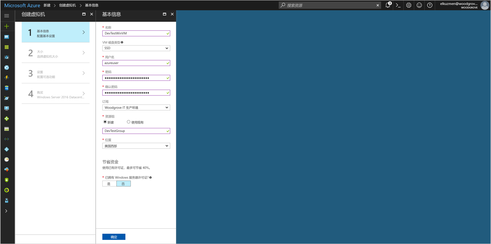
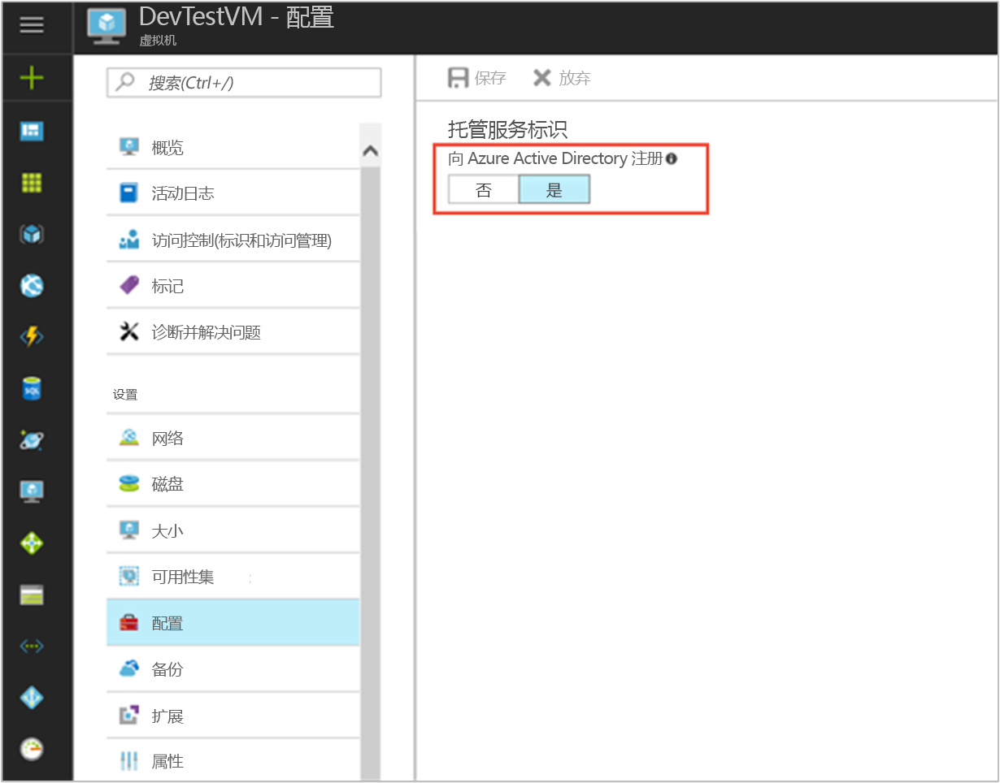
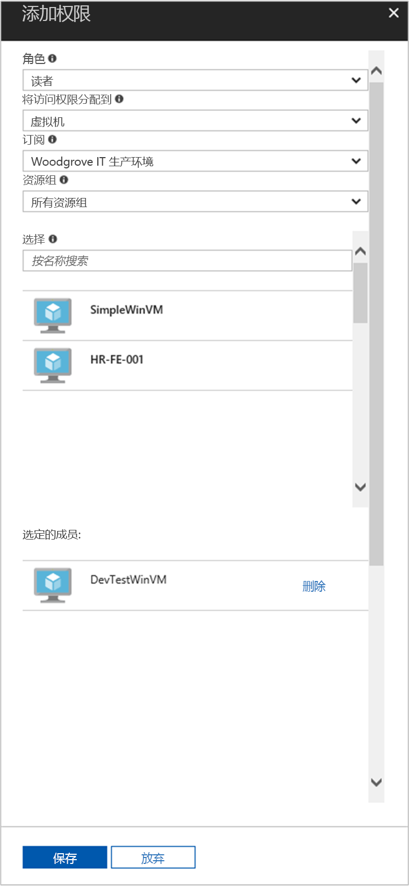

# <a name="use-a-windows-vm-managed-service-identity-msi-to-access-resource-manager"></a>使用 Windows VM 托管服务标识 (MSI) 访问资源管理器

[!INCLUDE[preview-notice](../../includes/active-directory-msi-preview-notice.md)]

本教程演示了如何启用 Windows 虚拟机 (VM) 的托管服务标识 (MSI) 的过程。 然后，可以使用该标识访问 Azure 资源管理器 API。 托管服务标识由 Azure 自动管理，可用于通过支持 Azure AD 身份验证的服务的身份验证，这样就无需在代码中插入凭据了。 学习如何：

> [!div class="checklist"]
> * 在 Windows VM 上启用 MSI 
> * 授予 VM 对 Azure 资源管理器中资源组的访问权限 
> * 使用 VM 标识获取访问令牌，并使用它调用 Azure 资源管理器


如果还没有 Azure 订阅，可以在开始前创建一个 [免费帐户](https://azure.microsoft.com/free/?WT.mc_id=A261C142F)。

## <a name="sign-in-to-azure"></a>登录 Azure
登录 Azure 门户 ([https://portal.azure.com](https://portal.azure.com))。

## <a name="create-a-windows-virtual-machine-in-a-new-resource-group"></a>在新的资源组中创建 Windows 虚拟机

本教程将新建 Windows VM。  另外，还可以在现有 VM 上启用 MSI。

1.  单击 Azure 门户左上角的“新建”按钮。
2.  选择“计算”，然后选择“Windows Server 2016 Datacenter”。 
3.  输入虚拟机信息。 此处创建的用户名和密码是用于登录虚拟机的凭据。
4.  在下拉列表中为虚拟机选择正确的订阅。
5.  要选择在其中创建虚拟机的新资源组，请选择“新建”。 完成后，单击“确定”。
6.  选择 VM 大小。 若要查看更多的大小，请选择“全部查看”或更改“支持的磁盘类型”筛选器。 在“设置”页中保留默认值，然后单击“确定”。

    

## <a name="enable-msi-on-your-vm"></a>在 VM 上启用 MSI 

通过 VM MSI，可以从 Azure AD 获取访问令牌，而无需在代码中插入凭据。 启用 MSI 会告诉 Azure 为 VM 创建托管标识。 事实上，启用 MSI 会执行两项操作：在 VM 上安装 MSI VM 扩展，以及在 Azure 资源管理器中启用 MSI。

1.  选择要在其上启用 MSI 的虚拟机。  
2.  在左侧导航栏中，单击“配置”。 
3.  此时，将会看到托管服务标识。 若要注册并启用 MSI，请选择“是”，若要禁用，请选择“否”。 
4.  务必单击“保存”，以保存配置。  
    

5. 若要查看并确认在此 VM 上安装了哪些扩展，请单击“扩展”。 如果启用了 MSI，列表中会显示“ManagedIdentityExtensionforWindows”。

    

## <a name="grant-your-vm-access-to-a-resource-group-in-resource-manager"></a>授予 VM 对资源管理器中资源组的访问权限
使用 MSI，代码可以获取访问令牌，对支持 Azure AD 身份验证的资源进行身份验证。  Azure 资源管理器支持 Azure AD 身份验证。  首先，需要授予此 VM 标识对资源管理器中资源（在此示例中，为包含 VM 的资源组）的访问权限。  

1.  转到“资源组”选项卡。 
2.  选择为 Windows VM 创建的特定“资源组”。 
3.  转到左侧面板中的“访问控制(IAM)”。 
4.  然后为 Windows VM 添加一个新的角色分配。  选择“角色”作为“读取器”。 
5.  在下一个下拉列表中，为资源虚拟机分配访问权限。 
6.  接下来，请确保“订阅”下拉列表中列出的订阅正确无误。 对于“资源组”，请选择“所有资源组”。 
7.  最后，在“选择”中，选择下拉列表中的 Windows VM 并单击“保存”。

    

## <a name="get-an-access-token-using-the-vm-identity-and-use-it-to-call-azure-resource-manager"></a>使用 VM 标识获取访问令牌，并使用它调用 Azure 资源管理器 

在此部分中将需要使用 PowerShell。  如果尚未安装，请在[此处](https://docs.microsoft.com/powershell/azure/overview?view=azurermps-4.3.1)进行下载。 

1.  在门户中，导航到“虚拟机”并转到 Windows 虚拟机，然后在“概述”中，单击“连接”。 
2.  输入创建 Windows VM 时添加的用户名和密码。 
3.  现在，已经创建了与虚拟机的远程桌面连接，请在远程会话中打开 PowerShell。 
4.  使用 Powershell 的 Invoke-WebRequest，向本地 MSI 终结点发出请求以获取 Azure 资源管理器的访问令牌。

    ```powershell
       $response = Invoke-WebRequest -Uri http://localhost:50342/oauth2/token -Method GET -Body @{resource="https://management.azure.com/"} -Headers @{Metadata="true"}
    ```
    
    > [!NOTE]
    > “资源”参数的值必须完全匹配 Azure AD 预期的值。 如果使用 Azure 资源管理器资源 ID，必须在 URI 的结尾添加斜线。
    
    接下来，提取完整响应，响应以 JavaScript 对象表示法 (JSON) 格式字符串的形式存储在 $response 对象中。 
    
    ```powershell
    $content = $response.Content | ConvertFrom-Json
    ```
    接下来，从响应中提取访问令牌。
    
    ```powershell
    $ArmToken = $content.access_token
    ```
    
    最后，使用访问令牌调用 Azure 资源管理器。 在此示例中，我们还使用 PowerShell 的 Invoke-WebRequest 调用 Azure 资源管理器，并将访问令牌包含在授权标头中。
    
    ```powershell
    (Invoke-WebRequest -Uri https://management.azure.com/subscriptions/<SUBSCRIPTION ID>/resourceGroups/<RESOURCE GROUP>?api-version=2016-06-01 -Method GET -ContentType "application/json" -Headers @{ Authorization ="Bearer $ArmToken"}).content
    ```
    > [!NOTE] 
    > URL 区分大小写。因此，请确保大小写与之前在命名资源组时使用的大小写完全相同，并确保“resourceGroup”使用的是大写“G”。
        
    以下命令将返回资源组的详细信息：

    ```powershell
    {"id":"/subscriptions/98f51385-2edc-4b79-bed9-7718de4cb861/resourceGroups/DevTest","name":"DevTest","location":"westus","properties":{"provisioningState":"Succeeded"}}
    ```

## <a name="related-content"></a>相关内容

- 有关 MSI 的概述，请参阅[托管服务标识概述](../active-directory/msi-overview.md)。

使用以下评论部分提供反馈，帮助我们改进内容。

