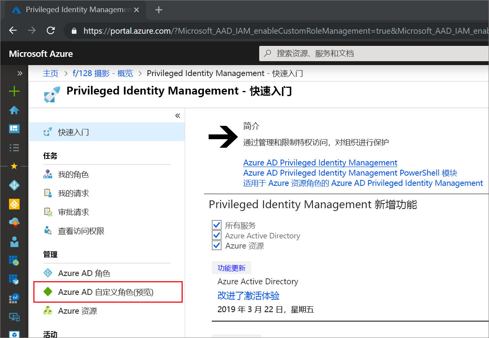
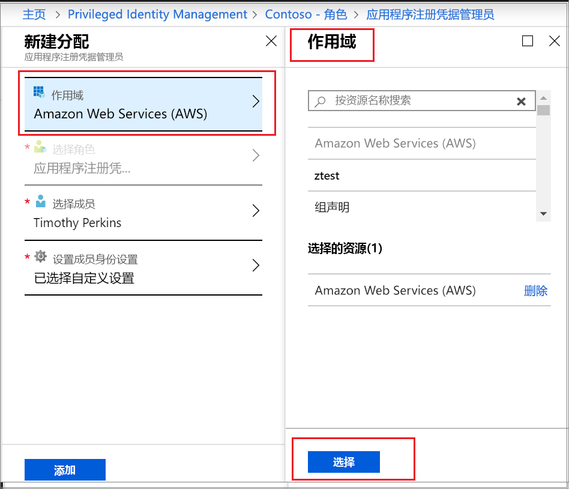

# 激活 Privileged Identity Management 中的 Azure AD 自定义角色

Azure Active Directory （Azure AD）中 Privileged Identity Management 现在支持在 "身份和访问管理" 管理体验中为应用程序管理创建的自定义角色的实时和时间绑定分配。 有关创建自定义角色以在 Azure AD 中委派应用程序管理的详细信息，请参阅[Azure Active Directory 中的自定义管理员角色（预览版）](../users-groups-roles/roles-custom-overview.md)。

> [!NOTE]
> 预览期间，Azure AD 自定义角色不与内置目录角色集成。 功能正式发布后，会在内置角色中进行角色管理。

## 激活角色

需要激活 Azure AD 自定义角色时，请在 Privileged Identity Management 中选择 "我的角色" 导航选项来请求激活。

1. 登录到[Azure 门户](https://portal.azure.com)。
1. 打开 Azure AD [Privileged Identity Management](https://portal.azure.com/?Microsoft_AAD_IAM_enableCustomRoleManagement=true&Microsoft_AAD_IAM_enableCustomRoleAssignment=true&feature.rbacv2roles=true&feature.rbacv2=true&Microsoft_AAD_RegisteredApps=demo#blade/Microsoft_Azure_PIMCommon/CommonMenuBlade/quickStart)。

1. 选择**Azure AD 自定义角色**，查看符合条件的 Azure AD 自定义角色分配的列表。

   

> [!Note] 
>  在分配角色之前，必须创建/配置角色。 有关配置 AAD 自定义角色的详细信息，请参阅 [此处] （ https://docs.microsoft.com/azure/active-directory/privileged-identity-management/azure-ad-custom-roles-configure)

1. 在 " **Azure AD 自定义角色（预览）** " 页上，找到所需的分配。
1. 选择 "**激活角色**" 以打开 "**激活**" 页。
1. 如果你的角色需要多重身份验证，请选择 "**验证你的身份"，然后继续**。 每个会话只需进行一次身份验证。
1. 选择 **"验证我的身份**"，并按照说明进行操作以提供任何其他安全验证。
1. 若要指定自定义应用程序范围，请选择 "**作用域**" 以打开 "筛选器" 窗格。 应在所需的最小范围内请求对角色的访问权限。 如果分配在应用程序范围内，则只能在该范围内激活。

   

1. 如果需要，请指定自定义激活开始时间。 使用时，角色成员在指定时间激活。
1. 在 "**原因**" 框中，输入激活请求的原因。 这可以是必需的，也可以不在角色设置中进行。
1. 选择 "**激活**"。

如果该角色不需要审批，则会根据设置将其激活，并将其添加到活动角色列表中。 如果要使用激活的角色，请从[Privileged Identity Management 中分配 Azure AD 自定义角色](azure-ad-custom-roles-assign.md)中的步骤开始。

如果角色需要审批才能激活，你将收到 Azure 通知，告知你请求正在等待审批。

## 后续步骤

- [分配 Azure AD 自定义角色](azure-ad-custom-roles-assign.md)
- [删除或更新 Azure AD 自定义角色分配](azure-ad-custom-roles-update-remove.md)
- [配置 Azure AD 自定义角色分配](azure-ad-custom-roles-configure.md)
- [Azure AD 中的角色定义](../users-groups-roles/directory-assign-admin-roles.md)
