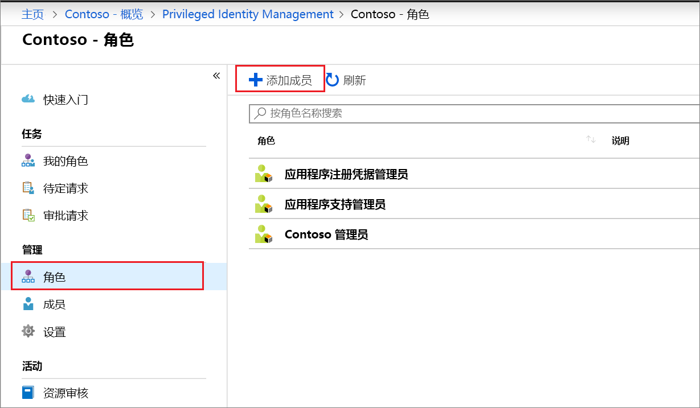
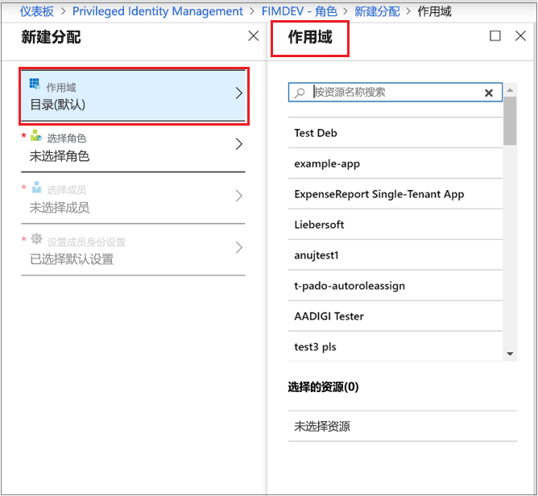
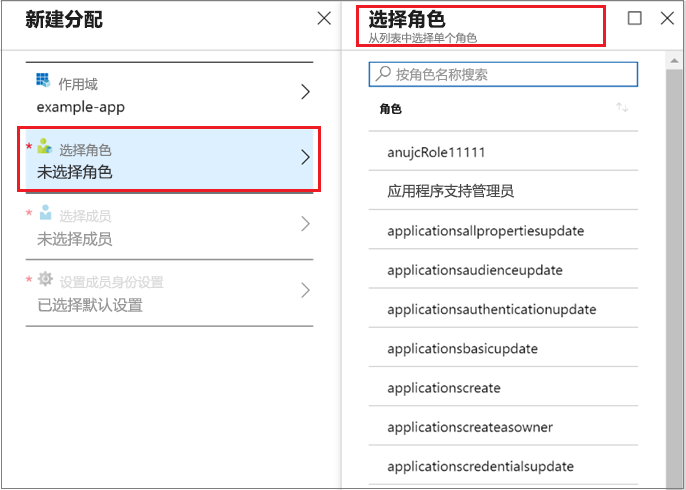
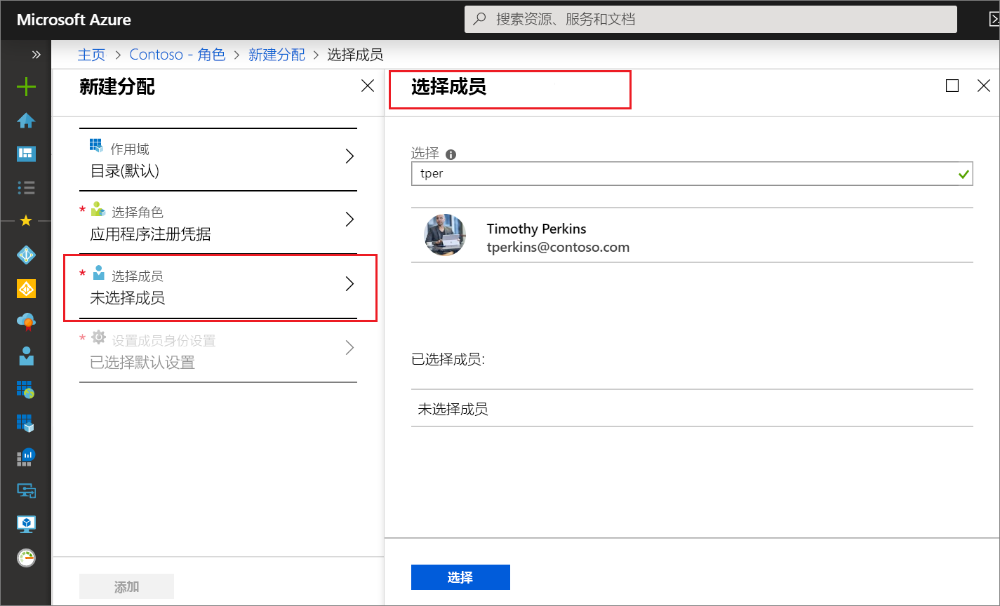
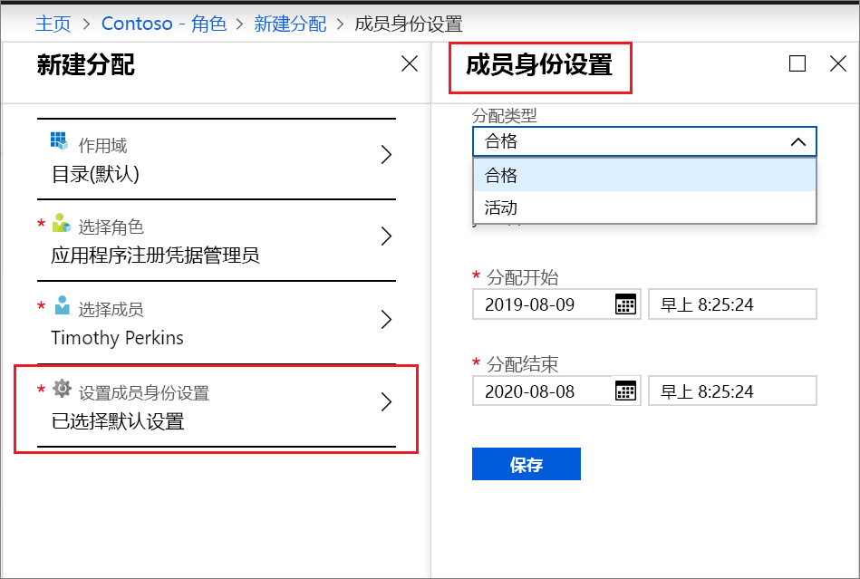
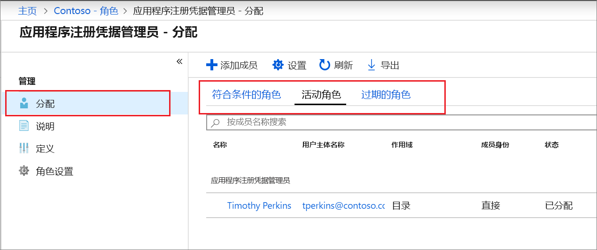

# 在 Privileged Identity Management 中分配 Azure AD 自定义角色

本文介绍如何使用 Privileged Identity Management (PIM) 来创建对自定义角色进行的恰时分配和有时限的分配，这些自定义角色是在 Azure Active Directory (Azure AD) 管理体验中为了管理应用程序而创建的。

- 若要详细了解如何在 Azure AD 中创建自定义角色来委托应用程序管理，请参阅 [Azure Active Directory 中的自定义管理员角色（预览）](../users-groups-roles/roles-custom-overview.md)。
- 如果未使用过 Privileged Identity Management，请参阅[开始使用 Privileged Identity Management](pim-getting-started.md) 以获取详细信息。
- 有关如何授予其他管理员访问权限以管理 Privileged Identity Management 的信息，请参阅向[其他管理员授予访问管理 Privileged Identity Management 的权限](pim-how-to-give-access-to-pim.md)。

> [!NOTE]
> 在预览版中，Azure AD 自定义角色未集成内置的目录角色。 此功能的正式版发布后，可在内置的角色体验中进行角色管理。

## 分配角色

Privileged Identity Management 可以管理可在 Azure Active Directory (Azure AD) 应用程序管理中创建的自定义角色。  以下步骤对自定义目录角色进行符合条件的分配。

1. 在 Azure 门户中使用分配给特权角色管理员角色的用户帐户登录到 [Privileged Identity Management](https://portal.azure.com/?Microsoft_AAD_IAM_enableCustomRoleManagement=true&Microsoft_AAD_IAM_enableCustomRoleAssignment=true&feature.rbacv2roles=true&feature.rbacv2=true&Microsoft_AAD_RegisteredApps=demo#blade/Microsoft_Azure_PIMCommon/CommonMenuBlade/quickStart)。
1. 选择“Azure AD 自定义角色(预览版)”。

    

1. 选择“角色”以查看 Azure AD 应用程序的自定义角色的列表。

    

1. 选择“添加成员”打开分配页。
1. 若要将角色分配的范围限定为单个应用程序，请选择“范围”以指定应用程序范围。

    

1. 选择“选择角色”打开“选择角色”列表。

    

1. 选择要分配的角色，然后单击“选择”。 此时将打开“选择成员”列表。

    

1. 选择要分配到该角色的用户，然后单击“选择”。 此时将打开“成员身份设置”窗格。

    

1. 在“成员身份设置”页上，选择“符合条件”或“活动”：

    - “符合条件”分配要求分配到该角色的用户执行某个操作，然后该用户才能使用该角色。 操作可能包括通过多重身份验证检查、提供业务理由或请求获得指定审批者的批准。
    - “活动”分配不要求分配的用户执行任何操作便可使用该角色。 活动用户始终具有分配给该角色的特权。

1. 如果“永久”复选框已显示并且可选（具体取决于角色设置），可以指定该分配是否是永久性的。 选中该复选框可使分配永久符合条件或永久进行分配。 清除该复选框可指定分配持续时间。
1. 若要创建新的角色分配，请依次单击“保存”、“添加”。 此时将显示分配过程状态的通知。

若要验证角色分配，请在打开的角色中选择“分配” > “分配”，然后检查角色分配是否正确标识为“符合条件”或“活动”。

 

## 后续步骤

- [激活 Azure AD 自定义角色](azure-ad-custom-roles-assign.md)
- [删除或更新 Azure AD 自定义角色分配](azure-ad-custom-roles-update-remove.md)
- [配置 Azure AD 自定义角色分配](azure-ad-custom-roles-configure.md)
- [Azure AD 中的角色定义](../users-groups-roles/directory-assign-admin-roles.md)
