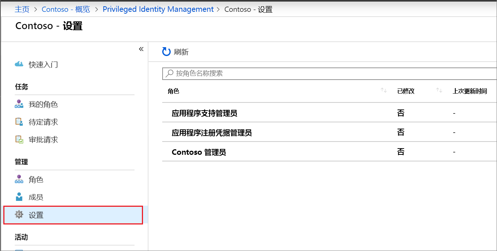
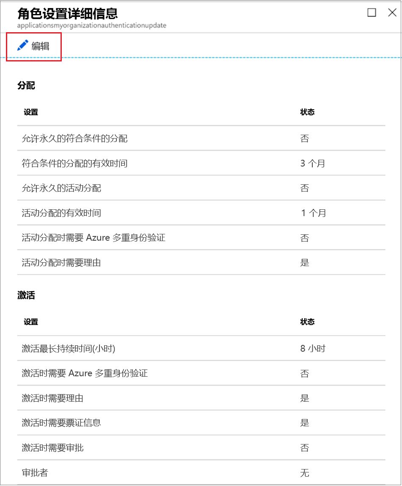
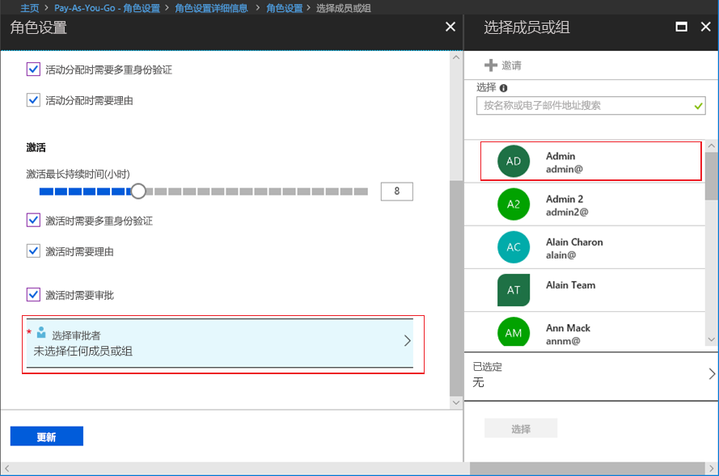

# 在 Privileged Identity Management 中配置 Azure AD 自定义角色

特权角色管理员可以更改当用户激活其自定义角色分配时应用到该用户的角色设置，以及适用于分配自定义角色的其他应用程序管理员的角色设置。

## 打开角色设置

遵循以下步骤打开 Azure AD 角色的设置。

1. 在 Azure 门户中使用分配给特权角色管理员角色的用户帐户登录到 [Privileged Identity Management](https://portal.azure.com/?Microsoft_AAD_IAM_enableCustomRoleManagement=true&Microsoft_AAD_IAM_enableCustomRoleAssignment=true&feature.rbacv2roles=true&feature.rbacv2=true&Microsoft_AAD_RegisteredApps=demo#blade/Microsoft_Azure_PIMCommon/CommonMenuBlade/quickStart)。
1. 选择“Azure AD 自定义角色(预览版)”。 

    

1. 选择“设置”打开“设置”页。   选择要配置其设置的角色。
1. 选择“编辑”打开“角色设置”页。  

    

## 角色设置

可以配置多个设置。

### 分配持续时间

配置角色的设置时，可以从用于每种分配类型（“符合条件”或“活动”）的两个分配持续时间选项中进行选择·。 在 Privileged Identity Management 中将成员分配到角色时，这些选项将成为默认的最大持续时间。

可以选择其中一个“符合条件”的分配持续时间选项： 

- **允许永久性符合条件分配**：管理员可以分配永久性符合条件成员身份。
- **使符合条件分配在以下时间后过期**：管理员可以要求所有符合条件分配都具有指定的开始和结束日期。

此外，可以选择其中一个“活动”分配持续时间选项： 

- **允许永久性活动分配**：管理员可以分配永久性活动成员身份。
- **使活动分配在以下时间后过期**：管理员可以要求所有活动分配都具有指定的开始和结束日期。

### 需要 Azure 多重身份验证

Privileged Identity Management 提供了两种不同的可选 Azure 多重身份验证强制执行方案。

- **要求在活动分配时进行多重身份验证**

  如果你只是想要短时间地（例如一天）将某个成员分配到某个角色，要求分配的成员请求激活可能需要花费较长时间。 在这种情况下，当用户激活其角色分配时，Privileged Identity Management 无法强制实施多重身份验证，因为从分配的那一刻，该用户的角色已处于活动状态。 为确保负责分配角色的管理员是其本人，请选中“进行活动分配时要求执行多重身份验证”框。 

- **要求在激活时进行多重身份验证**

  可以要求分配到某个角色的符合条件用户在激活之前，先在 Azure 多重身份验证中进行注册。 此过程可确保请求激活的用户一定就是其本人。 强制执行此选项可以在用户帐户可能已遭入侵的情况下保护关键角色。 若要要求符合条件的成员在激活之前运行 Azure 多重身份验证，请选中“在激活时要求进行多重身份验证”  框。

有关详细信息，请参阅[多重身份验证和 Privileged Identity Management](pim-how-to-require-mfa.md)。

### 最长激活持续时间

使用“最长激活持续时间”  滑块是角色在过期前保持活动状态的最大时间（以小时为单位）。 此值可以是 1 到 24 个小时。

### 需要理由

可以要求成员在活动分配或激活时输入理由。 若需要理由，请选中“在活动分配时需要理由”  复选框或“在激活时需要理由”  框。

### 需要批准才能激活

如果要求批准以激活角色，请按照以下步骤操作。

1. 选中“需要批准以激活”  复选框。
1. 选择“选择审批者”打开“选择成员或组”列表   。

    

1. 至少选择一个成员或组，然后单击“选择”  。 必须至少选择 1 个审批者。 没有默认的审批者。 所选项将出现在所选审批者列表中。
1. 指定角色设置后，选择“更新”以保存更改。 

## 后续步骤

- [激活 Azure AD 自定义角色](azure-ad-custom-roles-assign.md)
- [分配 Azure AD 自定义角色](azure-ad-custom-roles-assign.md)
- [删除或更新 Azure AD 自定义角色分配](azure-ad-custom-roles-update-remove.md)
- [Azure AD 中的角色定义](../users-groups-roles/directory-assign-admin-roles.md)
