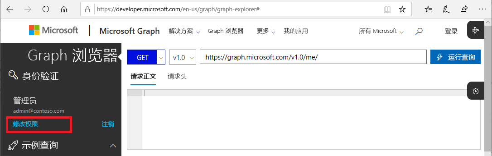
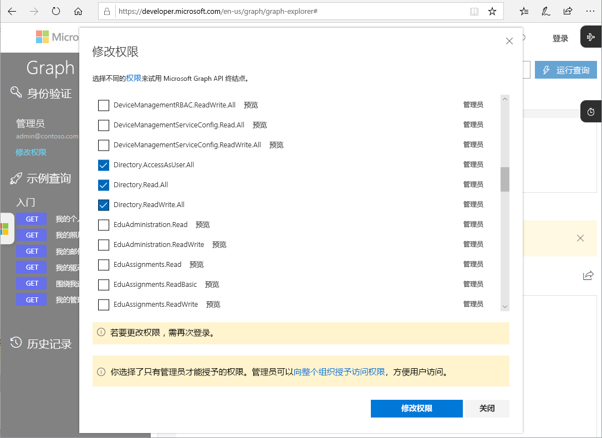

# 适用于 Privileged Identity Management 的 Microsoft Graph API（预览版）

可以使用 Azure Active Directory 的 [Microsoft Graph API](https://developer.microsoft.com/graph/docs/concepts/overview) 执行 Privileged Identity Management 任务。 本文介绍使用适用于 Privileged Identity Management 的 Microsoft Graph API 的重要概念。

有关 Microsoft Graph API 的详细信息，请查看 [Azure AD Privileged Identity Management API 参考](https://developer.microsoft.com/graph/docs/api-reference/beta/resources/privilegedidentitymanagement_root)。

> [!IMPORTANT]
> Microsoft Graph 中 /beta 版本下的 API 为预览版，可能会进行更改。 不支持在生产应用程序中使用这些 API。
>
> 尽管所有 PIM 操作都通过图形 API 命令进行支持，但我们使用另一个系统来批准激活请求。 用于批准的图形 API 目前正在开发中，将在接下来的几个月内发布。

## 所需的权限

若要调用适用于 Privileged Identity Management 的 Microsoft Graph API，必须拥有下述权限中的**一项或多项**：

- `Directory.AccessAsUser.All`
- `Directory.Read.All`
- `Directory.ReadWrite.All`
- `PrivilegedAccess.ReadWrite.AzureAD`

### 设置权限

应用程序必须具有必要的权限才能调用适用于 Privileged Identity Management 的 Microsoft Graph API。 若要指定所需的权限，最容易的方式是使用 [Azure AD 许可框架](../develop/consent-framework.md)。

### 在 Graph 浏览器中设置权限

如果使用 Graph 浏览器来测试调用，则可在工具中指定权限。

1. 以全局管理员身份登录到 [Graph 浏览器](https://developer.microsoft.com/graph/graph-explorer)。

1. 单击“修改权限”。 

    

1. 选中要包括的权限旁边的复选框。 `PrivilegedAccess.ReadWrite.AzureAD` 在 Graph 浏览器中尚不可用。

    

1. 单击“修改权限”以应用权限更改。 

## 后续步骤

- [Azure AD Privileged Identity Management API 参考](https://developer.microsoft.com/graph/docs/api-reference/beta/resources/privilegedidentitymanagement_root)
