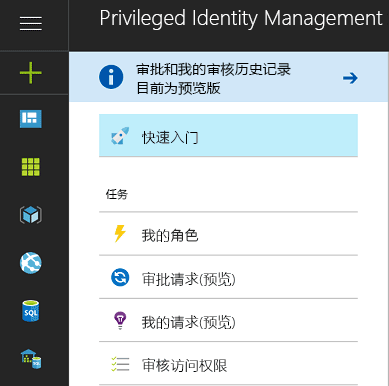
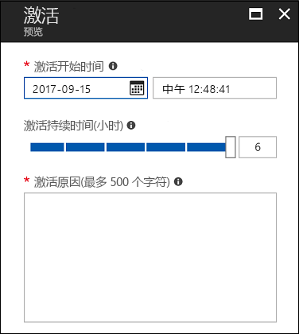
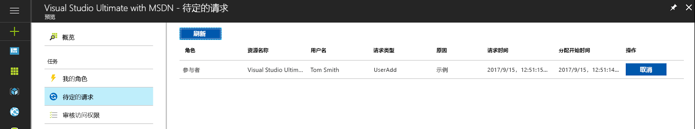
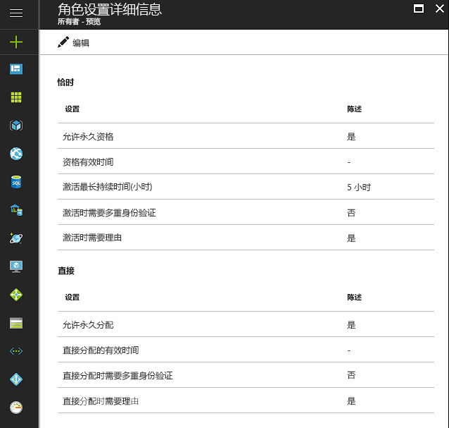

# 什么是 Azure AD Privileged Identity Management？

使用 Azure Active Directory (AD) Privileged Identity Management，可以管理、控制和监视组织内的访问。 这包括访问 Azure AD、Azure 资源（预览版）和其他 Microsoft Online Services（例如 Office 365 或 Microsoft Intune）中的资源。

> [!NOTE]
> 为租户启用特权身份管理时，每位与该服务交互或从中受益的用户都需要有效的 Azure AD Premium P2 或企业移动性 + 安全性 E5 付费版或试用版许可证。 示例包括用户/一个组中的用户，即：
>
>- 分配给特权角色管理员角色 
>- 指定为可通过 PIM 管理的符合条件的其他目录角色 
>- 能够批准/拒绝 PIM 中的请求 
>- 使用及时或直接（基于时间）的分配，分配给 Azure 资源角色  
>- 分配给访问审查
>
>有关详细信息，请参阅 [Azure Active Directory 版本](../fundamentals/active-directory-whatis.md)。

组织希望尽量减少拥有访问权限的人员以保护信息或资源安全，因为这样做可以减小恶意用户获得相应访问权限，或者已授权用户无意中影响敏感资源的可能性。  但是，用户仍需在 Azure AD、Azure、Office 365 或 SaaS 应用中执行特权操作。 组织可能会授予用户对订阅和 Azure AD 等 Azure 资源的特许访问权限。 在这种情况下，需要监督这些用户使用其管理特权执行了哪些操作。 Azure AD Privileged Identity Management 有助于缓解访问权限过度、不必要或滥用的风险。

Azure AD Privileged Identity Management 可帮助组织实现以下目的：

- 查看为哪些用户分配了可管理 Azure 资源（预览版）的特权角色，以及为哪些用户分配了 Azure AD 中的管理角色
- 启用针对 Microsoft Online Services（例如 Office 365 和 Intune）、订阅和资源组 Azure 资源（预览版）以及单个资源（例如虚拟机）的按需“实时”管理访问权限 
-   查看管理员激活历史记录，包括管理员对 Azure 资源（预览版）所做的更改
- 获取有关管理员分配发生更改的警报
- 要求对激活 Azure AD 特权管理员角色（预览版）进行审批 
- 评审管理角色的成员身份，并要求用户提供持续需要成员身份的理由

在 Azure AD 中，Azure AD Privileged Identity Management 可以管理分配到内置 Azure AD 组织角色的用户，例如全局管理员。 在 Azure 中，Azure AD Privileged Identity Management 可以管理通过 Azure RBAC 角色分配的用户和组，包括所有者或参与者。

## 实时管理员访问

一直以来，都可以通过 Azure 门户、其他 Microsoft Online Services 门户或 Windows PowerShell 中的 Azure AD cmdlet 将用户分配到管理员角色。 因此，该用户将成为**永久管理员**，始终以分配的角色工作。 Azure AD Privileged Identity Management 引入了**有资格管理员**的概念。有资格管理员应是不时（但不是整天或每天）需要特权访问的用户。 该角色处于非活动状态，直到用户需要访问权限，然后他们完成激活过程，并在预定的时间内成为活动管理员。 越来越多的组织选择使用这种方法来减少或消除对特权角色的“长期管理访问”。

## 为目录启用 Privileged Identity Management

可以在 [Azure 门户](https://portal.azure.com/)中开始使用 Azure AD Privileged Identity Management。

> [!NOTE]
> 只有拥有组织帐户（例如 @yourdomain.com）而非 Microsoft 帐户（例如 @outlook.com）的全局管理员才能为目录启用 Azure AD Privileged Identity Management。

1. 以目录的全局管理员身份登录 [Azure 门户](https://portal.azure.com/) 。
2. 如果组织有多个目录，请在 Azure 门户的右上角选择用户名。 选择会在其中使用 Azure AD Privileged Identity Management 的目录。
3. 选择“所有服务”，并使用“筛选器”文本框搜索“Azure AD Privileged Identity Management”。
4. 选中“固定到仪表板”，并单击“创建”。 Privileged Identity Management 应用程序打开。

如果你是在目录中使用 Azure AD Privileged Identity Management 的第一个人并导航到 Azure AD 目录角色，[安全向导](pim-security-wizard.md)会引导你进行初始分配体验。 然后，将自动成为该目录的第一个**安全管理员**和**特权角色管理员**。

对于 Azure AD 角色，只有充当“特权角色管理员”角色的用户可以管理 Azure AD PIM 中的其他管理员分配。 可以[在 PIM 中为其他用户提供管理目录角色的能力](pim-how-to-give-access-to-pim.md)。 全局管理员、安全管理员和安全读者可在 Azure AD PIM 中查看 Azure AD 角色的分配。
对于 Azure RBAC 角色，只是订阅管理员、资源所有者或资源用户访问管理员可以在 Azure AD PIM 中管理其他管理员的分配。  默认情况下，充当特权角色管理员、安全管理员或安全读者的用户无权在 Azure AD PIM 中查看 Azure RBAC 角色的分配。

## Privileged Identity Management 概述（入口点）

Azure AD Privileged Identity Management 支持管理 Azure AD 目录角色，以及 Azure 资源（预览版）的角色。 Azure 资源角色的功能与 Azure AD 中的管理角色不同。 Azure 资源角色针对位于分配级别的资源以及资源层次结构中的所有附属资源（称为继承）提供粒度权限。 [详细了解 RBAC、资源层次结构和继承](../../role-based-access-control/role-assignments-portal.md)。 可以通过访问“PIM 概述”入口点左侧导航菜单的“管理”部分下的相应链接，管理 Azure AD 目录角色和 Azure 资源（预览版）的 PIM。

PIM 提供便捷的访问方式，让我们通过左侧导航菜单中的“任务”部分激活角色，以及查看等待做出答复的激活/请求、审批（适用于 Azure AD 目录角色）和评审。

从“概述”入口点访问任何“任务”菜单项时，生成的视图包含 Azure AD 目录角色和 Azure 资源角色（预览版）的结果。

“我的角色”包含活动角色分配，以及 Azure AD 目录角色和 Azure 资源角色（预览版）的有资格角色分配。 [详细了解如何激活有资格的角色分配](pim-how-to-activate-role.md)。

Azure 资源（预览版）的激活角色功能引入了新的体验，可让有资格的角色成员计划在将来的某个日期/时间进行激活，并在管理员允许的最大时间范围内选择特定的激活持续时间。

如果不再需要计划的激活，用户可以通过左侧导航菜单导航到挂起的请求，并单击该请求对应的“取消”按钮，来取消其挂起的请求。

## Privileged Identity Management 管理员仪表板

Azure AD Privileged Identity Manager 提供一个管理员仪表板，其中显示许多重要信息，例如：

* 指出提升安全性的机会的警报
* 分配给每个特权角色的用户数  
* 有资格的管理员和永久管理员的数目
* 目录中的特权角色激活图
*   Azure 资源角色（预览版）的实时、时限和永久分配数目
*   在过去 30 天获得新角色分配的用户和组数目（Azure 资源角色）

## 特权角色管理

使用 Azure AD Privileged Identity Management，可以通过添加或删除每个 Azure AD 目录角色的永久或有资格的管理员，来管理管理员。 借助适用于 Azure 资源（预览版）的 PIM，能够管理租户中订阅的所有者、用户访问管理员和全局管理员可将用户或组分配到 Azure 资源角色，并指定他们有访问资格（实时访问权限）、在开始和结束日期/时间范围内拥有时限（不需要激活）访问权限，或永久性（如果已在角色设置中启用）访问权限。

## 配置角色激活设置

使用[角色设置](pim-how-to-change-default-settings.md)可以配置 Azure AD 目录角色的有资格角色激活属性，包括：

* 角色激活期限的持续时间
* 角色激活通知
* 用户在角色激活过程中需要提供的信息
* 服务票证或者事件编号
* [审批工作流要求 - 预览](./azure-ad-pim-approval-workflow.md)

请注意，图中“多重身份验证”的按钮处于禁用状态。 对于某些特权级别高的角色，我们需要 MFA 以便加强保护。

Azure 资源角色（预览版）的角色设置可让管理员配置“实时”和“直接”分配设置，包括：

- 可将用户或组分配到角色且不附带结束日期/时间（永久分配）
- 分配的默认持续时间（如果不是永久性的）
- 最大激活持续时间（有资格的角色成员激活时）
- 用户在角色激活期间（实时分配）或分配期间（直接分配）需要提供的信息

## 角色激活

若要[激活角色](pim-how-to-activate-role.md)，有资格的管理员需要请求该角色的时间限定“激活”。 可以使用 Azure AD Privileged Identity Management 中“激活我的角色”选项请求激活。

想要激活某个角色的管理员需要在 Azure 门户中初始化 Azure AD Privileged Identity Management。

角色激活可自定义。 在“PIM”设置中，可以确定激活时限，以及管理员为了激活角色而需要提供的信息。

## 查看角色活动

可通过两种方法跟踪员工和管理员使用特权角色的方式。 第一个选项是使用[目录角色审核历史记录](pim-how-to-use-audit-log.md)。 审核历史记录日志会跟踪特权角色分配发生的更改、角色激活历史记录，以及 Azure 资源角色（预览版）设置发生的更改。 

第二个选项是设置定期[访问权限审查](pim-how-to-start-security-review.md)。 指派的审查人（例如团队经理）可以执行这些访问权限审查，员工也可以自行审查。 这是监视哪些人员仍然需要访问权限，哪些人员不再需要访问权限的最佳方法。

## 订阅过期时的 Azure AD PIM

使用 Azure AD PIM 之前，租户必须拥有 Azure AD Premium P2（或 EMS E5）试用版或付费版订阅。  此外，必须将许可证分配给租户的管理员。  具体而言，必须将许可证分配给通过 Azure AD PIM 管理的 Azure AD 角色中的管理员、通过 Azure AD PIM 管理的 Azure RBAC 角色中的管理员，以及执行访问评审的任何非管理员用户。
如果组织未续订 Azure AD Premium P2 或者试用版过期，Azure AD PIM 功能将不再在租户中可用，有资格的角色分配将被删除，用户不再能够激活角色。 有关详细信息，请参阅 [Azure AD PIM 订阅要求](./subscription-requirements.md)

## 后续步骤

[!INCLUDE [active-directory-privileged-identity-management-toc](../../../includes/active-directory-privileged-identity-management-toc.md)]
