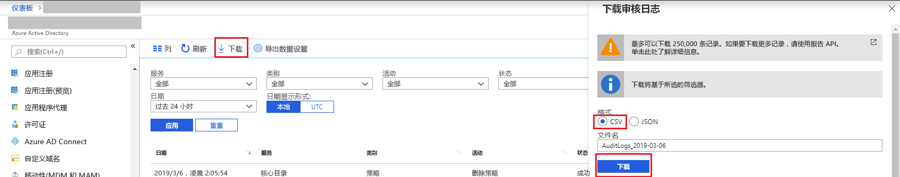

# 快速入门：通过 Azure 门户下载审核报表

在此快速入门中，你将学习如何下载租户过去 24 小时的审核日志。

## 先决条件

需要：

* 一个 Azure Active Directory 租户。 
* 一位属于该租户的安全管理员、安全读者或全局管理员角色的用户。 此外，该租户中的任何用户均可访问其自己的审核日志。

## 快速入门：下载审核报表

1. 导航到 [Azure 门户](https://portal.azure.com)。
2. 从左侧导航窗格中选择“Azure Active Directory”，然后使用“切换目录”按钮选择活动目录。
3. 从仪表板中，选择“Azure Active Directory”，然后选择“审核日志”。 
4. 在“日期范围”筛选器下拉列表中选择“过去 24 小时”，再选择“应用”以查看过去 24 小时的审核日志。 
5. 选择“下载”按钮，以下载包含所筛选记录的 CSV 文件。 

## 后续步骤

* [Azure Active Directory 门户中的“登录活动”报表](concept-sign-ins.md)
* [Azure Active Directory 报告保留期](reference-reports-data-retention.md)
* [Azure Active Directory 报告延迟](reference-reports-latencies.md)
