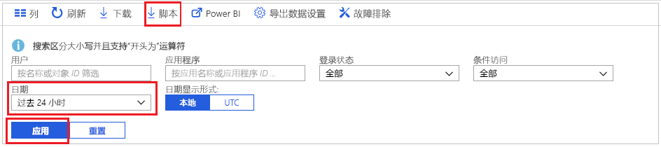
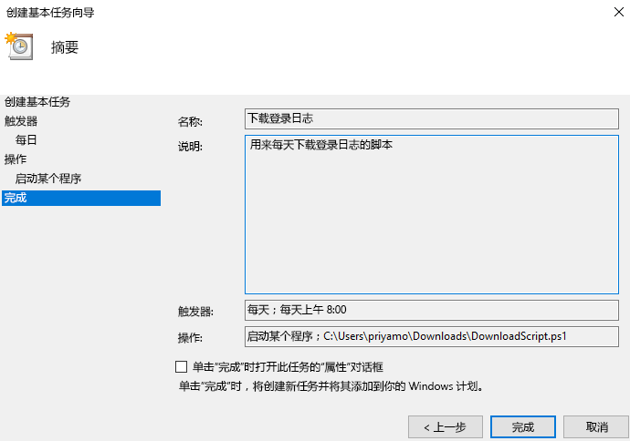

# 教程：如何下载并使用脚本来访问登录日志

如果想要在 Azure 门户之外使用登录活动数据，可以将其下载。 Azure 门户中的“下载”选项会创建一个 CSV 文件，包含最近的 5000 条记录。 如果需要更大的灵活性，例如，一次下载超出 5000 条记录，或者按计划的时间间隔下载日志，则可使用“脚本”按钮生成一个 PowerShell 脚本，用于下载数据。

本教程介绍如何生成一个脚本，以便下载过去 24 小时的所有登录日志并将其计划为每天都运行。 

## 先决条件

需要：

* 一个使用高级 (P1/P2) 许可证的 Azure Active Directory 租户。 
* 一位属于该租户的全局管理员、安全管理员、安全读者或报表读者角色的用户。 此外，任何用户都可以访问自己的登录活动。 
* 若要在 Windows 10 计算机上运行下载的脚本，请[设置 AzureRM 模块并设置执行策略](concept-sign-ins.md#running-the-script-on-a-windows-10-machine)。

## 教程

1. 导航到 [Azure 门户](https://portal.azure.com)，选择目录。
2. 在“监视”部分，选择 **Azure Active Directory**，然后选择“登录”。 
3. 使用“日期范围”筛选器下拉列表，选择“24 小时”，获取过去 24 小时的数据。 
4. 选择“应用”，验证筛选器是否已如预期那样应用。 
5. 从顶部菜单中选择“脚本”，使用应用的筛选器下载 Powershell 脚本。

     
     
6. 在 Windows 计算机上打开“任务计划程序”应用程序，选择“创建基本任务”。
7. 输入任务的名称和说明，然后单击“下一步”。
8. 选择“每日”单选按钮，让任务每日都运行，然后输入开始日期和时间。
9. 在操作菜单中依次选择“启动程序”、下载的脚本、“下一步”。 
10. 查看计划的任务，选择“完成”，以便创建该任务。

     

现在，任务会每天都运行，并会将过去 24 小时的登录记录保存到 **AAD_SignInReport_YYYYMMDD_HHMMSS.csv** 格式的文件中。 也可编辑下载的 PowerShell 脚本，将其保存到另一文件名下，或者修改下载的记录的数目。 

## 后续步骤

* [Azure Active Directory 报告保留策略](reference-reports-data-retention.md)
* [Azure Active Directory 报告 API 入门](concept-reporting-api.md)
* [使用证书访问报告 API](tutorial-access-api-with-certificates.md)
