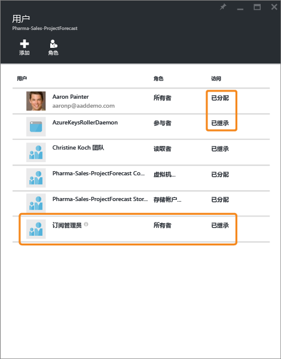
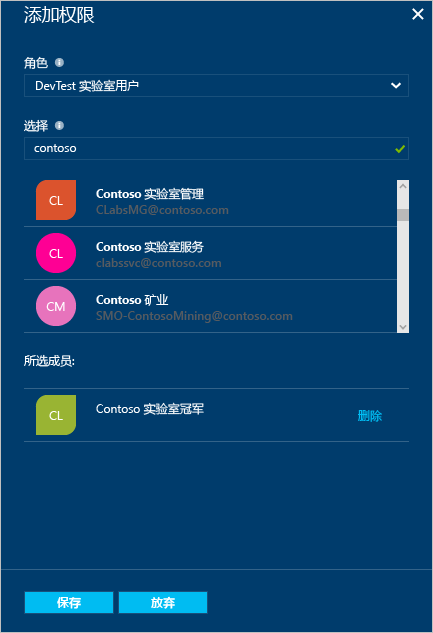

# 使用基于角色的访问控制管理 Azure 订阅资源的访问权限
> [!div class="op_single_selector"]
> * [管理用户或组的访问权限](role-based-access-control-manage-assignments.md)
> * [管理资源的访问权限](role-based-access-control-configure.md)

Azure 基于角色的访问控制 (RBAC) 可用于对 Azure 进行细致的访问管理。 使用 RBAC，可以仅授予用户执行其作业所需的访问次数。 本文可帮助你在 Azure 门户中启动并运行 RBAC。 如果想要了解有关 RBAC 如何帮助你管理访问权限的详细信息，请参阅[什么是基于角色的访问控制](role-based-access-control-what-is.md)。

在每个订阅中，最多可以授予 2000 个角色分配。 

## 查看访问权限
可在 [Azure 门户](https://portal.azure.com)中的主边栏选项卡上查看谁有权访问资源、资源组或订阅。 例如，我们想要查看谁有权访问其中一个资源组：

1. 在左侧的导航栏中选择“资源组”  。  
    
2. 在“资源组”  边栏选项卡上，选择资源组的名称。
3. 从左侧菜单中选择“访问控制 (IAM)”。  
4. “访问控制”边栏选项卡列出了授予该资源组访问权限的所有用户、组和应用程序。  
   
    

请注意，有些角色的权限范围已划归到**此资源**，还有一些角色从另一个范围**继承**权限。 特定于资源组分配访问权限，或者从父订阅的分配继承访问权限。

> [!NOTE]
> 经典订阅管理员和协同管理员被视为新的 RBAC 模型中订阅的所有者。

## 添加访问权限
授予资源、资源组或订阅（即角色分配范围）内的访问权限。

1. 在“访问控制”边栏选项卡上选择“添加”。  
2. 从“选择角色”边栏选项卡中选择你想要分配的角色。
3. 在你想要授予访问权限的目录中选择用户、组或应用程序。 可以通过显示名称、电子邮件地址和对象标识符搜索该目录。  
   
    
4. 选择“确定”  以创建分配。 “添加用户”  弹出窗口跟踪进度。  
    

成功添加角色分配后，该角色分配将出现在“用户”边栏选项卡上。

## 删除访问权限
1. 将光标悬停在要删除的分配的名称上面。 该名称旁边会显示一个复选框。
2. 使用复选框选择一个或多个角色分配。
2. 选择“删除”。  
3. 选择“是”确认删除。

不能删除继承的分配。 如果需要删除继承的分配，则需要在创建角色分配的作用域上进行操作。 在“作用域”列的“继承”旁，有一条链接指向分配了此角色的资源。 请转到该处列出的资源以删除角色分配。

## 管理访问权限的其他工具
可以使用 Azure 门户以外的工具中的 Azure RBAC 命令分配角色和管理访问权限。  依照该链接以了解有关先决条件和 Azure RBAC 命令入门的详细信息。

* [Azure PowerShell](role-based-access-control-manage-access-powershell.md)
* [Azure 命令行界面](role-based-access-control-manage-access-azure-cli.md)
* [REST API](role-based-access-control-manage-access-rest.md)

## 后续步骤
* [创建访问变更历史记录报表](role-based-access-control-access-change-history-report.md)
* 请参阅 [RBAC 内置角色](role-based-access-built-in-roles.md)
* 定义你在 [Azure RBAC 中的自定义角色](role-based-access-control-custom-roles.md)

