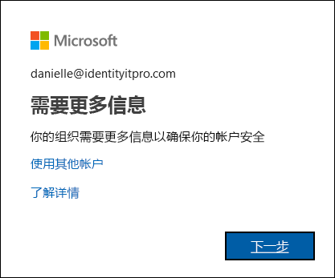

# 什么是“附加验证”页？

假设 IT 部门的某位同事或者你的老板向你发送了一封电子邮件，指出组织已对你的帐户添加了附加的安全验证。 这意味着什么？ 这意味着组织要采取额外的措施来确保使用你帐户登录的是你本人。 这种额外的验证也称双重验证，是使用用户名、密码和移动设备或电话的组合来实现的。

双重验证比单纯使用密码更安全，因为它依赖于两种形式的身份验证：你知道的事情和拥有的物品。 你知道的事情就是你的密码。 你拥有的物品就是你经常携带的手机或设备。 双重验证有助于防止恶意黑客假装你的身份，因为即使他们有你的密码，也不太可能有你的设备。

>[!Important]
>本文适用于尝试通过工作或学校帐户（如 alain@contoso.com）使用双因素验证的用户。 如果你是管理员，正在查找有关如何为你的员工或其他用户启用双因素验证的信息，请参阅 [Azure Active Directory 身份验证文档](https://docs.microsoft.com/azure/active-directory/authentication/)。

## 谁决定是否要使用此功能？

根据具体的帐户类型，你的组织可能决定必须使用双重验证，有时你也可以自行决定使用此功能。

- **工作或学校帐户。** 如果你使用工作或学校帐户（例如 alain@contoso.com），则由你的组织决定是否必须使用双重验证，以及具体的验证方法是什么。 由于你的组织已决定你必须使用此功能，因此无法单独将其关闭。

- **Microsoft 个人帐户。** 可以选择为 Microsoft 个人帐户（例如 alain@outlook.com）设置双重验证。 如果无法使用双重验证和个人 Microsoft 帐户，请参阅[为你的 Microsoft 帐户打开或关闭双重验证](https://support.microsoft.com/help/4028586/microsoft-account-turning-two-step-verification-on-or-off)。 因为你选择是否使用此功能，所以可根据需要随时将其打开或关闭。

    >[!Note]
    >如果你在使用双因素验证和其中一个个人 Microsoft 帐户（例如，danielle@outlook.com）时遇到问题，可以尝试有关[如何对 Microsoft 帐户使用双重验证](https://support.microsoft.com/help/12408/microsoft-account-how-to-use-two-step-verification)的建议。

## 访问“其他安全性验证”页

组织打开并设置了双重验证后，你会收到一条消息，提示如何提供更多信息来帮助保护帐户安全。

### 访问“其他安全性验证”页

1. 从“需要更多信息”提示中选择“下一步”   。

    随即出现“其他安全性验证”页  。

2. 从“其他安全性验证”页中，必须决定登录到工作或学校帐户后要使用哪种双重验证方法来验证你的身份  。 可以选择：

    | 联系方式 | 说明 |
    | --- | --- |
    | 移动应用 | <ul><li>**接收验证通知。** 此选项将通知推送到智能手机或平板电脑上的验证器应用。 查看通知，如果合法，则在应用中选择“身份验证”  。 公司或学校可能要求在身份验证之前，输入 PIN。</li><li>**使用验证码。** 在此模式下，验证器应用生成每隔 30 秒更新一次的验证码。 在登录屏幕中输入最新验证码。 Microsoft Authenticator 应用可用于 [Android](https://go.microsoft.com/fwlink/?linkid=866594) 和 [iOS](https://go.microsoft.com/fwlink/?linkid=866594)。</li></ul> |
    | 身份验证电话 | <ul><li>**电话呼叫**向提供的电话号码发起自动语音呼叫。 接听电话，并按电话键盘上的井号键 (#) 进行身份验证。</li><li>**短信**发送包含验证码的短信。 遵循短信中的提示，回复短信或在登录界面中输入提供的验证码。</li></ul> |
    | 办公电话 | 向已提供的电话号码进行自动语音呼叫。 接听电话，并按电话键盘上的井号键 (#) 进行身份验证。 |

## 后续步骤

在访问“其他安全性验证”页后，必须选择并设置双重验证方法  ：

- [将移动设备设置为验证方法](multi-factor-authentication-setup-phone-number.md)

- [将办公室电话设置为验证方法](multi-factor-authentication-setup-office-phone.md)

- [将 Microsoft Authenticator 应用设置为验证方法](multi-factor-authentication-setup-auth-app.md)

## 相关资源

- [管理双重验证方法设置](multi-factor-authentication-end-user-manage-settings.md)

- [管理应用密码](multi-factor-authentication-end-user-app-passwords.md)

- [使用双重验证登录](multi-factor-authentication-end-user-signin.md)

- [获取有关双重验证的帮助](multi-factor-authentication-end-user-troubleshoot.md) 
