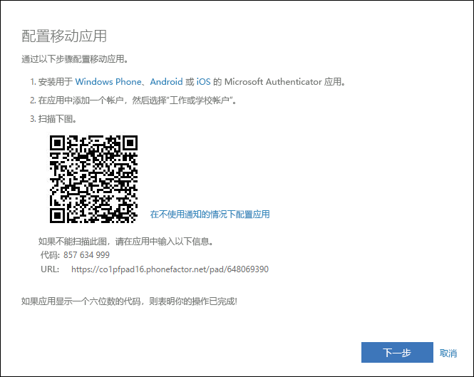
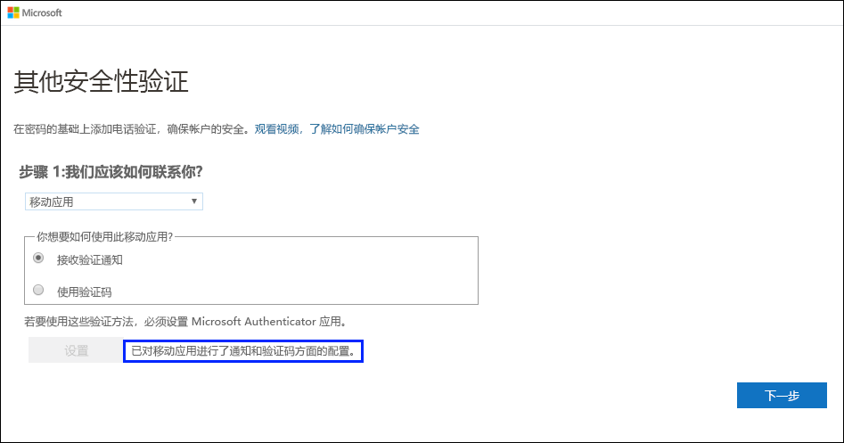
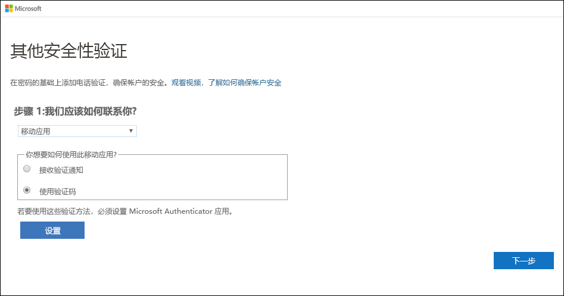
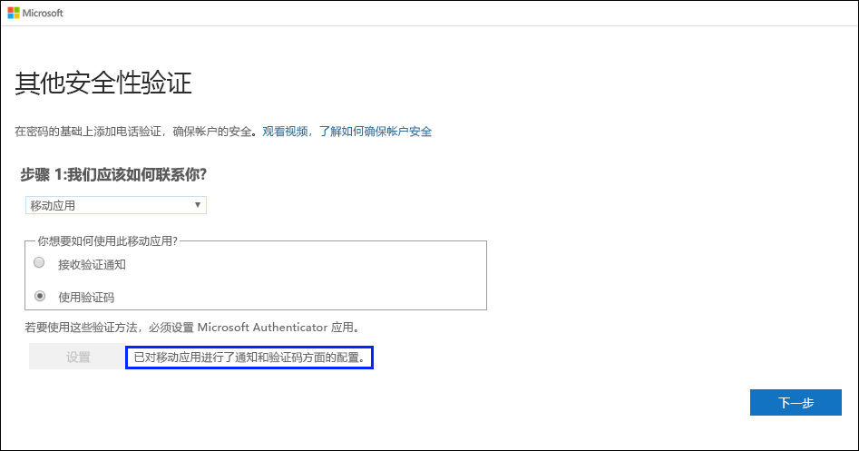
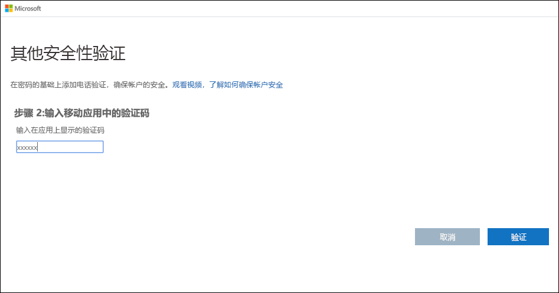

# 将验证器应用设置为双重验证方法

可以对验证器应用进行设置，将向移动设备发送通知或向你发送验证代码作为安全验证方法。 不一定要使用 Microsoft Authenticator 应用，可在设置过程中选择其他应用。 但是，本文使用 Microsoft Authenticator 应用。

>[!Important]
>必须先下载并安装 Microsoft Authenticator 应用，然后才能添加帐户。 如果尚未这样做，请按照[下载并安装应用](user-help-auth-app-download-install.md)一文中的步骤操作。

>[!Note]
> 如果“移动应用”选项灰显，则可能是因为组织不允许你使用验证器应用进行验证。 在这种情况下，需选择另一种方法，或与管理员联系以获取进一步帮助。

## 将 Microsoft Authenticator 应用设置为发送通知

1. 在“其他安全验证”  页上，选择“移动应用”  （从“第 1 步:  我们应该如何联系你”区域进行选择）。

2. 从“你希望如何使用此移动应用”区域选择“接收验证通知”，然后选择“设置”。   

    

    此时会显示“配置移动应用”  页。

    

3. 打开 Microsoft Authenticator 应用，从右上方的“自定义和控制”  图标中选择“添加帐户”  ，然后选择“工作或学校帐户”  。

    >[!Note]
    >如果这是你首次设置 Microsoft Authenticator 应用，则可能会收到一个提示，询问你是允许该应用访问你的相机 (iOS)，还是允许该应用拍摄照片和录制视频 (Android)。 你必须选择“允许”  ，以便验证器应用可以访问你的相机，在下一步中拍摄 QR 码的照片。 如果你不允许使用相机，仍然可以设置验证器应用，但需要手动添加代码信息。 有关如何手动添加代码的信息，请参阅[手动将帐户添加到应用](user-help-auth-app-add-account-manual.md)。

4. 在计算机上使用设备的摄像头扫描“配置移动应用”屏幕中的 QR 码，然后选择“下一步”   。

5. 返回到计算机的“其他安全验证”页，确保获得的消息指出配置已成功，然后选择“下一步”。  

    

    验证器应用会向你的移动设备发送一则测试性的通知。

6. 在移动设备上选择“批准”  。

7. 在计算机上，将移动设备电话号码添加到“步骤 3:  如果无法访问移动应用”区域，然后选择“下一步”。 

    强烈建议添加移动设备电话号码作为备份，以免出现因某种原因无法访问或使用移动应用的情况。

8. 在“步骤 4:  继续使用你的现有应用程序”区域，复制提供的应用密码，并将其粘贴到安全位置。

    

    >[!Note]
    >有关如何将应用密码用于旧应用的信息，请参阅[管理应用密码](multi-factor-authentication-end-user-app-passwords.md)。 如果要继续使用不支持双重验证的旧应用，只需使用应用密码即可。

9. 选择“完成”  。

## 将 Microsoft Authenticator 应用设置为使用验证码

1. 在“其他安全验证”  页上，选择“移动应用”  （从“第 1 步:  我们应该如何联系你”区域进行选择）。

2. 从“你希望如何使用此移动应用”区域选择“使用验证码”，然后选择“设置”。   

    

    此时会显示“配置移动应用”  页。

    

3. 打开 Microsoft Authenticator 应用，从右上方的“自定义和控制”  图标中选择“添加帐户”  ，然后选择“工作或学校帐户”  。

    >[!Note]
    >如果这是你首次设置 Microsoft Authenticator 应用，则可能会收到一个提示，询问你是允许该应用访问你的相机 (iOS)，还是允许该应用拍摄照片和录制视频 (Android)。 你必须选择“允许”  ，以便验证器应用可以访问你的相机，在下一步中拍摄 QR 码的照片。 如果你不允许使用相机，仍然可以设置验证器应用，但需要手动添加代码信息。 有关如何手动添加代码的信息，请参阅[手动将帐户添加到应用](user-help-auth-app-add-account-manual.md)。

4. 在计算机上使用设备的摄像头扫描“配置移动应用”屏幕中的 QR 码，然后选择“下一步”   。

5. 返回到计算机的“其他安全验证”页，确保获得的消息指出配置已成功，然后选择“下一步”。  

    

    验证器应用会要求你提供测试用的验证码。

6. 在 Microsoft Authenticator 应用中，向下滚动到工作或学校帐户，然后将 6 位数的代码从应用中复制并粘贴到计算机上的“步骤 2:  输入移动应用中的验证码”框，然后选择“验证”。 

    

7. 在计算机上，将移动设备电话号码添加到“步骤 3:  如果无法访问移动应用”区域，然后选择“下一步”。 

    强烈建议添加移动设备电话号码作为备份，以免出现因某种原因无法访问或使用移动应用的情况。

8. 在“步骤 4:  继续使用你的现有应用程序”区域，复制提供的应用密码，并将其粘贴到安全位置。

    

    >[!Note]
    >有关如何将应用密码用于旧应用的信息，请参阅[管理应用密码](multi-factor-authentication-end-user-app-passwords.md)。 如果要继续使用不支持双重验证的旧应用，只需使用应用密码即可。

9. 选择“完成”  。

## 后续步骤

设置双重验证方法后，可以添加其他方法、管理设置和应用密码、登录，或获得一些常见双重验证相关问题的帮助。

- [管理双重验证方法设置](multi-factor-authentication-end-user-manage-settings.md)

- [管理应用密码](multi-factor-authentication-end-user-app-passwords.md)

- [使用双重验证登录](multi-factor-authentication-end-user-signin.md)

- [获取有关双重验证的帮助](multi-factor-authentication-end-user-troubleshoot.md)
