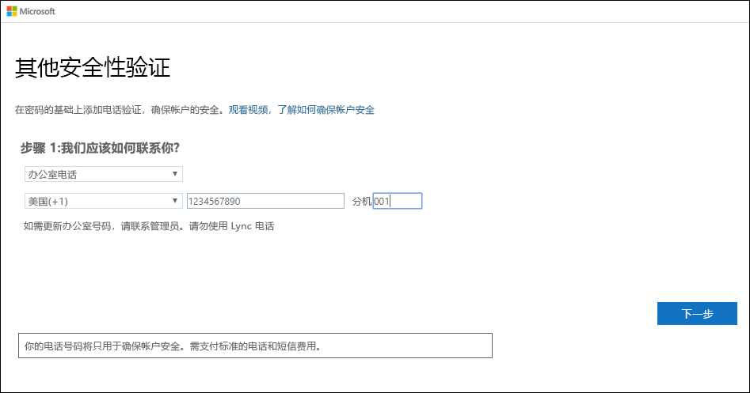
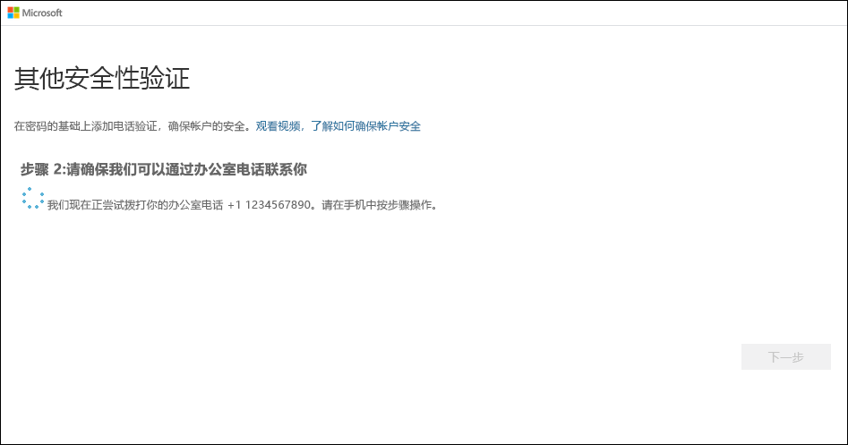

# 将办公室电话设置为双因素验证方法

可以设置办公室电话，使其充当双因素验证方法。

>[!Note]
> 如果“办公室电话”选项灰显，则可能是你的组织不允许你使用办公室电话号码进行验证。 在这种情况下，需选择另一种方法，或与管理员联系以获取进一步帮助。

## 将办公室电话号码设置为验证方法

1. 在“其他安全验证”  页上，选择“办公室电话”  （从“第 1 步:  我们如何与您联系”区域），从下拉列表中选择你所在的国家或地区，键入办公室电话号码，然后键入分机（如果有）。

    

2. 你将收到来自 Microsoft 的电话呼叫，要求你按办公室电话上的井号 (#) 来验证你的身份。

    

3. 从“第 3 步:  继续使用你的现有应用程序”区域，复制提供的应用密码，并将其粘贴到安全位置。

    

    >[!Note]
    >有关如何将应用密码用于旧应用的信息，请参阅[管理应用密码](multi-factor-authentication-end-user-app-passwords.md)。 如果要继续使用不支持双重验证的旧应用，只需使用应用密码即可。

4. 选择“完成”  。

## 后续步骤

设置双重验证方法后，可以添加其他方法、管理设置和应用密码、登录，或获得一些常见双重验证相关问题的帮助。

- [管理双重验证方法设置](multi-factor-authentication-end-user-manage-settings.md)

- [管理应用密码](multi-factor-authentication-end-user-app-passwords.md)

- [使用双重验证登录](multi-factor-authentication-end-user-signin.md)

- [获取有关双重验证的帮助](multi-factor-authentication-end-user-troubleshoot.md)
