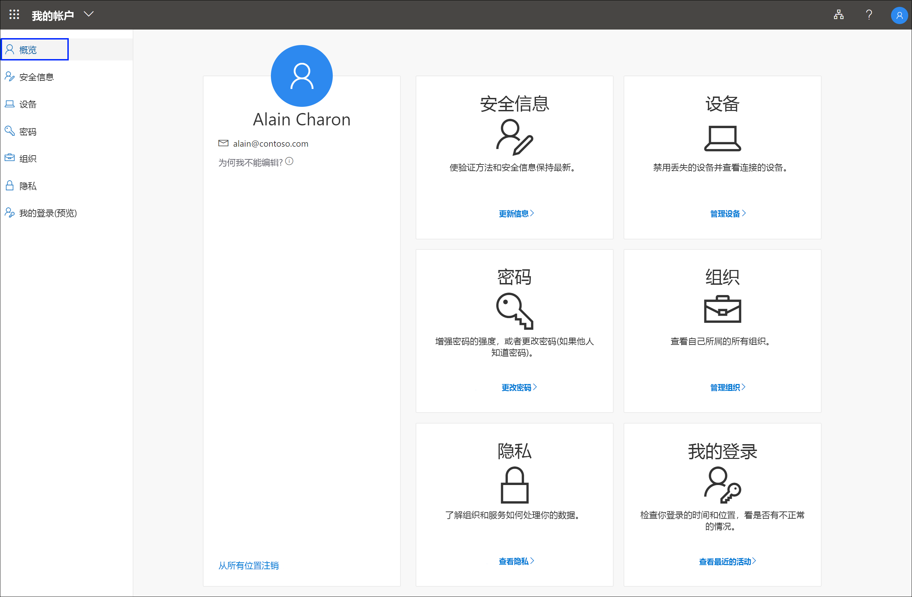

# 什么是“我的帐户”门户？

“我的帐户”（预览）门户可以通过设置和管理安全信息、管理连接的组织和设备，以及查看组织使用数据的方式，来帮助你管理工作或学校帐户  。

可以使用下述任何浏览器的最新版本转到“我的帐户”门户 (https://myprofile.microsoft.com) )  ：

- Chrome
- Microsoft Edge
- Safari
- Firefox
- Internet Explorer 11

>[!Important]
>本文适用于尝试执行以下操作的用户：访问“我的帐户”门户以更新其安全信息、设备信息、密码、连接的组织、隐私或以前的登录信息。 如果你是管理员，想要了解如何为你的员工和其他用户启用身份验证和其他 Azure Active Directory (Azure AD) 功能，请参阅[适用于管理员的 Azure AD 文档](https://docs.microsoft.com/azure/active-directory/)。

## 后续步骤

- 选择查看或管理[安全信息](user-help-security-info-overview.md)

- 查看或管理已连接的[设备](my-account-portal-devices-page.md)

- 查看并管理[组织](my-account-portal-organizations-page.md)

- 查看[登录活动](my-account-portal-sign-ins-page.md)

- 查看组织如何[使用隐私相关数据](my-account-portal-privacy-page.md)

## 相关的 Microsoft Office 内容

- [登录以管理 Office 产品](https://support.office.com/article/sign-in-to-manage-your-office-product-959ac957-8d37-4ae4-b1b6-d6e4874e013f)

- [转到 Office“我的帐户”页面  ](https://portal.office.com/account/)

- [转到 Office“我的安装”页面  ](https://portal.office.com/account/#installs)

- [转到 Office“订阅”页面  ](https://portal.office.com/account/#subscriptions)