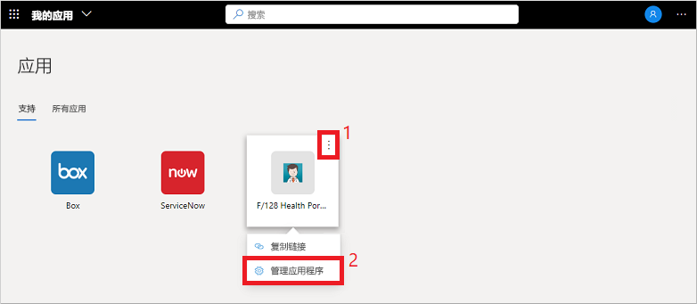
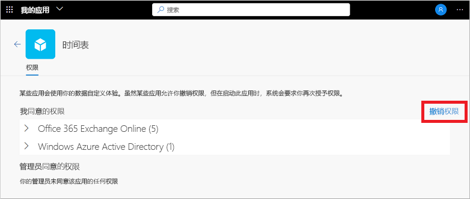

# 在“我的应用”门户中编辑或撤销应用程序权限

在“我的应用”门户中使用组织应用程序时，你通常会授予权限并保存帐户信息  。 为了确保数据安全，你可能需要查看并撤销权限或清除保存的帐户凭据。 删除权限或帐户可能会破坏某些应用的功能。 如果删除权限或帐户后遇到问题，请与组织的支持人员联系以获得更多帮助。

[!INCLUDE [preview-notice](../../../includes/active-directory-end-user-my-apps-and-workspaces.md)]

>[!Important]
>此内容适用于用户。 如果你是管理员，可以在[应用程序管理文档](https://docs.microsoft.com/azure/active-directory/manage-apps/access-panel-workspaces)中查找有关如何设置和管理基于云的应用的详细信息。

## 管理应用权限

若要查看你或你的管理员许可的权限，请在“我的应用”门户中将鼠标悬停在应用上时选择“...”，然后选择“管理应用程序”    ：

“权限”窗口的顶部显示个人许可的权限。 应用权限的示例包括能够访问日历、联系人或照相机。

可以通过选择“撤销权限”来撤销许可的任何权限，但是删除许可可能会破坏某些应用的功能  。 如果删除权限或帐户后遇到问题，请与组织的支持人员联系以获得更多帮助。

权限窗口的底部显示了管理员代表你许可的权限。 如果没有管理员许可的权限，则不显示此部分。 由于管理员已许可这些权限，无法撤销这些权限，而组织的策略通常需要这些权限。

## 后续步骤

在“我的应用”门户中管理应用权限并保存帐户后，你可以  ：

- 将应用整理到组织创建和提供的各种类别中。 有关详细信息，请参阅[在“我的应用”门户中访问和使用集合](my-applications-portal-workspaces.md)。

## 相关文章

- [更新个人资料和帐户信息](my-account-portal-overview.md)。 说明如何更新“我的个人资料”门户上显示的个人信息  。

- [管理组织](my-account-portal-organizations-page.md)。 说明如何在“我的个人资料”门户的“组织”页中查看和管理与组相关的信息   。

- [管理已连接的设备](my-account-portal-devices-page.md)。 说明如何在“我的个人资料”门户的“设备”页中使用工作或学校帐户管理已连接到的设备   。
