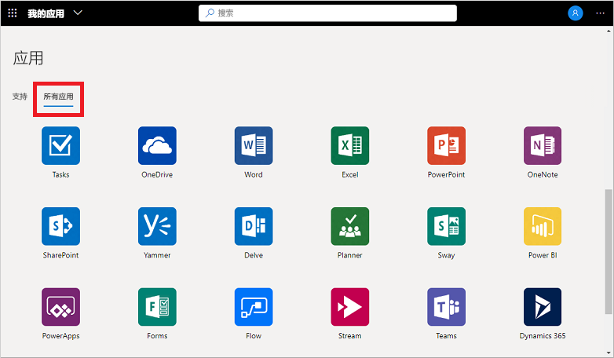
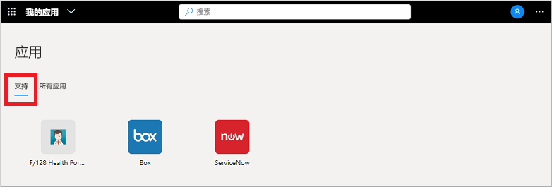

# 在“我的应用”门户中使用集合

集合是“我的应用”门户中显示的各种应用视图  。 例如，可以按部门功能或用户角色将应用组合到集合中。 如果看不到任何可用的集合或类别，则表示管理员尚未设置或共享任何集合。 若要查看共享的集合，请联系组织的支持人员以获得其他帮助或权限。

[!INCLUDE [preview-notice](../../../includes/active-directory-end-user-my-apps-and-workspaces.md)]

>[!Important]
>此内容适用于“我的应用”用户。  如果你是管理员，可以在[应用程序管理文档](https://docs.microsoft.com/azure/active-directory/manage-apps/access-panel-workspaces)中查找有关如何设置和管理基于云的应用的详细信息。

## 使用集合访问应用

“我的应用”门户中的集合列表默认为显示一个名为“所有应用”的集合，其中包括可访问的所有应用   ：

在此列表中看到的任何其他集合均由管理员创建并与你共享。 可以选择其中某个集合，以查看范围更受限的应用集，如以下示例中的“支持”  ：

选择并查看集合时，只能看到可以访问的默认应用程序。

## 后续步骤

在“我的应用”门户中将应用整理成各种类别之后，可以  ：

- 查看、更新或撤销授予应用程序的权限。 有关详细信息，请参阅[在“我的应用”门户中编辑或撤销应用程序权限](my-applications-portal-permissions-saved-accounts.md)。

## 相关文章

- [更新个人资料和帐户信息](my-account-portal-overview.md)。 说明如何更新“我的个人资料”门户上显示的个人信息  。

- [管理组织](my-account-portal-organizations-page.md)。 说明如何在“我的个人资料”门户的“组织”页中查看和管理与组相关的信息   。

- [管理已连接的设备](my-account-portal-devices-page.md)。 说明如何在“我的个人资料”门户的“设备”页中使用工作或学校帐户管理已连接到的设备   。